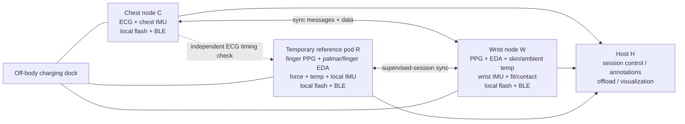
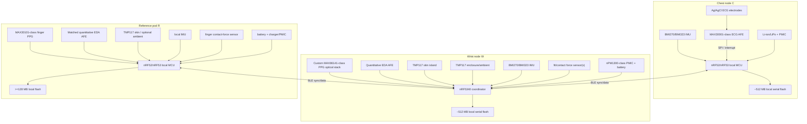
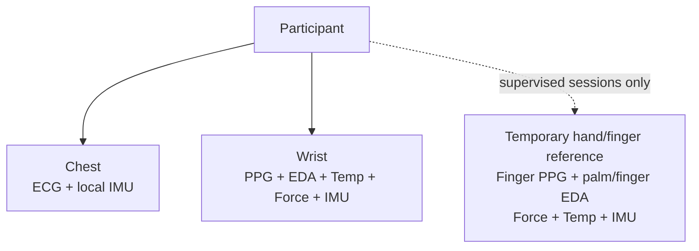
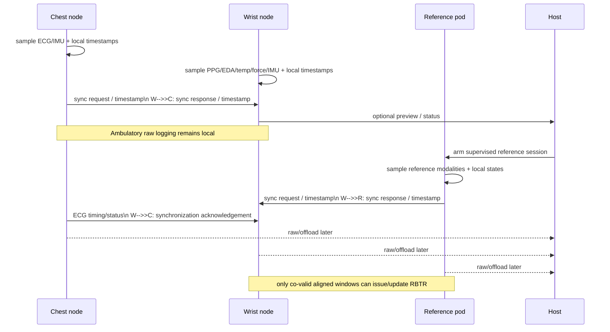
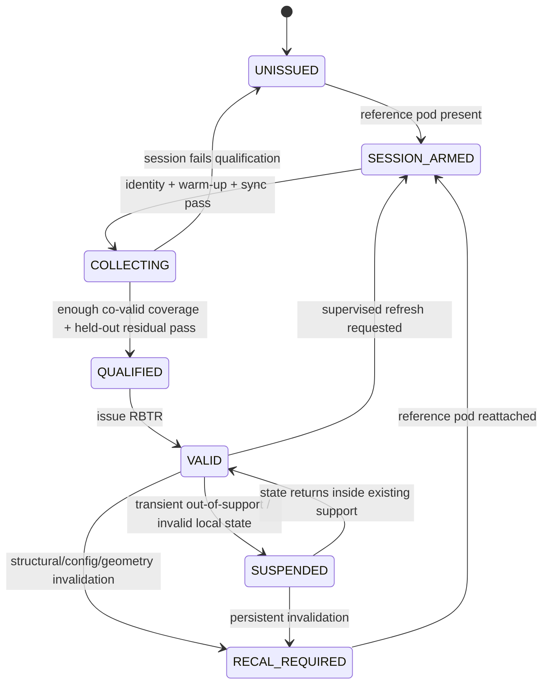
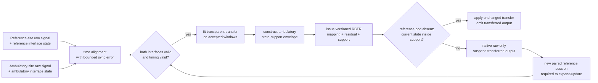

# AUD/SUD Patent-Oriented Hardware Architecture

> **Document status:** engineering architecture proposal + invention-disclosure input  
> **Research cut-off:** 11 September 2026  
> **Repository baseline:** `Beastly713/aud-obj-hardware`, default branch `main`, reconciled through commit `4bc9d3859493c2cb8a52ac3b49528e6eecfd1876`  
> **Legal boundary:** this is technical research and an engineering-level patent discussion aid. It is **not** a legal opinion, freedom-to-operate opinion, patentability opinion, claim set, or substitute for review by a qualified patent professional.

## 1. Executive Summary

### 1.1 Proposed architecture

The strongest architecture to propose now is a **three-module physiological instrumentation system**:

1. a **persistent chest ECG node** for continuous electrical cardiac timing and chest-local motion;
2. a **persistent wrist ambulatory node** for lower-burden PPG, quantitative EDA, local skin-temperature context, wrist-local motion/tremor, and physical-interface state;
3. a **temporary supervised reference hand/finger module** used only during controlled sessions, with finger PPG, palmar/finger EDA, local motion, contact/force state and temperature.

A phone, tablet or workstation may configure sessions and retrieve data, but it is deliberately **outside the sample-time authority**. Each body module timestamps acquisition locally and stores an authoritative raw copy. Wireless arrival time is never substituted for sensor sample time.

The physical architecture is selected because it follows the measurement evidence rather than forcing all modalities onto one fashionable enclosure. Chest ECG is a strong passive continuous cardiac-timing geometry; wrist PPG/EDA/temperature can be worn with relatively low burden but are interface-sensitive; finger PPG and palmar/finger EDA are strong controlled-session reference sites even though they are inconvenient for unrestricted daily hand use.[^R2][^R3]

### 1.2 Known/proven foundation

Most of the electronics and sensing arrangement are deliberately **not treated as inventive**. The architecture borrows from mature public implementations:

- MAX30001/MAX30003-class wearable ECG front ends;
- MAX86141/MAX30101-class optical PPG;
- conventional quantitative EDA front ends;
- TMP117-class skin-contact temperature sensing on a thermally isolated structure;
- local IMUs at mechanically relevant body interfaces;
- nRF52/nRF53-class low-power wireless controllers;
- interrupt/FIFO/DRDY-based acquisition;
- local flash-first logging;
- explicit clock synchronization and drift estimation;
- fit/contact-force sensing;
- per-modality quality/validity flags.[^H1][^H2][^H3][^H4][^H6][^H7][^H8][^H9][^H12][^P6][^P8]

HealthyPi Move is especially important as a proof that a modern open wearable can combine MAX30001 ECG, wrist and finger optical sensing, EDA, temperature, inertial sensing, local flash and an nRF5340-class controller. It is a strong engineering precedent and therefore **weakens**, rather than supports, any attempt to claim sensor aggregation as new.[^H8]

### 1.3 Primary inventive hypothesis retained after prior-art attack

The broad concept **“use a temporary higher-quality sensor to calibrate a lower-burden wearable” is not retained as the invention**. It is already strongly exposed. Life Meter discloses a short reference pulse-oximeter measurement at a non-wrist site used to calibrate a wrist bracelet for longer-term monitoring; Tula Health discloses wearable recalibration from a separate measurement device; Panoramic Digital Health discloses synchronized reference measurements and mapping into a reference space; and a 2026 Zelik application explicitly trains a secondary long-wear sensor from a primary time-limited sensor and later uses the secondary sensor alone.[^P1][^P4][^P18][^P3]

The narrower mechanism retained for an initial invention disclosure is provisionally called the **Reference-Bounded Transfer Record (RBTR)**:

> During a supervised session, a temporary reference interface and a persistent ambulatory interface acquire the same nominal modality at different body sites. A transfer record is issued only from windows in which **both physical interfaces and inter-module timing are simultaneously valid**. The record contains not only transfer parameters but also a **bounded support envelope of the ambulatory physical-interface states actually observed while the reference interface was present and valid**. After the reference module is removed, the ambulatory system may use the transferred output only while its current interface state remains inside that support envelope. Ambulatory data alone may suspend or revoke the record but **may not expand the support envelope or modify transfer parameters**. Expansion or modification requires a new co-valid session in which an identified reference module is again physically present.

This is deliberately narrower than “personalized calibration,” “quality scoring,” or “cross-site mapping.” The engineering distinction is the **one-way authority boundary**: reference-absent operation can become more conservative, but it cannot self-authorize a broader domain of supposedly reference-equivalent operation.

The transfer record is modality-specific. A PPG transfer record can be suspended while chest ECG remains valid and wrist IMU tremor information remains usable. Raw data are preserved even when transferred output is prohibited.

### 1.4 Why the retained hypothesis is still risky

No reviewed reference was identified that clearly discloses the complete RBTR combination exactly as proposed: cross-site reference + interface-state support envelope learned only during co-valid windows + reference-required expansion/update authority + later local revocation without self-update + modality-specific independence. That is **not** a conclusion of novelty.

The obviousness risk remains **high**. A skilled person could plausibly combine:

- Life Meter or Zelik for temporary-reference-to-long-wear transfer;
- Fitbit for force/contact characterization of the wearable interface;
- Samsung for signal/artifact confidence;
- Panoramic or Goertek for calibration validity and reference-gated update;
- known out-of-distribution/support-region concepts from estimation practice;
- ordinary state-machine control and versioned calibration records.[^P1][^P3][^P4][^P5][^P6][^P8]

Accordingly:

- **engineering confidence in the architecture:** high;
- **confidence that the broad reference/ambulatory idea is patentable:** low;
- **confidence that RBTR is worth disclosing and searching further:** moderate;
- **confidence that RBTR is legally patentable:** not established.

### 1.5 Largest unresolved patent risks

The three largest risks are:

1. an unlocated patent that already claims a calibration model together with a bounded validity domain and reference-only update authority;
2. an obviousness combination of temporary-reference calibration + fit/quality sensing + gated recalibration;
3. drafting the mechanism too abstractly, causing it to collapse into generic software calibration rather than a reproducible hardware-interface control mechanism.

The architecture should therefore be built even if the patent disappears. RBTR should be experimentally tested because its value depends on a measurable technical effect: **lower error and fewer invalid “reference-equivalent” outputs when the ambulatory interface drifts outside the physical states actually validated against the reference interface**.

---

## 2. Scope and Purpose

This document fixes a technically credible end-to-end architecture for multimodal physiological monitoring in AUD/SUD rehabilitation, withdrawal-related research, supervised assessment and ambulatory longitudinal monitoring.

It is intended to support:

- engineering architecture review;
- mentor discussion;
- an initial invention disclosure;
- focused prior-art work by a patent professional;
- prototype planning;
- later empirical validation.

It does **not** assert that any sensor diagnoses AUD, detects craving, predicts relapse, determines withdrawal severity, measures ethanol, or replaces clinical assessment. The repository's scientific chain remains controlling:

`physical measurement -> derived feature -> physiological association -> AUD/SUD research relevance -> clinical interpretation`

Those steps must not be collapsed.[^R2][^R4]

The document also distinguishes four different kinds of system content:

- **known prior-art foundation** — public designs or conventional engineering intentionally reused;
- **ordinary project-specific engineering** — reasonable implementation choices that make the system buildable;
- **potentially inventive mechanism** — RBTR and narrower dependent mechanisms;
- **uncertain hypotheses** — features whose novelty or technical benefit still needs validation.

---

## 3. Source Repository and Existing Project Context

The complete `docs/` corpus was treated as the project record, with the newest physical inventory controlling where older language conflicted. The following repository documents were reviewed as a linked set:

- `docs/hardware_inventory.md` — canonical physical identities and visible board markings;[^R1]
- `docs/aud_multimodal_hardware_evidence_map.md` — modality capability and scientific boundaries;[^R4]
- `docs/aud_sensor_role_definition.md` — measurement roles and cross-modal interpretation;[^R2]
- `docs/aud_hardware_form_factor_options.md` — body-site and physical architecture exploration;[^R3]
- `docs/aud_hardware_reference_solutions.md` — reproducible/open/reference implementations;[^R5]
- `docs/aud_novelty_hypothesis_map.md` — earlier novelty-space and prior-art screening.[^R6]

### 3.1 Material repository corrections that control this architecture

Two version identifiers must not regress to older notes:

- the ProtoCentral legacy GSR/EDA board is **PC-tinyGSR, PCB marking `12/22`**;
- the CJMCU AD8232 board is **CJMCU-8232, PCB marking `V502`**.[^R1]

Any older reference to `11/22` or `VS82` is superseded by the verified physical inventory.

### 3.2 Existing scientific boundaries carried forward

The design retains these repository conclusions:

- ECG is the strongest route to standardized beat timing and RR-derived HRV, subject to acquisition validity.
- PPG supplies peripheral pulse timing/morphology and perfusion-sensitive optical data; PPG PRV is not automatically ECG HRV.
- ECG R-wave to distal PPG fiducial gives **pulse arrival time (PAT)**, not pure PTT.
- Legacy tinyGSR `12/22` is not assumed to provide calibrated absolute microsiemens.
- TMP117 measures its own local die temperature; skin-temperature interpretation requires a controlled thermal path and does not equal core temperature.
- IMU data provide body-segment motion, tremor and interface-context information; one IMU cannot represent motion at every body site.
- None of the existing sensors directly measures ethanol.[^R2][^R4]

---

## 4. Design Objectives

### 4.1 Physiological measurement objectives

The system should preserve research-grade access to:

- chest ECG waveform and beat timing;
- peripheral PPG raw optical waveforms;
- quantitative EDA where the product embodiment is concerned;
- local skin-temperature trend and thermal-interface state;
- acceleration and angular velocity for local movement, tremor and artifact context.

Derived features are secondary to trustworthy raw acquisition.

### 4.2 Engineering objectives

The system shall:

- digitize sensitive signals close to the relevant interface;
- retain local sample timestamps and sequence numbers;
- prevent silent sample loss;
- maintain local authoritative storage;
- make sensor and interface failures observable;
- keep body-spanning analog paths and I2C links out of the final product;
- allow individual modules to fail without making every other modality unusable;
- run body-connected ECG/EDA prototypes from battery with charging and non-isolated mains connections absent.

### 4.3 Ambulatory objectives

Persistent modules should be tolerable for daily wear and should not require finger/palm instrumentation continuously. The design should preserve chest cardiac timing and wrist peripheral/context information while accepting that wrist PPG/EDA can become invalid during particular physical states.

### 4.4 Supervised-session objectives

Controlled sessions should exploit a temporary, mechanically constrained finger/palm reference interface and should establish or refresh cross-site transfer evidence only under explicitly valid conditions.

### 4.5 Patentability objectives

The design should:

- remain good engineering without patent protection;
- avoid claiming known sensor aggregation;
- attach any inventive argument to a reproducible physical mechanism;
- expose adverse prior art;
- keep the provisional invention narrow enough to distinguish it from generic personalization/calibration;
- generate experimental evidence for a concrete technical effect.

---

## 5. Constraints and Non-Goals

The architecture does not attempt to:

- diagnose AUD/SUD;
- infer craving directly from EDA;
- infer relapse directly from HRV or multimodal fusion;
- treat wrist EDA as physiologically identical to palmar EDA;
- treat PRV as universally equivalent to HRV;
- estimate blood pressure merely because ECG and PPG provide PAT;
- estimate core body temperature from local skin temperature;
- make the temporary reference module a certified gold standard by assertion;
- use host-reception timestamps as acquisition time;
- make synchronization, motion-artifact suppression or generic quality scoring the invention;
- charge body-connected prototypes while electrodes are attached;
- rely on cloud availability for acquisition integrity.

The proposed system is a **research/engineering platform architecture**, not a certification statement.

---

## 6. Canonical Current Hardware Inventory

| Current component | Exact verified board/version | Function | Current evidence boundary | Proposed role | Decision |
|---|---|---|---|---|---|
| ESP32 development board | `ESP32 DEVKITV1`, 30-pin, ESP-WROOM-32-family module | controller / acquisition | exact carrier vendor, USB-UART, regulator and measured ADC behavior unresolved | centralized V0/V1 bring-up and logger | **Retain for prototype only; replace in product** |
| ProtoCentral GSR/EDA board | `PC-tinyGSR`, legacy board, PCB marking `12/22` | EDA/GSR | `BASELINE` trimmer observed; absolute conductance conversion not established | relative EDA bring-up / comparison | **Retain prototype only; replace with quantitative matched EDA AFEs for RBTR work** |
| CJMCU ECG board | `CJMCU-8232`, AD8232, PCB marking `V502` | single-lead ECG analog front end | exact passive gain/filter/RLD implementation unresolved | chest ECG first-light | **Retain prototype only; replace product path with MAX30001-class AFE** |
| SmartElex optical board | SmartElex MAX30101 Photodetector breakout | PPG | `INT` exposed; `ADR: 0x52` is silkscreen observation, not verified 7-bit address | strongest fit is controlled finger reference prototype | **Retain and relocate to reference pod** |
| SmartElex temperature board | SmartElex TMP117 breakout | local temperature | `INT`, 0x48–0x4B markings, cut-out sensor zone observed; thermal system accuracy unverified | skin-contact thermal experiments | **Retain prototype; product uses TMP117 on dedicated thermal island** |
| GY-521 IMU | GY-521 with MPU-6050 | 6-axis motion | carrier regulator/pull-ups/silicon/performance unresolved | initial wrist/hand motion and tremor | **Retain prototype; replace product with modern FIFO IMU** |

The table is based on the repository's physically reconciled inventory.[^R1]

### 6.1 Why the current hardware is not discarded

The existing BOM is sufficient to establish first raw signals, mechanical failure modes and a synchronized V0. Replacing every board now would waste learning. The product/patent embodiment, however, must not inherit unnecessary limitations such as the ESP32 ADC ECG path or legacy-relative EDA.

### 6.2 Product replacements

- **ECG:** MAX30001 is selected provisionally because it is a wearable-oriented, dedicated biopotential AFE with digital interface and lead detection; ADS1292R remains a research-grade alternative embodiment.[^H1]
- **Wrist PPG:** MAX86141-class optical AFE is selected because it gives a flexible custom optical path suitable for purpose-built wrist mechanics; MAX30101 remains a valid reference/finger path.[^H2][^H13]
- **EDA:** a quantitative front end based on the modern ProtoCentral tinyGSR principle is selected for both wrist and reference module so the two sites are not confounded by different undocumented electronics.[^H7]
- **IMU:** BMI270/BMI323-class local inertial sensing is selected for current availability, FIFO/timestamp-oriented wearable use and local motion capture.[^H6]
- **Controller:** nRF5340 is selected for the wrist coordinator; an nRF52840/nRF53-class local controller is suitable for chest/reference nodes. This is good engineering, not an invention.[^H4]

---

## 7. What Existing Systems Already Solve

### 7.1 HealthyPi Move

HealthyPi Move is the closest open reference by sensor scope. Its documented architecture includes MAX30001 ECG/BioZ, wrist optical sensing, a MAX30101 finger optical path, EDA/GSR, skin temperature, BMI323 motion, nRF5340 and local QSPI flash.[^H8]

**Reuse deliberately:** modality partition, local storage, modern BLE/RTOS organization, separate finger sensor concept.

**Do not claim:** ECG+PPG+EDA+temperature+IMU integration, finger plus wrist optical sensing, nRF5340 wearable acquisition.

### 7.2 Analog Devices MAXREFDES100/104/106

MAXREFDES100 demonstrates MAX30101 optical sensing alongside dedicated ECG, temperature, motion, local memory and BLE/USB. MAXREFDES104/106 show integrated wearable/patch mechanics and deliberate skin-temperature subassemblies.[^H9][^H10][^H11]

**Reuse deliberately:** dedicated AFEs, local memory, interrupt-driven acquisition, temperature mechanical separation, body-interface design discipline.

### 7.3 EmotiBit

EmotiBit demonstrates ESP32-supported multi-rate optical/EDA/temperature/motion acquisition with bounded buffers, local SD recording and wireless transport.[^R5]

**Reuse deliberately:** acquisition/logging separation, per-sensor buffers, raw-data-first workflow.

### 7.4 Empatica EmbracePlus

Empatica's current EmbracePlus publicly documents a wrist platform combining ventral EDA, multi-wavelength PPG, acceleration/gyroscope and digital temperature, with raw-data collection and on-board storage.[^H14]

**Implication:** the wrist quartet is a known integration class. Its existence validates feasibility and simultaneously makes that combination unusable as a novelty theory.

### 7.5 Shimmer

Shimmer's documentation supports mature research workflows with GSR/physiology, IMU, local microSD and sensor logging.[^H15]

**Implication:** raw-data logging and research-grade modular sensing are known foundations.

---

## 8. Prior-Art-Saturated Concepts We Will NOT Treat as Novel

The following are excluded from the invention thesis:

1. ECG + PPG + EDA + temperature + IMU as a sensor bundle.
2. A wrist device containing PPG + EDA + temperature + motion.
3. Chest ECG synchronized with wrist PPG.
4. PAT computation from ECG and distal PPG.
5. Local accelerometry used to identify PPG motion artifact.
6. Local motion used to qualify ECG/EDA.
7. A global or per-sensor “quality score.”
8. Contact pressure used to characterize PPG/wearable fit.
9. Calibration of a wearable from a separate reference device.
10. A short-use accurate/primary sensor used to train a long-wear secondary sensor.
11. Recalibration triggered by changed physiological/environmental state.
12. A distributed body sensor network with local clocks and synchronization.
13. Using heartbeat-derived signals to synchronize body-worn sensors.
14. Personalized baselines.
15. Detecting or monitoring withdrawal using generic wearable physiological/motion sensors.
16. Craving or substance-use inference from EDA + movement + temperature + heart rate.
17. “AI-powered multimodal fusion.”
18. A temporary finger/palm module merely because it is removable.
19. A calibration state machine by itself.
20. Local flash, BLE, a PMIC, batteries, docks or modular PCBs.

The relevant patent evidence is substantial.[^P1][^P3][^P4][^P5][^P6][^P8][^P10][^P11][^P12][^P13][^P14][^P16][^P18]

---

## 9. Remaining Technical Problem

The concrete engineering problem is:

> A low-burden ambulatory sensor interface can occupy physical contact states that were never represented during a controlled cross-site comparison. If a cross-site transfer model is allowed to keep producing “reference-related” output—or to self-update—under those unvalidated contact, motion, thermal or optical states, the system can silently convert interface drift into apparently calibrated physiology.

This is not solved merely by adding a generic signal-quality threshold. A waveform can look numerically plausible while the mechanical interface has shifted. Conversely, a high-motion state can invalidate wrist PPG while chest ECG and wrist tremor remain valuable.

The proposed mechanism therefore separates three questions:

1. **Is the native ambulatory measurement itself recordable?**
2. **Is this modality currently valid enough for its ordinary native use?**
3. **Is the current physical interface state within a domain that was actually observed against the temporary reference interface?**

Only the third question authorizes a **transferred/reference-related output**.

The sought technical effect is not “better personalization.” It is **preventing extrapolative use and unanchored self-recalibration of a cross-site transfer relationship when the temporary reference interface is absent**.

---

## 10. Candidate Invention Directions Considered

### 10.1 Decision matrix

Ratings are 1–5 where 5 is favorable except the two risk columns, where 5 means high risk.

| Candidate | Technical usefulness | Feasibility | Problem strength | Hardware specificity | Low software dependence | Prior-art distance | Anticipation risk | Obviousness risk | Demonstrable effect | Current-HW compatibility | Disclosure suitability | Decision |
|---|---:|---:|---:|---:|---:|---:|---:|---:|---:|---:|---:|---|
| A. sensor aggregation for AUD/SUD | 4 | 5 | 3 | 3 | 4 | 1 | 5 | 5 | 3 | 5 | 1 | **Reject** |
| B. per-site validity / role-aware motion | 5 | 5 | 5 | 4 | 4 | 2 | 4 | 5 | 5 | 5 | 2 | **Supporting only** |
| C. temporary finger/palm reference calibrates wrist | 5 | 4 | 5 | 4 | 3 | 1 | 5 | 5 | 4 | 4 | 2 | **Reject as broad core** |
| D. **RBTR: bounded transfer + reference-only expansion/update authority** | 5 | 4 | 5 | 5 | 3 | 3 | 3 | 4–5 | 5 | 3 | 4 | **Select provisionally** |
| E. ECG residual can revoke PPG transfer without self-update | 4 | 4 | 4 | 4 | 4 | 3 | 3–4 | 4 | 5 | 3 | 3 | **Dependent/supporting** |
| F. withdrawal tremor is both artifact and target | 4 | 5 | 4 | 3 | 4 | 2 | 4 | 5 | 4 | 5 | 2 | **Dependent context only** |
| G. disease-state AI/personalized prediction | 3 | 3 | 3 | 1 | 1 | 1 | 5 | 5 | 2 | 4 | 1 | **Reject** |

### 10.2 Why D is retained

Candidate D survives only because it is formulated as an **authority and validity-envelope mechanism tied to physical interfaces**, not as a generic model. The most important essential element is not the regression form. It is the rule that the system can become **less permissive** without the reference module but cannot become **more permissive or materially different** without re-entering a co-valid reference state.

### 10.3 Why C is rejected as the core

Life Meter is especially damaging: it expressly uses a reference pulse-oximeter at a non-wrist site for short reference measurements and a wrist bracelet for longer monitoring, with calibration data stored/applied to the wearable.[^P1] Zelik's 2026 application independently demonstrates the generic primary-time-limited / secondary-long-duration training concept in another wearable sensing domain.[^P3]

No invention disclosure should describe C as if it were fresh.

---

## 11. Selected Primary Architecture

### 11.1 System modules

The primary architecture consists of:

- **Module C — Chest ECG node**: persistent, battery-powered, local ECG + chest IMU + storage + BLE.
- **Module W — Wrist ambulatory node**: persistent, battery-powered, PPG + quantitative EDA + skin and enclosure temperature + wrist IMU + interface force/contact + storage + BLE.
- **Module R — Reference hand/finger pod**: temporary, battery-powered, controlled finger PPG + palmar/finger quantitative EDA + temperature + IMU + PPG contact force + local storage + BLE.
- **Host H — phone/tablet/workstation**: session control, annotation, data offload, visualization; not the authoritative sample clock.
- **Dock D — off-body charging/data dock**: ordinary product infrastructure; no patent thesis depends on it.

### 11.2 Primary site assignment

| Modality | Persistent site | Controlled/reference site | Rationale |
|---|---|---|---|
| ECG | chest | chest remains same node | do not force passive ECG into wrist geometry |
| PPG | wrist | finger | low-burden ambulatory vs controlled optical site |
| EDA | volar wrist/strap electrodes | palmar/finger | convenience vs conventional high-response controlled site |
| Temperature | wrist skin-contact island + enclosure/ambient reference | hand/pod skin contact | context + thermal validity, not core temperature |
| IMU | chest and wrist; reference pod local IMU | local to each interface | local motion is site-specific |
| Contact/force | wrist optical/skin interface | reference finger optical fixture | makes physical coupling explicit |

The reference hand site is called a **controlled reference interface**, not a universal physiological gold standard. EDA site superiority is task-dependent; wrist EDA can be meaningful and even perform strongly in particular contexts such as sleep. The controlled waking protocol must validate the actual selected sites.[^S2][^S3]

---

## 12. Physical Architecture



### 12.1 Wearing configuration

**Ambulatory mode:** chest + wrist only.  
**Supervised transfer session:** chest + wrist + reference pod.  
**Maintenance/charging:** modules off body and docked.

The reference pod is not worn continuously. That is an explicit design feature, not a limitation to hide.

---

## 13. Electronics Architecture



### 13.1 Selected buses

- ECG AFE: SPI plus interrupt/data-ready.
- Wrist PPG AFE: SPI where supported by the selected optical AFE.
- EDA ADC/front end: local I2C/SPI only within its module.
- TMP117: local I2C.
- IMU: local SPI preferred in final hardware; I2C acceptable in prototypes.
- External flash: high-speed serial/QSPI/SPI as supported.
- Inter-module: BLE for product use; explicit local clocks remain authoritative.

There is **no body-spanning I2C bus** in the product architecture.

---

## 14. Module-by-Module Design

### 14.1 Chest / ECG module

**Selected role:** persistent cardiac electrical timing anchor.

**Selected AFE:** MAX30001-class single-lead ECG AFE.[^H1]

**Why selected:**

- it removes the general-purpose MCU ADC from the main ECG chain;
- it is designed for wearable biopotential acquisition;
- digital sample delivery and lead status make timing/validity more explicit;
- it has strong public reference-design precedent.

**Prototype path:** CJMCU-8232 V502 AD8232 + ESP32 ADC is retained for first-light only. The exact V502 filtering must be characterized before using morphology beyond robust R-peak timing.[^R1][^R5]

**Local IMU:** selected. Chest motion cannot be inferred perfectly from wrist motion.

**Storage:** approximately 512 MB local serial nonvolatile memory selected as a minimum design class for multi-day buffering at daily-mode rates. A removable microSD is acceptable for prototypes but not required for the final enclosure.

**Electrodes:** disposable Ag/AgCl electrodes for prototype; product may use replaceable adhesive electrodes, a textile/strap electrode set or another validated dry interface. Electrode material and skin-contact duration remain flexible because they affect human factors and biocompatibility, not RBTR essence.

**Sampling:**

- daily ECG: 256 samples/s;
- supervised/high-resolution mode: 512 samples/s;
- chest IMU: 100 Hz daily, 200 Hz supervised.

The exact rate may later be changed without altering the invention.

### 14.2 Wrist ambulatory module

**Selected role:** persistent low-burden peripheral sensing and RBTR consumer.

**PPG:** custom MAX86141-class optical stack with opaque light barrier, defined skin contact, controlled LED/photodiode geometry and local contact/force sensing.[^H2] The goal is raw optical data, pulse timing and morphology/perfusion features—not an unvalidated SpO2 claim.

**EDA:** quantitative front end, preferably the same electrical architecture on wrist and reference pod. The modern tinyGSR v3 design is a strong implementation reference; the legacy 12/22 board is not.[^H7]

**Temperature:** two channels are selected for the product embodiment:

1. a skin-facing TMP117 on a low-mass thermally isolated island;
2. a second enclosure/ambient/system temperature sensor.

The second channel is conventional engineering derived from TI's dual-TMP117 body-temperature reference approach; it improves interpretation of thermal settling and device heating but is not proposed as novelty.[^H3][^H12]

**IMU:** local BMI270/BMI323-class 6-axis IMU.

**Interface force/contact:** one or more thin force/strain/pressure elements mechanically coupled to the wrist contact stack. Fitbit prior art directly teaches using fit/force to characterize physiological sensor contact, so the force sensor is explicitly **known foundation**.[^P6]

**Controller:** nRF5340 coordinator.[^H4]

**Power:** nPM1300-class PMIC with protected rechargeable cell selected as a concrete implementation candidate.[^H5]

**Storage:** approximately 512 MB local serial flash selected to provide at least roughly two days of raw buffering in the proposed daily-mode budget. Offload frequency and optical sequence can later change.

**Sampling defaults:**

- PPG: 100 samples/s in normal use;
- EDA: 32 samples/s;
- skin temperature: 1 sample/s;
- enclosure/ambient temperature: 1 sample/s;
- IMU: 100 Hz normal, 200 Hz supervised/withdrawal-assessment mode;
- contact force: 5 Hz normal, 25 Hz supervised.

### 14.3 Temporary supervised/reference module

The reference module is a **mechanically constrained hand/finger fixture**, not a loose collection of sensor boards.

Selected interfaces:

- finger PPG using MAX30101-class optical sensing;
- palmar/finger EDA using the same quantitative AFE family as the wrist;
- local IMU;
- PPG contact-force sensing;
- skin temperature and, if needed, a second ambient/enclosure temperature channel.

The current SmartElex MAX30101 is especially suitable for the **prototype version of this pod**, because finger acquisition is the clearest way to exploit it without pretending the breakout has final wrist mechanics.

**Mechanical form:** a spring/compliant finger cradle with an opaque optical well and force sensor, plus short leads or a handplate for EDA electrodes. Electronics are supported by the fixture rather than hanging from the contacts.

**Controller:** nRF52840/nRF53-class.

**Storage:** at least 128 MB is sufficient for multi-hour supervised sessions at the proposed rates; final capacity can be larger.

**Power:** independent battery. During body use there is no galvanic data/charging cable to the host.

**Identity:** module serial/hardware revision and firmware/configuration hash become part of an issued RBTR. Cryptographic authentication may be used, but cryptography itself is not the invention.

### 14.4 Host/controller/logger boundary

The host may:

- start/stop supervised sessions;
- display donning checks;
- collect annotations and protocol events;
- download files;
- compute transfer records if the same deterministic algorithm is used;
- present validity status.

The host must **not**:

- invent sample timestamps from packet arrival;
- silently fill dropped raw data;
- modify RBTR parameters without a qualifying reference session;
- turn an invalid modality into a seemingly calibrated one.

---

## 15. Sensing Interface Design

### 15.1 ECG

Prototype: three-electrode Ag/AgCl configuration with short leads and strain relief.

Product: chest-local AFE with electrodes kept physically near the electronics. Lead-off state is stored with raw ECG.

The architecture optimizes for beat timing and HRV-quality RR intervals first. Diagnostic morphology is not assumed.

### 15.2 PPG

The optical fixture is part of the sensor system. Required mechanical elements include:

- opaque optical barrier;
- controlled source-detector-to-skin geometry;
- compliant pressure;
- local fit/force measurement;
- rigid relation between IMU and optical PCB;
- saturation/ambient-light metadata.

Contact force materially changes PPG behavior and is already known in the literature and patents.[^S5][^S6][^P6]

### 15.3 EDA

The product embodiment uses quantitative matched AFEs. The controlled reference uses palmar/finger electrodes; the wrist uses dedicated skin-facing contacts.

Required stored interface metadata include:

- open/short/saturation state;
- range/gain selection if the AFE has ranges;
- raw conductance or resistance-domain signal;
- electrode/site identifier;
- local motion state;
- time since donning/settling.

The legacy 12/22 board remains useful for qualitative/relative prototype learning, not the final RBTR evidence chain.

### 15.4 Temperature

The skin sensor sits on a separate thermal island or flex/necked PCB region. MCU, PMIC, radio, battery and high-duty optical emitters are kept away from its direct thermal path.

The system reports **local skin-contact temperature**, never core temperature.

### 15.5 IMU

Every IMU has an explicit role:

- chest IMU: chest/electrode mechanical context;
- wrist IMU: wrist PPG/EDA interface motion + hand/forearm tremor/context;
- reference IMU: motion at the controlled reference fixture.

A remote IMU is not substituted for a local one during RBTR issuance.

### 15.6 Force/contact sensing

Force sensing is used to characterize the mechanical interface and support the state envelope. It is not called novel. It should be calibrated sufficiently to distinguish repeatable relative contact states; absolute newtons are useful but not essential to the RBTR concept.

---

## 16. Operating Modes

| Mode | Active modules | Purpose | RBTR authority |
|---|---|---|---|
| `BOOT_SELF_TEST` | any | hardware ID, config, storage, sensor checks | none |
| `AMBULATORY_NATIVE` | C + W | ordinary raw physiological recording | may use an existing valid RBTR; cannot modify it |
| `REFERENCE_SESSION_ARMED` | C + W + R | check module identity, placement, timing, contact and warm-up | no issue/update yet |
| `REFERENCE_COLLECTING` | C + W + R | simultaneous paired data collection | candidate windows only |
| `REFERENCE_QUALIFIED` | C + W + R | paired-window validity and minimum support checks passed | may issue/update successor RBTR |
| `RBTR_VALID` | C + W | transferred output allowed only inside support envelope | read/use only |
| `RBTR_SUSPENDED` | C + W | current state invalid/out-of-support/transient fault | no transferred output; raw recording continues |
| `RECAL_REQUIRED` | C + W | persistent invalidation/config change/record expiry | no transferred output until new reference session |
| `MAINTENANCE_CHARGE` | off body | charging/offload/firmware service | body acquisition disabled |

The state machine is deliberately asymmetric: reference-absent operation can transition from `VALID` toward `SUSPENDED`/`RECAL_REQUIRED`, but cannot authorize a new broader record.

---

## 17. End-to-End Operating Sequence

1. User dons chest and wrist modules.
2. Each module boots, identifies hardware/firmware, verifies local storage and loads its current configuration.
3. Chest checks lead contact; wrist checks optical range, EDA contact state, thermal channel status, force/contact and IMU.
4. Each module begins native raw acquisition and local logging using its local monotonic clock.
5. The wrist coordinator and chest node perform periodic clock synchronization; offset/drift estimates and residuals are stored.
6. If no valid RBTR exists, the system still records native data. It simply does not label a wrist-derived quantity as reference-transferred.
7. At a supervised session, the temporary reference pod is attached in its indexed finger/palm fixture.
8. The reference pod identity, firmware/configuration and sensor status are recorded.
9. All modules undergo a warm-up/stabilization phase. The session does not immediately update anything.
10. Synchronization residual must be below the session threshold.
11. For each modality, local validity checks are evaluated independently at the reference and ambulatory sites.
12. Only windows satisfying the **co-valid gate** enter the paired calibration dataset.
13. A modality-specific transfer function is fit using accepted paired windows.
14. Residual performance is evaluated on held-out accepted windows.
15. The system constructs the **ambulatory state-support envelope** from the physical-interface states observed in accepted windows.
16. Minimum coverage/fit criteria must pass. Otherwise no record is issued.
17. If qualification passes, an immutable new RBTR version is issued and any previous version is marked superseded.
18. The reference pod is removed.
19. During later ambulatory operation, native raw data are always recorded if physically obtainable.
20. Transferred/reference-related output is emitted only when:
    - local native signal validity is acceptable;
    - timing state is acceptable when cross-modal timing is involved;
    - the current ambulatory interface-state vector lies inside the stored RBTR support envelope;
    - the record is not suspended/expired/superseded.
21. A transient violation suspends transferred output for that modality without destroying raw data.
22. Persistent or structural invalidation marks the record `RECAL_REQUIRED`.
23. The ambulatory node cannot update mapping coefficients or enlarge the support envelope on its own.
24. A later supervised session may issue a successor record if the reference pod is again present and both interfaces become co-valid.
25. Charging/maintenance occurs off-body.

---

## 18. Timing and Synchronization Architecture

### 18.1 Timing authority

Every sample is associated with:

- module-local monotonic timer;
- sequence number;
- configured sample period;
- FIFO/DRDY event where available;
- current mapping from local time to session time;
- synchronization uncertainty/residual.

### 18.2 Product synchronization method

BLE packet timing alone is not treated as a precise clock. The nodes perform periodic timestamp exchanges and estimate offset and drift. The session representation is:

`session_time ~= a * local_time + b`

where `a` represents drift and `b` offset. Raw exchanges are stored so post-processing can recompute the mapping.

### 18.3 Controlled-session target

For RBTR sessions involving beat-level PPG/ECG correspondence, the selected **engineering target** is a validated inter-node residual of **<= 2 ms for at least 95% of synchronization checkpoints**. This is not a medical standard and can be tightened if PAT-specific research later requires it.

EDA/temperature do not inherently need millisecond alignment, but one stricter system requirement simplifies data provenance.

### 18.4 Prior-art boundary

Synchronization is not presented as inventive. Onera, among others, discloses multiple body-worn sensors with independent clocks synchronized from heart-rate-derived signals.[^P11]

### 18.5 Verification

Bench verification uses a logic analyzer and one or more observable hardware markers. A synthetic event should be timestamped on multiple nodes so measured offset/drift error can be separated from physiological variability.

---

## 19. Measurement-Validity Architecture

### 19.1 No single global quality score

Validity is represented as **per-interface, per-modality state**, with raw reasons.

#### Wrist PPG state

Example fields:

- `optical_saturation`
- `ambient_intrusion`
- `ac_amplitude_range`
- `dc_operating_range`
- `fit_force`
- `fit_force_variability`
- `local_motion_rms`
- `motion_band_energy`
- `sensor_fifo_loss`
- `thermal_state`
- `native_pulse_consistency`
- `ecg_ppg_correspondence` when chest ECG is available

#### EDA state

- `electrode_open_short`
- `afe_saturation`
- `conductance_operating_range`
- `baseline_drift_rate`
- `local_motion`
- `settling_time`
- `temperature_context`
- `sample_loss`

#### ECG state

- lead-off;
- saturation/clipping;
- QRS detectability;
- chest-local motion;
- sample loss;
- R-R plausibility.

#### Temperature state

- skin-contact channel valid;
- sensor fault;
- enclosure/ambient difference;
- thermal derivative;
- stabilization state.

#### Synchronization state

- current offset estimate;
- drift estimate;
- residual/error bound;
- last successful synchronization;
- sequence continuity.

### 19.2 How validity affects data

| State | Raw storage | Native feature | RBTR-transferred feature | Fusion/interpretation |
|---|---|---|---|---|
| valid + inside RBTR envelope | yes | yes | yes | allowed with provenance |
| valid native + outside RBTR envelope | yes | yes | **no** | use native only |
| modality invalid | yes if samples exist | generally suppressed/flagged | no | other modalities may remain valid |
| timing invalid | yes | independent features may remain | cross-modal transfer/timing suppressed | no beat-level fusion |
| reference invalid during session | yes | yes | no RBTR training window | session can continue collecting |
| packet/storage loss | remaining data + loss flag | depends | no across affected segment | explicit gap |

This separation is central to the engineering value of the architecture.

---

## 20. Controlled-Session to Ambulatory Relationship Mechanism

### 20.1 What is actually transferred

The system does **not** attempt to reconstruct an entire palmar/finger waveform from the wrist by default. That would be unnecessarily broad and fragile.

The first implementation uses modality-specific low-dimensional transfer targets:

#### PPG

Candidate transferred quantities:

- pulse-detection confidence/yield relative to controlled finger reference;
- normalized pulse-amplitude or selected morphology features;
- selected perfusion-related features;
- optional bias/scale mapping for a defined feature.

ECG provides independent beat timing to test whether wrist and finger optical pulses correspond to real cardiac beats. SpO2 is outside the initial RBTR scope unless independently validated.

#### EDA

Candidate transferred quantities:

- standardized tonic level/trend relationship within person;
- phasic event detection probability/threshold;
- phasic event amplitude normalization;
- site latency characterization where reproducible.

The design does **not** claim wrist EDA becomes physically identical to palmar EDA.

### 20.2 Co-valid window gate

A paired window may enter transfer fitting only if all required conditions are simultaneously true:

- reference sensor native validity pass;
- ambulatory sensor native validity pass;
- local contact/force within accepted acquisition range;
- local motion below or within the protocol-defined training state;
- no saturation/open/short;
- thermal state stable enough for the modality;
- no sample loss over the window;
- synchronization residual below threshold.

This gate is **known quality-control logic** and not, alone, the invention.

### 20.3 Transfer function

The initial architecture intentionally favors a transparent transform:

- affine or piecewise-affine mapping;
- robust regression;
- monotonic calibration curve;
- small lookup table;
- feature-specific bias/gain/latency parameters.

A complex neural network is neither necessary nor desirable for the first invention demonstration.

### 20.4 State-support envelope

For each accepted paired training window, the ambulatory node contributes a state vector such as:

`x = [fit_force, force_variability, local_motion_rms, selected_motion_band_energy, skin_temp, enclosure_temp_delta, PPG_DC, PPG_AC_DC, ambient_light_state, time_since_donning]`

The exact dimensions are modality-specific.

The issued RBTR stores a bounded support representation. The first implementation should use an interpretable form such as:

- per-dimension robust ranges plus required pairwise bins; or
- a low-dimensional convex hull after pre-declared scaling; or
- occupancy bins over the 2–4 state dimensions experimentally shown to dominate transfer error.

A new state is considered **inside support** only if it passes the chosen deterministic inclusion test.

The support envelope is not a generic “confidence score.” It answers a narrower factual question:

> Was an adequately similar physical interface state represented while the reference interface was simultaneously valid?

### 20.5 RBTR contents

Each record contains at least:

- `rbtr_id`
- predecessor/successor relationship
- subject pseudonymous identifier
- modality
- ambulatory module ID + hardware revision
- reference module ID + hardware revision
- firmware hashes/configuration hashes
- body-site / fixture identifiers
- issue time and supervised-session ID
- synchronization error statistics
- accepted training-window identifiers
- transform type and parameters
- held-out residual metrics
- interface-state feature definition/version
- support-envelope representation and bounds
- invalidation rules
- expiry policy, if used
- state (`VALID`, `SUSPENDED`, `RECAL_REQUIRED`, `SUPERSEDED`)

### 20.6 One-way authority rule

After reference removal:

**Allowed:**

- evaluate current state against the stored envelope;
- apply unchanged transfer parameters while inside support;
- suspend use;
- revoke/supersede because of structural changes;
- store new raw ambulatory data;
- accumulate evidence suggesting recalibration is needed.

**Not allowed:**

- change transfer coefficients from ambulatory data alone;
- enlarge state bounds;
- add a new support cluster;
- declare a previously unsupported interface state equivalent to reference;
- silently replace the record after firmware/sensor geometry changes.

A successor record can be issued only after the identified reference module is again present and co-valid paired data satisfy qualification.

### 20.7 Why this remains hardware/system rather than software-only

The mechanism depends on:

- two physically different body interfaces;
- temporary presence/absence of a reference module;
- local force/contact, motion, optical and thermal state measurements;
- local digitization and module identity;
- simultaneous synchronized acquisition;
- a hardware-state envelope tied to those physical interfaces;
- controlled authorization of a transfer record based on reference-module presence.

The transform math is not the inventive center.

---

## 21. Motion / Tremor / Artefact Handling

Motion has three different roles and must not be collapsed.

### 21.1 Motion as corruption

Local wrist movement can corrupt PPG or change EDA contact. Chest motion can affect electrodes. Local motion contributes to modality validity.

### 21.2 Motion as context

Activity can explain HR, temperature or EDA changes. This remains nonspecific.

### 21.3 Motion as a target signal

Hand/wrist tremor energy can be a research variable relevant to alcohol-withdrawal tremor. Accelerometry has prior scientific precedent for quantitative withdrawal-tremor assessment, but tremor is not itself a diagnosis.[^S11]

### 21.4 Role separation

If wrist PPG becomes invalid during tremor:

- PPG raw data remain;
- PPG transferred output may be suspended;
- wrist IMU tremor features remain valid if the IMU itself is valid;
- chest ECG may remain valid;
- the system does not globally mark the person “invalid.”

That behavior is good engineering. Broad role-aware validity is already exposed by prior art and is treated as supporting architecture rather than the invention.[^P8]

---

## 22. Data Architecture

### 22.1 Raw stream record

Conceptually:

```text
session_id
module_id
stream_id
hardware_revision
firmware_hash
config_hash
local_timestamp_ticks
session_time_estimate
sync_uncertainty_us
first_sample_sequence
sample_count
sample_period_nominal
status_bits
payload[]
crc
```

### 22.2 Required provenance

Every session preserves:

- exact hardware revision;
- sensor register/configuration snapshot;
- body site;
- fixture/electrode identifier;
- sample rates;
- battery/RF state;
- synchronization statistics;
- RBTR ID, if any;
- supervised protocol event markers;
- error and overflow counters.

### 22.3 Raw vs derived separation

Raw files are immutable session evidence. Derived features live in a separate layer and retain links to:

- source window IDs;
- algorithm version;
- validity state;
- RBTR version.

### 22.4 Local storage budget

Using conservative fixed-width storage assumptions, the selected daily modes are approximately:

| Node | Assumed raw streams | Approx. payload/day | +20% metadata/headroom | Practical implication |
|---|---|---:|---:|---|
| Chest | ECG 256 Hz x 4 B + 6-axis IMU 100 Hz x 12 B | ~192 MB | ~231 MB | ~512 MB gives roughly two days before offload |
| Wrist | 3 PPG values @100 Hz x 3 B + IMU 100 Hz + EDA 32 Hz + 2 temp + force | ~194 MB | ~233 MB | ~512 MB gives roughly two days before offload |
| Reference | session mode only | ~301 MB/day-equivalent | ~361 MB/day-equivalent | a two-hour session is roughly 30 MB with headroom |

These are **engineering planning estimates**, not component guarantees. The storage budget must be recalculated after the exact MAX86141 LED/photodiode sequence and record packing are frozen.

---

## 23. Power, Safety and Isolation

### 23.1 Prototype rule

When human ECG or EDA electrodes are connected:

> body-side electronics operate from battery; USB charging and non-isolated mains-referenced test equipment are disconnected.

This follows the repository's reference-design safety findings and is a research safety boundary, not certification.[^R5]

### 23.2 Product power architecture

Wrist:

- protected rechargeable Li-ion/LiPo;
- nPM1300-class charger/system PMIC;
- low-noise rails for analog/optical front ends;
- controlled radio duty cycling;
- battery/runtime target: at least 24 h between normal charging events.

Chest/reference:

- independent protected cells;
- local regulation;
- off-body charging.

### 23.3 Charging interlock

The final design should physically/firmware-interlock `MAINTENANCE_CHARGE` so physiological electrode acquisition cannot continue as if in normal body mode while wired charging is active.

The detailed medical electrical safety design is a later product-development task. IEC 60601-1 becomes relevant if the device is developed as medical electrical equipment; this document does not claim compliance.[^STD1]

### 23.4 Risk-management framework

A product program should use ISO 14971 risk-management practice, IEC 62304 where medical-device software lifecycle requirements apply, and the current ISO 10993-1 framework for biological evaluation of patient-contacting materials.[^STD2][^STD3][^STD4]

---

## 24. Mechanical/Form-Factor Architecture

### 24.1 Chest

Primary product form: small chest pod/patch or strap-mounted electronics with short electrode paths.

Required features:

- strain isolation between enclosure and electrodes;
- replaceable patient-contact layer;
- local IMU rigidly fixed to enclosure;
- no long body-spanning analog ECG cable.

### 24.2 Wrist

Primary product form: compact wrist pod with:

- underside optical well;
- opaque elastomer light barrier;
- defined compression range;
- separate EDA contact regions;
- skin temperature island separated thermally from MCU/PMIC/LEDs;
- one or more fit-force sensors;
- wrist IMU rigid to case;
- strap geometry that preserves EDA contacts.

Empatica's wearing guidance itself illustrates ordinary interface sensitivity: snug fit, correct position, skin contact and fully covered PPG LEDs matter to data quality.[^H14]

### 24.3 Reference hand/finger pod

Primary form: session-only indexed fixture:

- index-finger optical cradle/clip;
- mechanical stop and compliant spring;
- contact-force sensor under or around the optical interface;
- opaque optical shroud;
- two controlled EDA contacts on finger/palmar surfaces without a heavy board hanging from the leads;
- local IMU rigid to fixture;
- reference electronics supported on the fixture or dorsal hand plate.

The controlled fixture should be repeatable enough that its own interface state can be measured and included in the co-valid gate.

### 24.4 EDA interaction check

Because simultaneous EDA circuits can potentially interact electrically through the body if poorly designed, wrist and reference EDA front ends remain battery-floating from each other and the host. Bench/body testing must verify that simultaneous excitation does not measurably distort either channel. If interaction is detected, the session may use controlled interleaved EDA excitation while preserving temporal pairing at the slower EDA timescale. This is an implementation safeguard, not an invention claim.

---

## 25. Prototype Hardware vs Patent/Product Embodiment

| Function | Immediate prototype | Stronger product/patent embodiment |
|---|---|---|
| ECG | V502 AD8232 -> ESP32 ADC for first light | MAX30001-class local chest AFE |
| controller | ESP32 DEVKITV1 central V0 | nRF5340 wrist + local Nordic-class nodes |
| wrist PPG | acquire a second documented optical module / custom eval fixture | MAX86141 custom wrist optics |
| reference PPG | existing SmartElex MAX30101 finger fixture | MAX30101-class indexed reference clip |
| wrist EDA | legacy tinyGSR can explore relative signal only | quantitative matched EDA AFE |
| reference EDA | second quantitative EDA board strongly preferred | same AFE family as wrist |
| temperature | SmartElex TMP117 fixture | TMP117 skin island + system/ambient channel |
| IMU | GY-521 MPU-6050 at selected site | local BMI270/BMI323 per module |
| contact force | FSR/load/force prototype sensor | integrated calibrated force/strain structure |
| storage | microSD on ESP32 V0 | local serial flash per body node |
| synchronization | central clock first; then multi-node dev boards | local clocks + offset/drift sync |
| power | battery packs, USB removed on body | integrated PMIC and off-body charging |

### 25.1 Why the patent embodiment is broader than the prototype BOM

The invention hypothesis concerns relationships among **physical interfaces, validity states, transfer records and update authority**. It should not be tied to one MCU, AFE or radio protocol. Conversely, the disclosure must still name implementable parts so it is enabled as an engineering system.

---

## 26. Additional Components Required

| Component/Class | Concrete candidate | Why needed | Prototype/Product | Required/Optional | Novelty-relevant? |
|---|---|---|---|---|---|
| dedicated ECG AFE | MAX30001; ADS1292R alternative | remove MCU-ADC uncertainty; explicit digital timing | product; benchmark prototype | required product | no |
| wrist optical AFE | MAX86141-class | custom wrist optical geometry | product | required | no |
| second optical sensor | second MAX30101-class board / MAX86141 eval path | simultaneous wrist + finger study | prototype | **required for RBTR test** | enables mechanism but known |
| quantitative EDA AFEs x2 | modern tinyGSR-v3-equivalent | simultaneous wrist + palm quantitative mapping | prototype/product | **required for serious EDA RBTR** | enables mechanism but known |
| local IMUs | BMI270/BMI323 or extra MPU-6050 prototypes | interface-local motion at chest/wrist/reference | both | required for full architecture | supporting only |
| contact-force sensors | FlexiForce/FSR/load/strain prototype; custom product structure | quantify interface mechanics | both | required for first PPG RBTR test | supporting, prior art |
| local storage | microSD V0; ~512 MB serial flash persistent nodes | authoritative raw data and RF independence | both | required | no |
| reference flash | >=128 MB | session buffering | product | required | no |
| PMIC | nPM1300-class | charging/fuel gauge/regulation | product | required | no |
| protected batteries | appropriate Li-ion/LiPo | untethered safe research use | both | required | no |
| ECG electrodes/cable | Ag/AgCl snaps | repeatable prototype ECG contact | prototype | required | no |
| EDA electrodes | controlled finger/palm contacts | repeatable reference measurement | both | required | no |
| optical gasket/cradle | opaque elastomer + spring/compliant mount | light/pressure control | both | required | no |
| thermal island/flex | custom PCB/flex patterned on TI/ADI references | actual skin-temperature path | product | required if temperature retained | no |
| charging dock | off-body contacts/USB-C host side | maintenance and safety separation | product | optional implementation | no |

No component is added merely to make the system look sophisticated.

---

## 27. Primary Inventive Hypothesis

### 27.1 Engineering statement

The provisional inventive hypothesis is:

> A distributed physiological sensing system in which a persistent ambulatory sensing interface and a removable reference sensing interface are operated simultaneously at different body sites; local physical-interface state is measured at both sites; only co-valid synchronized windows are allowed to establish a cross-site transfer record; the record contains a mapping plus a bounded representation of ambulatory physical-interface states actually represented during co-valid reference measurement; and, after the reference interface is removed, the persistent system is permitted to apply the mapping only within that represented state domain and is permitted to suspend/revoke—but not enlarge or update—the record until the reference interface is again present in a qualifying session.

### 27.2 Essential technical elements

1. physically distinct ambulatory and temporary reference interfaces;
2. same nominal modality measured at both sites during a supervised overlap;
3. interface-local state sensing rather than waveform-only quality;
4. inter-module synchronization with measured uncertainty;
5. co-valid acceptance gate;
6. explicit transfer parameters;
7. explicit bounded state-support envelope;
8. post-reference application limited to that envelope;
9. one-way authority: local operation can restrict but not expand/update;
10. new/update authorization requires reference re-presence + co-valid data;
11. raw/native data remain available when transferred output is disallowed;
12. modality-specific independence.

### 27.3 Technical effect to prove

The primary measurable effect is:

> Compared with an unbounded cross-site calibration, RBTR should reduce the rate at which materially erroneous transferred outputs are emitted after contact pressure, position, motion, thermal state or optical coupling leaves the conditions represented during reference acquisition.

A secondary effect is preventing autonomous model drift from unlabeled ambulatory data after reference removal.

---

## 28. Secondary / Dependent Inventive Features

### 28.1 Independent ECG residual can suspend PPG RBTR

Chest ECG provides an independent beat sequence. If wrist PPG-to-ECG correspondence or an established residual distribution departs materially from the RBTR's reference-session behavior, the PPG record can be suspended.

Crucially, chest ECG is allowed to **invalidate** the PPG transfer, not silently retrain it.

### 28.2 Modality-specific transfer records

PPG and EDA have separate records, support envelopes and revocation states. One may fail while the other remains usable.

### 28.3 Hardware/configuration binding

The record can be bound to:

- sensor board revision;
- optical LED/photodiode configuration;
- EDA AFE range;
- firmware/config hash;
- fixture/site identifier.

A configuration change that invalidates comparability forces `RECAL_REQUIRED`.

### 28.4 Successor-record history

New reference sessions create successor records rather than silently mutating the old record. This improves reproducibility and makes the calibrated physical domain auditable.

### 28.5 Indexed reference mechanics

The reference pod may use a mechanical stop, force target and optical shield so the reference interface itself is repeatable. This is likely ordinary engineering but can support a narrower embodiment.

### 28.6 Thermal-state-gated transfer

A PPG transfer record can be valid only when local skin and enclosure-temperature relationships fall within represented states. Generic temperature compensation is prior art; the narrower point is its role in the RBTR support domain.

---

## 29. Known Foundation vs Potentially Inventive Layer

| System element | Known / conventional? | Prior-art / engineering support | Proposed implementation | Potential novelty contribution |
|---|---|---|---|---|
| chest single-lead ECG | yes | MAX30001, patches, reference systems | local MAX30001 node | none |
| wrist PPG | yes | Empatica, HealthyPi Move, ADI | MAX86141 custom optics | none |
| finger PPG | yes | pulse-oximetry, HealthyPi Move, MAX30101 | temporary indexed clip | none |
| wrist/palmar EDA | yes | literature/devices | matched quantitative AFEs | none |
| temp + IMU | yes | wearables/reference designs | local channels | none |
| force/fit sensing | yes | Fitbit patent + literature | optical-interface force | none alone |
| distributed nodes | yes | body-sensor networks | chest/wrist/ref | none |
| local flash-first logging | yes | HealthyPi/ADI/Empatica | per-node flash | none |
| synchronization | yes | Onera and ordinary timing | offset + drift | none |
| per-interface validity | yes broadly | Samsung/Fitbit/quality literature | explicit local states | none alone |
| reference-to-wearable calibration | yes | Life Meter, Tula, Panoramic | paired site transfer | none broadly |
| high-fidelity primary -> long-wear secondary | yes | Zelik 2026 | reference pod -> wrist | none broadly |
| **state-support envelope derived only from co-valid reference windows** | uncertain | no exact reviewed disclosure found | stored in RBTR | **possible contribution** |
| **post-reference restriction to represented physical-state domain** | uncertain/partly analogous | generic validity/OOD principles known | deterministic gate | **possible contribution** |
| **ambulatory may restrict/revoke but cannot expand/update** | not identified as exact combination | calibration/update controls generally known | authority rule | **strongest provisional contribution** |
| **expansion/update requires reference physically present + co-valid** | partial analogs | reference recalibration known | successor RBTR | **possible contribution in combination** |
| modality-specific independent records | likely engineering obvious | quality systems | PPG/EDA separate | dependent/supporting |
| ECG residual revokes PPG transfer without self-update | no exact reviewed match identified | ECG-PPG checking + quality known | dependent mechanism | dependent/supporting |

“Not identified” means **not identified in this search**, not “does not exist.”

---

## 30. Prior-Art Search and Closest References

### 30.1 Search approach

The search was mechanism-led rather than disease-keyword-led. Query families included:

- temporary reference sensor + persistent wearable;
- reference device calibration of wrist sensor;
- cross-site/body-site calibration;
- primary short-wear sensor + secondary long-wear sensor;
- contact-pressure/fit validation;
- quality-gated calibration;
- recalibration under valid physiological/environment states;
- distributed wearable synchronization;
- withdrawal/craving wearable sensors;
- wrist/palm/finger physiological interfaces.

Searches were broadened across patents, manufacturer platforms and literature. Patent family/status metadata below should still be verified independently by a patent professional and official registers before filing or freedom-to-operate decisions.

### 30.2 Closest references

| Ref | Document | Priority / publication | Applicant/assignee | Relevant disclosure | What it does **not appear** to disclose in the reviewed material | Risk |
|---|---|---|---|---|---|---|
| P1 | **US12109024B2 — Pulse oximetry device, system and method** | priority 2018-04-05; grant pub 2024-10-08 | Life Meter Srl | non-wrist reference pulse oximeter, short reference measurement, wrist bracelet long-term, calibration data/correction | RBTR-style physical-state support envelope + no-expansion-without-reference rule not identified | **Very high** for broad cross-site calibration |
| P18 | **US11076811B1 — Calibration of a wearable medical device** | priority 2014-04-09; pub/grant 2021-08-03 | Tula Health Inc | separate physiological device can calibrate/recalibrate wearable; monitoring changes over time | exact RBTR authority/support construction not identified | **High** |
| P4 | **EP4161358B1 — Method for processing measurements taken by a sensor worn by a person** | priority 2020-06-08; grant pub 2024-07-31 | Panoramic Digital Health SAS | wearable measurements calibrated/processed using reference measurements; validity/conformity concepts | exact post-reference non-expansion rule not identified | **High** |
| P3 | **US20260054373 — Wearable sensor systems and algorithms for remote monitoring** | filed 2025-10-08; pub 2026-02-26 | inventors Karl E. Zelik et al. | time-limited primary sensor + long-duration secondary sensor; synchronized training; user-specific model; later secondary-only operation; periodic retraining | physiology/site-interface RBTR details not its focus | **Very high obviousness threat** |
| P2 | **US20260232248 — wrist-wearable PPG placement recommendation** | claims provisional priority 2025-02-12; pub 2026-08-13 | Meta-related inventors/filing | simultaneous wrist PPG and calibration PPG, placement error across positions/tightness | reviewed publication focuses placement recommendation rather than RBTR authority | **High** |
| P6 | **US11998355B2 — Pressure sensor integration into wearable device** | priority 2019-06-28; grant 2024-06-04 | Fitbit-related family | fit sensors estimate contact force at PPG interface and confidence; may calibrate based on fit | temporary cross-site reference authority not the core | **High** for force/contact novelty |
| P5 | **CN122056573A — BP measurement calibration method** | filed 2026-01-15; pub 2026-05-19 | Goertek Technology Co. | detects environment/human baseline state; prompts synchronized gold-label calibration and adjusts model only in appropriate calibration context | exact cross-site physical support envelope/non-expansion rule not identified | **High obviousness threat** |
| P8 | **US10595786B2 — Confidence indicator for physiological measurements using a wearable sensor platform** | priority 2014-03-24; grant pub 2020-03-24 | Samsung-related family | physiological signal + artifact/motion information + confidence | temporary reference transfer not core | **High** for quality-state claims |
| P11 | **US20240366159A1 — Synchronizing sensors using heart rate signals** | priority 2021-09-02; pub 2024-11-07 | Onera Technologies BV | independent clocks on multiple body sensors; heart-rate-derived alignment | RBTR transfer validity not its core | **High** for sync novelty |
| P12 | **US11375896B2 — Edge-intelligent IoT wearable for detection of cravings** | priority 2017-08-18; grant pub 2022-07-05 | see patent record | movement, EDR/GSR, HR, skin temperature; craving/stress processing | RBTR not identified | **High** for disease/application novelty |
| P13 | **US12290383B2 — monitoring/remediating withdrawal symptoms** | priority 2021-11-17; grant 2025-05-06 | Rekovar Inc | wearable sensor system, movement/biomarker monitoring, optional chest/wrist devices | RBTR not identified | **High** for withdrawal-wearable novelty |
| P14 | **WO2022099262A1 — wearable data collection device with non-invasive sensing** | priority 2020-11-03; pub 2022 | SOBR-related family | wrist substance/alcohol monitoring plus physiological/liveness sensing | RBTR not identified | **High** for substance-wearable novelty |
| P10 | **US8140143B2 / US20100268056A1 wearable physiological platform** | priority 2009-04-16 | MIT-related family | PPG/EDA/temp/motion wearable integration | RBTR not identified | **High** for modality aggregation |
| P16 | calibration-state-machine prior art | earlier wearable state-machine families | multiple | calibration/active/recalibration states | exact RBTR mechanism not established | **Moderate** for state-machine novelty |

### 30.3 Legal-status caution

Google Patents expressly states that its legal-status data are assumptions and not legal conclusions. “Active,” “pending,” “ceased,” or expected expiration dates in this document are therefore research metadata only. Official USPTO/EPO/WIPO/IPO records and patent-professional review are required before legal reliance.

### 30.4 Indian prior-art caution

An Indian application described in secondary public indexing as **202041020428, “A Smart Wearable Device For Monitoring Withdrawal Symptoms In A User”** appears highly relevant to the disease-use space.[^P15] Its procedural/legal state was not independently verified from an authoritative InPASS record for this document. It should be pulled directly from the Indian Patent Office during the next patent-professional search.

---

## 31. Element-by-Element Prior-Art Comparison

Legend: **D** = disclosed; **P** = partially disclosed / close analogy; **I** = arguably implied; **N/I** = not identified in reviewed disclosure; **?** = uncertain and requires claim-level professional review.

| Proposed essential element | Life Meter P1 | Tula P18 | Panoramic P4 | Zelik P3 | Meta P2 | Fitbit P6 | Goertek P5 | Samsung P8 |
|---|---|---|---|---|---|---|---|---|
| E1 persistent lower-burden wearable | D | D | D | D | D | D | D | D |
| E2 temporary/separate reference used during overlap | D | D | D | D | D | N/I | D | N/I |
| E3 different body/interface geometry | D | P | P | D | D | P | P | P |
| E4 local physical-interface state such as force/motion/temp | P | P | P | P | D/P | **D** | D/P | D |
| E5 co-valid windows gate reference fitting | P | P | D/P | P | P | P | **D/P** | P |
| E6 cross-site transfer parameters | **D** | D | D | **D** | P/D | P | D | P |
| E7 bounded support envelope built from states observed during co-valid reference data | N/I | N/I | ? | N/I | N/I | P | ? | P |
| E8 later transfer used only inside stored physical-state support domain | N/I | N/I | ? | N/I | N/I | P | P | P |
| E9 ambulatory-only data may restrict/revoke but cannot expand/update transfer | N/I | N/I | N/I | N/I | N/I | N/I | N/I | N/I |
| E10 expansion/update requires reference re-presence + new co-valid evidence | P/I | P/I | P/I | P (retraining with new paired data) | P/I | N/I | D/P | N/I |
| E11 modality-specific records independently valid/invalid | N/I | N/I | P | N/I | N/I | P | N/I | P |
| E12 independent ECG residual may suspend PPG transfer but not retrain it | N/I | N/I | N/I | N/I | N/I | N/I | N/I | P |

### 31.1 Implication

The matrix shows why the invention cannot be drafted around E1–E6: those elements are heavily occupied. The only plausible differentiation begins around E7–E10 and their **combination**.

That is also why obviousness remains serious: the allegedly differentiating elements can look like conservative control rules added to an already-known calibration architecture. Experimental evidence that the bounded authority structure solves a real failure mode will materially strengthen the engineering story, although it cannot by itself create legal non-obviousness.

---

## 32. Novelty Risk Analysis

### 32.1 Anticipation risk

**Broad architecture:** very high.  
**Broad reference-to-wrist calibration:** very high.  
**RBTR exact combination:** moderate based on the present search; not cleared.

A deeper professional claim search could still locate a single anticipatory reference.

### 32.2 Inventive-step / obviousness risk

**High.**

The likely examiner/opponent argument would be:

1. Life Meter/Zelik teaches the temporary/primary reference and persistent/secondary wearable relationship.
2. Fitbit/Samsung teaches interface fit, motion and signal-confidence state.
3. Goertek/Panoramic teaches calibration only under appropriate reference/validity conditions.
4. A skilled engineer would naturally restrict a model to a validated domain and request recalibration outside it.

The disclosure must therefore emphasize why the proposed **one-way authority boundary and represented physical-state support** are not merely ordinary thresholding, and must support that distinction with measured failure cases.

### 32.3 Abstraction risk

If drafted as “calculate confidence; calibrate when confident; recalibrate when not confident,” the concept becomes weak and generic.

The disclosure should name:

- the physical modules;
- body interfaces;
- local state sensors;
- record fields;
- state transitions;
- conditions that authorize update;
- what the device physically does when the reference module is absent.

### 32.4 Software-only risk

The mechanism should not depend on a cloud ML model. The hardware state and module-presence rule make the system more concrete, but jurisdiction-specific subject-matter eligibility must be assessed by counsel.

### 32.5 Medical-method risk

Claims should preferably center the sensing apparatus/system and technical signal-validity process, not treatment decisions such as “diagnosing withdrawal” or “treating craving.” Jurisdiction-specific medical-method exclusions require professional advice.

### 32.6 Enablement/specification risk

The disclosure must define at least one working implementation of:

- state-vector construction;
- support-envelope calculation;
- transfer fitting;
- co-valid criteria;
- update authorization;
- record invalidation.

Merely saying “AI determines validity” would be inadequate.

### 32.7 Overbreadth risk

Attempting to cover any “reference sensor + wearable” would collide with extensive prior art. The strongest disclosure is narrower and more technical.

---

## 33. Patentability Strengthening Opportunities

Changes that may improve defensibility **without making the product worse**:

1. **Make the support envelope explicitly physical-interface-derived.** Do not define it only from abstract waveform embeddings.
2. **Keep update authority asymmetric.** Reference-absent data can only reduce permissions.
3. **Bind record validity to hardware/configuration identity.** A changed optical geometry is not silently treated as the same calibration domain.
4. **Use independently measured cross-modal residuals to revoke, not self-train.**
5. **Separate native-valid from transfer-valid.** This prevents “quality score” from swallowing the invention.
6. **Retain immutable predecessor/successor records.** This makes reference anchoring auditable.
7. **Demonstrate a failure that unbounded calibration gets wrong.** Deliberate pressure/position/thermal perturbations should produce plausible raw pulses but unacceptable transfer error.
8. **Avoid disease language in the core.** The mechanism should remain technically meaningful after every AUD/SUD term is removed.
9. **Do not require neural networks.** A transparent implementation strengthens reproducibility.
10. **Search specific CPC/IPC neighborhoods** around wearable probe calibration (`A61B5/1495`), wrist/body sensor arrangement (`A61B5/6801`, `A61B5/6824`), physiological data calibration/validity and wearable fit before filing.[^P1]

---

## 34. Proposed Invention Statement

A wearable physiological sensing system uses a persistent ambulatory sensing interface and a removable controlled reference sensing interface at different body locations. During a reference session, both interfaces acquire a common physiological modality while each interface independently measures physical coupling and measurement-validity state. Time-aligned paired data are accepted only while both interfaces and the synchronization relationship meet defined validity conditions.

From accepted paired data, the system creates a versioned transfer record comprising (i) parameters relating one or more ambulatory measurements/features to corresponding reference-interface measurements/features, and (ii) a bounded description of ambulatory physical-interface states for which those parameters were actually supported by concurrent valid reference measurement.

After the reference interface is removed, the ambulatory interface continues native acquisition. A transferred/reference-related output is permitted only when the current ambulatory physical-interface state lies within the transfer record's supported domain. The persistent system may suspend or revoke the transfer record when the physical interface, configuration or cross-modal residual becomes inconsistent with that supported domain. It cannot expand the supported domain or modify the transfer parameters using ambulatory-only data. Such expansion or modification requires the reference interface to be reattached and new concurrently valid paired data to qualify a successor transfer record.

---

## 35. Potential Independent-Claim Concept

> **Discussion aid only — not legal claim language.**

An engineering-level independent concept would require:

1. a first body-worn ambulatory module containing a physiological sensor and at least one sensor of physical interface state;
2. a removable second reference module configured to measure the same nominal physiological modality at a different body interface and to measure its local interface state;
3. local acquisition clocks/timestamps and a processor capable of determining a bounded synchronization error;
4. logic that identifies paired windows only when the first interface, second interface and synchronization state each meet criteria;
5. generation, only from such paired windows, of a transfer record containing:
   - a physiological transfer relation; and
   - a support representation of physical ambulatory interface states represented in the paired windows;
6. storage of that record with module/configuration identity;
7. after removal of the reference module, application of the transfer relation only while current ambulatory physical-interface state lies within the stored support representation;
8. suspension/revocation when it does not;
9. a restriction preventing ambulatory-only data from expanding the support representation or modifying the transfer relation;
10. authorization of expansion/modification only after the reference module is again present and new paired windows meet the co-valid criteria.

The system may preserve native raw measurements regardless of transfer authorization.

---

## 36. Potential Dependent-Claim Concepts

Potential narrower embodiments for attorney discussion:

1. wrist PPG as ambulatory sensor and finger PPG as reference sensor;
2. wrist EDA as ambulatory sensor and palmar/finger EDA as reference sensor;
3. contact-force state as a dimension of the support envelope;
4. local inertial motion state as another dimension;
5. thermal-state/skin-to-enclosure temperature difference as another dimension;
6. optical DC/AC operating state and ambient-light intrusion as dimensions;
7. an independent chest ECG node that checks wrist PPG beat correspondence;
8. ECG-derived mismatch can suspend the PPG transfer record but cannot alter its parameters;
9. separate PPG and EDA RBTRs with independent state;
10. module ID, PCB revision, firmware hash and sensor configuration bound into the record;
11. successor records generated rather than in-place modification;
12. reference pod with indexed optical geometry and force-controlled finger contact;
13. minimum required coverage of multiple contact/motion bins before issuing a record;
14. synchronization uncertainty stored in and bounded by the record;
15. state transition from valid to recalibration-required after a don/doff or strap-geometry discontinuity;
16. raw native data retained while transferred output is suppressed;
17. off-body charging state that disables body measurement;
18. an embodiment in which reference and ambulatory EDA excitations are electrically isolated or time-interleaved to avoid interaction.

---

## 37. Alternative Embodiments

The core should not be unnecessarily tied to one part number.

### 37.1 ECG alternatives

- MAX30001/MAX30003-class;
- ADS1292R-class;
- another validated digital ECG AFE.

### 37.2 Optical alternatives

- MAX86141-class wrist AFE;
- MAX30101-class;
- another multi-wavelength reflective PPG architecture.

### 37.3 EDA alternatives

- tinyGSR-v3-like constant-voltage front end;
- other quantitative exosomatic EDA circuits;
- impedance-spectroscopy EDA if future contact-state research justifies it.

### 37.4 Controller/radio alternatives

- nRF53/nRF52;
- RP2040 acquisition + separate BLE radio;
- another MCU with deterministic local timing and nonvolatile storage.

### 37.5 Reference-site alternatives

- finger;
- palm;
- ear for PPG;
- another site experimentally shown to offer a controlled reference relationship.

The invention should not require that the reference interface is universally “better”; it must only be a **defined controlled interface whose relationship to the ambulatory interface is established during the qualifying session**.

### 37.6 Support representation alternatives

- robust hyper-rectangle;
- binned occupancy map;
- convex hull;
- one-class support boundary;
- lookup-table validity cells.

The claim concept should preserve the physical-state-bounded authority, not one mathematical representation.

---

## 38. Proposed Final Hardware BOM / Functional BOM

### 38.1 Prototype implementation

| Subsystem | Prototype component / class | Qty | Role |
|---|---|---:|---|
| central bring-up | existing ESP32 DEVKITV1 30-pin | 1 | initial single-clock recorder |
| ECG | existing CJMCU-8232 AD8232 V502 | 1 | first-light chest ECG |
| reference PPG | existing SmartElex MAX30101 | 1 | finger PPG |
| second/wrist PPG | documented MAX30101 breakout or MAX86141 evaluation path | 1 | simultaneous wrist PPG |
| legacy EDA | existing PC-tinyGSR 12/22 | 1 | qualitative/relative experiments |
| quantitative EDA | modern tinyGSR v3/equivalent | preferably 2 | wrist + reference simultaneous EDA |
| temp | existing SmartElex TMP117 | 1 | thermal-interface prototype |
| IMU | existing GY-521 MPU-6050 | 1 | first local motion channel |
| additional IMUs | MPU-6050/BMI270-class dev boards | 1–2 | chest/reference local state |
| local log | microSD module | 1 | V0 authoritative storage |
| reference/chest nodes | nRF52840/nRF5340 development boards | 2–3 | distributed prototype |
| force | FSR/FlexiForce/load-cell class | 2 | wrist/reference contact-state test |
| electrodes | Ag/AgCl ECG + controlled EDA contacts | set | skin interface |
| mechanics | optical shrouds, spring clip, wrist fixture, strain relief | set | reproducible contact |
| power | protected battery packs/regulators | per node | untethered human use |

### 38.2 Product / patent embodiment

| Function | Selected class | Notes |
|---|---|---|
| chest ECG | MAX30001-class | digital wearable AFE |
| chest motion | BMI270/BMI323-class | rigid local mount |
| chest control | low-power Nordic-class MCU | local clock/storage/BLE |
| chest storage | ~512 MB serial nonvolatile memory class | exact part later |
| wrist PPG | MAX86141-class custom optical system | optical mechanics are product-specific |
| wrist EDA | quantitative custom AFE | matched architecture to reference |
| wrist temperature | TMP117 skin island + system/ambient temp | thermally isolated |
| wrist motion | BMI270/BMI323 | local |
| wrist fit | force/strain/pressure sensors | known foundation |
| wrist MCU | nRF5340 | coordinator |
| wrist PMIC | nPM1300-class | charging/system power |
| wrist storage | ~512 MB class | at least ~2-day raw buffer target |
| reference PPG | MAX30101-class | indexed finger interface |
| reference EDA | matched quantitative AFE | palmar/finger |
| reference IMU | BMI270/BMI323 | local |
| reference force | force/pressure sensor | controlled optical contact |
| reference temperature | TMP117-class | context/settling |
| reference MCU | nRF52/nRF53 | local timing/BLE |
| reference storage | >=128 MB | multi-hour sessions |
| charging | off-body dock | no body-connected charging architecture assumed |

---

## 39. Architecture Diagrams

### 39.1 Physical/body placement



### 39.2 Electronics

See Section 13.

### 39.3 Data and synchronization



### 39.4 Operating state



### 39.5 Supervised-to-ambulatory relationship



---

## 40. Verification Plan

The experiments below are chosen specifically to test technical effects relevant to the architecture/invention, not to complete a clinical study.

### 40.1 Experiment 1 — clock and sample-integrity validation

**Hypothesis:** distributed sample timestamps can be mapped into a common session timeline within the selected error budget without using host arrival time.

**Hardware:** chest/wrist/reference development nodes, logic analyzer, shared observable timing stimulus.

**Metric:** 95th/99th percentile synchronization residual; drift over 60 min; lost sample count.

**Success criterion:** <=2 ms residual for >=95% checkpoints in reference-session mode; zero silent loss; all deliberate loss flagged.

**Patent relevance:** establishes that “co-valid paired windows” are physically meaningful rather than loose packet-time association.

### 40.2 Experiment 2 — wrist/finger PPG cross-site transfer

**Hypothesis:** a transparent wrist-to-finger feature relationship can reduce error in a controlled physical-state domain.

**Hardware:** finger reference pod, wrist PPG, ECG anchor, force sensors, local IMUs.

**Metric:** held-out error for selected pulse/morphology feature; beat correspondence; residual distribution.

**Success criterion:** pre-register a feature; require at least 20% lower held-out error than the uncalibrated wrist baseline within co-valid states. This is an engineering target, not a clinical threshold.

**Patent relevance:** establishes that a transfer object exists at all.

### 40.3 Experiment 3 — deliberate out-of-support mechanical perturbation

**Hypothesis:** an unbounded transfer continues to emit plausible but inaccurate output when wrist position/force changes, while RBTR suppresses that output.

**Perturbations:** strap loosening/tightening, controlled shift proximal/distal, partial light leak, controlled hand motion.

**Metric:** transferred-feature error versus finger reference; false-valid rate.

**Success criterion:** RBTR reduces the number of out-of-tolerance transferred outputs by >=50% relative to the same transfer model without support-envelope gating, while raw/native data remain available.

**Patent relevance:** this is the most important experiment for the claimed technical effect.

### 40.4 Experiment 4 — no-self-expansion fault injection

**Hypothesis:** ambulatory data cannot alter transfer parameters or state support without reference presence.

**Method:** run prolonged ambulatory sessions including new physical states; attempt firmware/API update paths.

**Metric:** record hash/parameters/support before and after; state transitions.

**Success criterion:** zero unauthorized parameter/support modifications; new states cause `SUSPENDED`/`RECAL_REQUIRED` only.

**Patent relevance:** proves the one-way authority mechanism is implemented, not descriptive prose.

### 40.5 Experiment 5 — successor-record qualification

**Hypothesis:** reattaching the reference pod under a deliberately changed but stable wrist fit can validly issue a successor record that covers the new state.

**Metric:** old record rejects state; new paired session qualifies; new record held-out error passes target; predecessor remains immutable.

**Success criterion:** deterministic transition old `RECAL_REQUIRED` -> new `VALID`, with full provenance.

**Patent relevance:** demonstrates controlled expansion only with reference evidence.

### 40.6 Experiment 6 — ECG residual suspension

**Hypothesis:** chest ECG can identify a degraded wrist PPG transfer condition even when wrist optical pulses appear superficially plausible.

**Metric:** ECG-to-PPG beat correspondence and residual distribution.

**Success criterion:** deliberate PPG displacement causes PPG RBTR suspension in >=90% of planned perturbation trials with <=5% false suspension in stable resting control windows.

**Patent relevance:** supports a narrower dependent mechanism.

### 40.7 Experiment 7 — EDA cross-site feasibility

**Hypothesis:** for controlled waking sessions, some wrist/palmar EDA feature relationship is stable enough to define a bounded transfer record.

**Hardware:** two matched quantitative EDA AFEs, local IMUs/temp, standardized stimulus/rest protocol.

**Metric:** tonic standardized error, phasic event concordance, stability across don/doff.

**Success criterion:** to be pre-registered after pilot noise characterization; if cross-site residual remains too large even in controlled states, **EDA is removed from the primary RBTR claim concept rather than forced into it**.

**Patent relevance:** prevents overgeneralizing the invention across modalities that do not support transfer.

### 40.8 Experiment 8 — temperature/settling validity contribution

**Hypothesis:** thermal-state variables explain a reproducible subset of wrist PPG/EDA transfer-error changes.

**Metric:** transfer residual versus skin temp, enclosure delta and derivative.

**Success criterion:** retain thermal variables in the support vector only if they materially improve out-of-domain detection on held-out perturbations.

**Patent relevance:** stops the state vector becoming a gratuitous sensor list.

### 40.9 Experiment 9 — EDA electrical cross-talk

**Hypothesis:** simultaneously active independent wrist and palmar EDA front ends do not materially perturb one another.

**Metric:** signal change with other EDA AFE enabled/disabled on resistor phantoms and controlled human setup.

**Success criterion:** interaction remains below a predeclared fraction of baseline noise/measurement error; otherwise use timed interleaving.

**Patent relevance:** implementation feasibility.

### 40.10 Experiment 10 — user-burden technical outcome

**Hypothesis:** reference pod removal preserves a usable ambulatory system while avoiding continuous finger/palm burden.

**Metric:** module wear time/donning failures are human-factors outcomes; sensor data yield is engineering outcome.

**Success criterion:** not needed before initial invention disclosure, but later comparison should show that removing R does not disable native C/W acquisition.

---

## 41. Decisions That Can Be Locked Now

The following have enough evidence to lock for the proposed architecture:

1. **Do not pursue a wrist-only system.**
2. **Use chest ECG as the persistent electrical cardiac timing anchor.**
3. **Use a wrist node for lower-burden PPG/EDA/temp/motion.**
4. **Use a temporary controlled finger/palm reference interface for supervised sessions.**
5. **Keep sample timestamps local to acquisition; never substitute host arrival time.**
6. **Store raw data locally.**
7. **Use per-interface/per-modality validity states rather than one global score.**
8. **Use local IMUs where interface motion matters.**
9. **Use a quantitative product EDA front end; do not base cross-site transfer on the legacy relative tinyGSR.**
10. **Use a dedicated digital ECG AFE in the product embodiment.**
11. **Treat contact force, synchronization and quality scoring as known foundation.**
12. **Reject broad reference-to-wearable calibration as the invention.**
13. **Advance RBTR only as a provisional narrow invention hypothesis.**
14. **Keep the core invention independent of AUD/SUD wording.**
15. **Body-connected prototype operation is battery-only with charging/debug isolation discipline.**

---

## 42. Decisions That Should Remain Flexible

These should not be frozen before their evidence matters:

- exact ECG electrode vector and adhesive/strap industrial design;
- MAX30001 vs another validated digital ECG AFE;
- MAX86141 vs another suitable optical AFE;
- exact nRF52/nRF53 split between modules;
- exact flash manufacturer/capacity beyond the raw-data retention requirement;
- exact battery capacity;
- exact force-sensor technology;
- exact support-envelope mathematical representation;
- exact PPG feature selected for first transfer;
- whether EDA ultimately supports RBTR strongly enough to remain in the independent concept;
- exact recalibration expiration time;
- ear PPG as an alternative reference embodiment;
- cloud/backend architecture;
- any disease-state inference algorithm.

Flexibility here avoids tying the invention to incidental implementation details.

---

## 43. Critical Open Questions

### 43.1 Blocking before a strong invention disclosure

1. **Can a targeted patent search locate a single reference with the RBTR E7–E10 combination?**
2. **Does wrist/finger PPG exhibit a real failure mode where an unbounded mapping looks plausible but becomes wrong under changed interface state, and does RBTR suppress it?**
3. **Can the one-way authority rule be explained as more than ordinary “do not extrapolate” engineering?**
4. **Which physical-state dimensions are truly necessary to predict transfer-domain failure?**
5. **Is EDA transfer technically stable enough to include in the core, or should PPG be the primary enabling embodiment?**

### 43.2 Important before prototype implementation of the invention

6. exact wrist optical hardware for simultaneous finger/wrist PPG;
7. acquisition of two matched quantitative EDA channels;
8. multi-node synchronization implementation and validation;
9. mechanical force-sensing fixtures;
10. chosen support-envelope representation;
11. transfer-feature definition;
12. EDA cross-talk test;
13. product-relevant storage packing and offload;
14. chest/wrist/reference battery and PMIC choices.

### 43.3 Can be resolved during implementation

15. exact enclosure contours;
16. precise UI/haptic behavior;
17. final charging-dock mechanics;
18. final radio protocol tuning;
19. long-term adhesive materials;
20. exact record-retention period;
21. cloud storage format.

---

## 44. Recommended Next Actions

### 44.1 Mentor review

Present only five central points:

1. **Architecture:** chest + wrist + temporary reference pod.
2. **Known foundation:** almost every sensor and subsystem is deliberately borrowed.
3. **Adverse prior art:** Life Meter and Zelik kill the broad temporary-reference idea.
4. **Narrow hypothesis:** RBTR's bounded physical-state support + no reference-absent expansion/update.
5. **Falsification plan:** experiments 2–5, especially the deliberate out-of-support perturbation test.

### 44.2 Initial invention disclosure / patent form

Prepare a concise disclosure around:

- the physical problem;
- three-module architecture;
- state vectors;
- co-valid gate;
- RBTR record structure;
- state machine;
- one-way authority rule;
- technical effects;
- closest adverse references;
- planned experimental evidence.

Do **not** lead with AUD, AI or the sensor list.

### 44.3 Focused professional prior-art work

Ask counsel/searcher to target:

- `A61B5/1495` and related wearable probe calibration;
- wearable calibration records with validity domains;
- calibration models whose update is blocked without a reference;
- reference-sensor presence/authentication as a prerequisite for recalibration;
- fit/contact-state-bounded calibration;
- out-of-distribution/operating-envelope control in physiological wearables;
- successor/versioned calibration objects;
- cross-site PPG and EDA calibration families;
- Indian application 202041020428 through InPASS;
- family/citation trees of Life Meter, Panoramic, Tula, Fitbit, Samsung and Meta.

### 44.4 Architecture revision gate

If a single anticipatory patent is found for RBTR E1–E10, do not cosmetically rename it. Keep the same strong engineering architecture and either:

- move to a narrower dependent mechanism with real technical distinction; or
- abandon the patent objective for this architecture.

### 44.5 Prototype implementation

Sequence:

1. reproduce stable individual raw channels with current boards;
2. add authoritative local logging;
3. validate chest ECG;
4. build simultaneous wrist/finger PPG with local force + IMUs;
5. build multi-node sync;
6. implement a minimal PPG RBTR;
7. deliberately perturb wrist contact;
8. only then add matched EDA transfer work;
9. move toward custom wrist/reference mechanics after the mechanism is proven.

### 44.6 Empirical validation

Freeze a pre-registered set of metrics/acceptance criteria before collecting the invention-strengthening comparison data. Preserve failed windows and perturbations, not just “good” demos.

---

## 45. Final Assessment

### 45.1 Engineering confidence

**High** for the overall architecture.

The chest + wrist + temporary controlled hand/finger arrangement follows established sensing physics, realistic body-site trade-offs and proven public hardware patterns. It is worth building even if no patent is ultimately available.

### 45.2 Patentability confidence

**Low-to-moderate for the narrowly formulated RBTR hypothesis; low for the broad architecture.**

The broad idea of temporary accurate sensing calibrating a longer-worn sensor is heavily exposed. The retained novelty space begins only after adding the physical-state support domain and asymmetric update authority.

### 45.3 Strongest novelty candidate

**A reference-issued, physical-interface-state-bounded transfer record that can be locally suspended/revoked but cannot be expanded or materially updated without re-presence of the controlled reference interface and newly co-valid paired acquisition.**

### 45.4 Strongest prior-art threat

The strongest single broad threat is **Life Meter US12109024B2** for non-wrist reference PPG calibrating a wrist wearable. The strongest obviousness mosaic is:

**Life Meter / Zelik + Fitbit + Panoramic / Goertek + Samsung.**

That combination attacks almost every broad building block around RBTR.

### 45.5 Is the architecture mature enough for an initial invention disclosure?

**Yes — for an initial technical disclosure, not for a confident filing decision.**

The disclosure can now be concrete about:

- hardware modules;
- body placement;
- sample timing;
- interface states;
- transfer record contents;
- update/revocation rules;
- technical effect;
- closest adverse prior art;
- validation experiments.

Before a filing strategy is chosen, a patent professional should perform a targeted claim-level search around E7–E10.

### 45.6 What should be presented to the mentor

Present the system as:

> **A proven three-module physiological sensing foundation with a narrow experimental invention hypothesis: the system refuses to treat a lower-burden wearable as reference-related outside physical interface states that were actually validated while the controlled reference interface was present, and it cannot silently broaden or retrain that relationship afterward.**

Do not present it as “a wearable that predicts relapse,” “AI for AUD,” or “finger sensors calibrate a wristband.” Those framings are scientifically weaker and legally more exposed.

---

# Source Notes and References

## Repository sources

[^R1]: Beastly713, [`docs/hardware_inventory.md`](https://github.com/Beastly713/aud-obj-hardware/blob/main/docs/hardware_inventory.md), repository `aud-obj-hardware`, reconciled through commit `4bc9d3859493c2cb8a52ac3b49528e6eecfd1876`, accessed 11 Sep 2026.
[^R2]: Beastly713, [`docs/aud_sensor_role_definition.md`](https://github.com/Beastly713/aud-obj-hardware/blob/main/docs/aud_sensor_role_definition.md), accessed 11 Sep 2026.
[^R3]: Beastly713, [`docs/aud_hardware_form_factor_options.md`](https://github.com/Beastly713/aud-obj-hardware/blob/main/docs/aud_hardware_form_factor_options.md), accessed 11 Sep 2026.
[^R4]: Beastly713, [`docs/aud_multimodal_hardware_evidence_map.md`](https://github.com/Beastly713/aud-obj-hardware/blob/main/docs/aud_multimodal_hardware_evidence_map.md), accessed 11 Sep 2026.
[^R5]: Beastly713, [`docs/aud_hardware_reference_solutions.md`](https://github.com/Beastly713/aud-obj-hardware/blob/main/docs/aud_hardware_reference_solutions.md), accessed 11 Sep 2026.
[^R6]: Beastly713, [`docs/aud_novelty_hypothesis_map.md`](https://github.com/Beastly713/aud-obj-hardware/blob/main/docs/aud_novelty_hypothesis_map.md), accessed 11 Sep 2026.

## Patent / prior-art sources

[^P1]: Life Meter Srl, **US12109024B2, “Pulse oximetry device, system and method.”** Prior-art/priority date shown by Google Patents: 5 Apr 2018; U.S. grant publication 8 Oct 2024. [Google Patents](https://patents.google.com/patent/US12109024B2/en). Status metadata on Google is not a legal conclusion.
[^P2]: **US Patent Application 20260232248, “Techniques for recommending a wrist-wearable device position for physiological measurements based on photoplethysmography (PPG) data and systems of use thereof.”** Published 13 Aug 2026; page states application filed 12 Feb 2026 and describes simultaneous wearable/calibration PPG comparisons. [Justia](https://patents.justia.com/patent/20260232248). Verify family/assignee/priority in official records before legal reliance.
[^P3]: Karl E. Zelik et al., **US Patent Application 20260054373, “Wearable Sensor Systems and Algorithms for Remote Monitoring.”** Filed 8 Oct 2025; published 26 Feb 2026. Discloses synchronized primary limited-wear and secondary long-wear sensors, user-specific calibration and later secondary-only estimation. [Justia](https://patents.justia.com/patent/20260054373).
[^P4]: Panoramic Digital Health SAS, **EP4161358B1, “Method for processing measurements taken by a sensor worn by a person.”** Priority shown 8 Jun 2020; granted/published 31 Jul 2024. [Google Patents](https://patents.google.com/patent/EP4161358B1/en).
[^P5]: Goertek Technology Co. Ltd., **CN122056573A, “Blood pressure measurement calibration method, wearable device and storage medium.”** Filed 15 Jan 2026; published 19 May 2026. [Google Patents](https://patents.google.com/patent/CN122056573A/en).
[^P6]: **US11998355B2, “Pressure sensor integration into wearable device.”** Prior-art date shown 28 Jun 2019; grant publication 4 Jun 2024. Discloses multiple fit sensors/contact-force characterization and confidence/calibration of skin-contact physiological measurement. [Google Patents](https://patents.google.com/patent/US11998355B2/en).
[^P7]: **US20240298904A1**, wearable/force-sensing blood-pressure-related calibration family discussed in the repository novelty work; includes automatic recalibration concepts after fit/replacement changes. [Google Patents](https://patents.google.com/patent/US20240298904A1/en).
[^P8]: **US10595786B2, “Confidence indicator for physiological measurements using a wearable sensor platform.”** Prior-art date shown 24 Mar 2014; U.S. grant publication 24 Mar 2020. [Google Patents](https://patents.google.com/patent/US10595786B2/en).
[^P9]: Koninklijke Philips-related family, **EP2747639B1**, wearable electrodermal activity sensing/positioning and fastening prior art. [Google Patents](https://patents.google.com/patent/EP2747639B1/en).
[^P10]: MIT-related family, **US8140143B2 / US20100268056A1**, early wearable physiological sensing including optical, electrodermal, temperature and motion channels. [Google Patents](https://patents.google.com/patent/US8140143B2/en).
[^P11]: Onera Technologies BV, **US20240366159A1, “Synchronizing sensors using heart rate signals.”** Priority shown 2 Sep 2021; published 7 Nov 2024. [Google Patents](https://patents.google.com/patent/US20240366159A1/en).
[^P12]: **US11375896B2, “Edge-intelligent IoT-based wearable device for detection of cravings in individuals.”** Includes movement, EDR/GSR, heart rate and skin temperature. [Google Patents](https://patents.google.com/patent/US11375896B2/en).
[^P13]: Rekovar Inc., **US12290383B2, “Integrated artificial intelligence based system for monitoring and remediating withdrawal symptoms.”** Priority shown 17 Nov 2021; U.S. grant publication 6 May 2025. [Google Patents](https://patents.google.com/patent/US12290383B2/en).
[^P14]: **WO2022099262A1, “Wearable data collection device with non-invasive sensing.”** Claims priority to U.S. provisional filed 3 Nov 2020 and concerns substance/alcohol-related wrist sensing plus physiology. [Google Patents](https://patents.google.com/patent/WO2022099262A1/en).
[^P15]: Indian application **202041020428, “A Smart Wearable Device For Monitoring Withdrawal Symptoms In A User.”** Secondary indexing: [QuickCompany](https://www.quickcompany.in/patents/a-smart-wearable-device-for-monitoring-withdrawal-symptoms-in-a-user). Procedural/legal status should be verified in InPASS before reliance.
[^P16]: Wearable calibration-state-machine prior art including **US10199008B2**. [Google Patents](https://patents.google.com/patent/US10199008B2/en).
[^P17]: Continuous-monitoring calibration art in which short-term/reference sensors are used to initialize/update longer-term sensors, including glucose-sensor families; cited here only as obviousness context, not as an assertion of identical subject matter.
[^P18]: Tula Health Inc., **US11076811B1, “Calibration of a wearable medical device.”** Priority shown 9 Apr 2014; U.S. publication/grant 3 Aug 2021. It expressly describes separate-device baseline/reference measurements used to calibrate/recalibrate a wearable. [Google Patents](https://patents.google.com/patent/US11076811).

## Engineering / manufacturer / reference-platform sources

[^H1]: Analog Devices, [MAX30001 Ultra-Low-Power, Single-Channel Integrated Biopotential (ECG, R to R, and Pace Detection) and Bioimpedance (BioZ) AFE](https://www.analog.com/en/products/max30001.html), accessed 11 Sep 2026.
[^H2]: Analog Devices, [MAX86141 Best-in-Class Optical Pulse Oximeter and Heart-Rate Sensor for Wearable Health](https://www.analog.com/en/products/MAX86141.html), accessed 11 Sep 2026.
[^H3]: Texas Instruments, [TMP117 High-Accuracy, Low-Power, Digital Temperature Sensor](https://www.ti.com/product/TMP117), accessed 11 Sep 2026.
[^H4]: Nordic Semiconductor, [nRF5340 SoC](https://www.nordicsemi.com/Products/nRF5340), accessed 11 Sep 2026.
[^H5]: Nordic Semiconductor, [nPM1300 PMIC](https://www.nordicsemi.com/Products/nPM1300), accessed 11 Sep 2026.
[^H6]: Bosch Sensortec, [BMI270 datasheet](https://www.bosch-sensortec.com/media/boschsensortec/downloads/datasheets/bst-bmi270-ds000.pdf), revision 1.6 (Mar 2026), accessed 11 Sep 2026.
[^H7]: ProtoCentral, [tinyGSR GSR/EDA digital output sensor board](https://protocentral.com/product/protocentral-tinygsr-gsr-eda-digital-output-sensor-board-qwiic-stemma-qt/), current v3 documentation and legacy-board history, accessed 11 Sep 2026.
[^H8]: ProtoCentral, [HealthyPi Move](https://protocentral.com/product/healthypi-move/) and [open hardware repository](https://github.com/Protocentral/healthypi-move-hw), accessed 11 Sep 2026.
[^H9]: Analog Devices, [MAXREFDES100 Health Sensor Platform](https://www.analog.com/en/resources/reference-designs/maxrefdes100.html), accessed 11 Sep 2026.
[^H10]: Analog Devices, [MAXREFDES104 Health Sensor Platform 4.0](https://www.analog.com/en/resources/reference-designs/maxrefdes104.html), accessed 11 Sep 2026.
[^H11]: Analog Devices, [MAXREFDES106 Health Sensor Platform 4.5](https://www.analog.com/en/resources/reference-designs/maxrefdes106.html), accessed 11 Sep 2026.
[^H12]: Texas Instruments, [TIDA-060034 TMP117 body-temperature sensing reference design](https://www.ti.com/tool/TIDA-060034), accessed 11 Sep 2026.
[^H13]: Analog Devices, [MAX30101 High-Sensitivity Pulse Oximeter and Heart-Rate Sensor](https://www.analog.com/en/products/max30101.html), accessed 11 Sep 2026.
[^H14]: Empatica, [EmbracePlus technical specifications](https://www.empatica.com/embraceplus) and [wearing guidance](https://support.empatica.com/hc/en-us/articles/13707205514653-Wearing-EmbracePlus), accessed 11 Sep 2026.
[^H15]: Shimmer, [Shimmer wearable sensor documentation / GSR+ resources](https://www.shimmersensing.com/support/wireless-sensor-networks-documentation/), accessed 11 Sep 2026.

## Scientific / measurement sources

[^S1]: Poh M-Z, Swenson NC, Picard RW. “A wearable sensor for unobtrusive, long-term assessment of electrodermal activity.” *IEEE Transactions on Biomedical Engineering* (2010). [PubMed](https://pubmed.ncbi.nlm.nih.gov/20172811/).
[^S2]: Sano A et al. Wrist electrodermal activity vs palmar measurement during sleep; illustrates strong site/context dependence rather than a universal palm>wrist rule. [PubMed](https://pubmed.ncbi.nlm.nih.gov/25286449/).
[^S3]: “Framework for Selecting and Benchmarking Mobile Devices in Psychophysiological Research” (2021), including comparative EDA site/device results. [PMC](https://pmc.ncbi.nlm.nih.gov/articles/PMC7854837/).
[^S4]: “Evaluation of the signal quality of wrist-based photoplethysmography” (2019). [PubMed](https://pubmed.ncbi.nlm.nih.gov/31100748/).
[^S5]: Teng XF, Zhang YT. Contact-force effects in photoplethysmographic measurement. [PubMed](https://pubmed.ncbi.nlm.nih.gov/15032494/).
[^S6]: WF-PPG dataset / study (2025), simultaneous wrist/fingertip PPG under varying wrist contact pressure with reference signals. DOI: [10.1038/s41597-025-04453-7](https://doi.org/10.1038/s41597-025-04453-7); [PubMed](https://pubmed.ncbi.nlm.nih.gov/39900957/).
[^S7]: van Lier HG et al. Daily-life physiological monitoring, craving and lapse over 100 days in people attempting alcohol recovery; large within/between-person variability and no simple physiological precursor. [PMC](https://pmc.ncbi.nlm.nih.gov/articles/PMC9287639/).
[^S8]: Alinia P et al. Wearable physiological signals in adults in alcohol-use-disorder recovery, feasibility/development study. [PubMed](https://pubmed.ncbi.nlm.nih.gov/34287205/).
[^S9]: Kaczor EE et al. Wearable biosensor study of ethanol intoxication/impairment (2026), small controlled feasibility study. [PubMed](https://pubmed.ncbi.nlm.nih.gov/41550855/); [PMC](https://pmc.ncbi.nlm.nih.gov/articles/PMC12805382/).
[^S10]: Lütt A et al. Multimodal psychophysiological assessment of craving during alcohol-related VR cue exposure (2026); subjective craving and electrodermal/cardiovascular measures did not map one-to-one. [JMIR](https://games.jmir.org/2026/1/e84156); [PubMed](https://pubmed.ncbi.nlm.nih.gov/42269089/).
[^S11]: Norouzi N et al. “Evaluation of alcohol intoxication and withdrawal syndromes based on analysis of tremor signals.” *Biomedical Signal Processing and Control* (2017). DOI: [10.1016/j.bspc.2016.11.006](https://doi.org/10.1016/j.bspc.2016.11.006).

## Standards / lifecycle references

[^STD1]: IEC, [IEC 60601-1 consolidated version 3.2](https://webstore.iec.ch/en/publication/67497), medical electrical equipment basic safety and essential performance framework.
[^STD2]: ISO, [ISO 14971:2019 — Medical devices — Application of risk management to medical devices](https://www.iso.org/standard/72704.html), current page accessed 11 Sep 2026.
[^STD3]: IEC, [IEC 62304:2006+A1:2015 — Medical device software — Software life cycle processes](https://webstore.iec.ch/en/publication/22794).
[^STD4]: ISO, [ISO 10993-1:2025 — Biological evaluation of medical devices — Part 1](https://www.iso.org/standard/10993-1).

---

## Final Quality-Control Record

### Repository fidelity

- Canonical current board identifiers use `PC-tinyGSR 12/22` and `CJMCU-8232 V502`.
- Legacy EDA is not presented as calibrated absolute conductance.
- SmartElex MAX30101 `ADR: 0x52` is not treated as a verified 7-bit address.
- TMP117 is not described as core-temperature sensing.
- ESP32 is not treated as a physiological sensor.

### Engineering

- Every physical module has controller, storage, power, interfaces and timing responsibility.
- No body-spanning I2C is assumed.
- Host arrival time is not used as sample time.
- Chest, wrist and reference IMUs have distinct roles.
- Local raw storage is authoritative.
- Battery-only research body use and off-body charging are explicit.

### Scientific correctness

- PPG PRV is not relabeled HRV.
- ECG+PPG timing is PAT, not automatically PTT.
- EDA is nonspecific sympathetic sudomotor measurement.
- tremor is a motor feature, not a withdrawal diagnosis.
- AUD/SUD labels do not carry the novelty argument.

### Patentability

- Sensor aggregation, generic quality scoring, fit sensing, synchronization, temporary-reference calibration and disease-specific wearable monitoring are explicitly acknowledged as prior-art-saturated.
- The retained invention hypothesis is narrower and is labelled provisional.
- Anticipation and obviousness are treated separately.
- Adverse references are preserved rather than minimized.

### Ambiguity

The core mechanism is specified as:

`co-valid paired acquisition -> transfer relation + physical-state support -> versioned RBTR -> reference removed -> apply only inside support -> local operation may suspend/revoke -> expansion/update requires new reference-present co-valid session`

No “smart calibration,” “AI-based optimization,” or unspecified “advanced algorithm” is required for the invention to operate.
