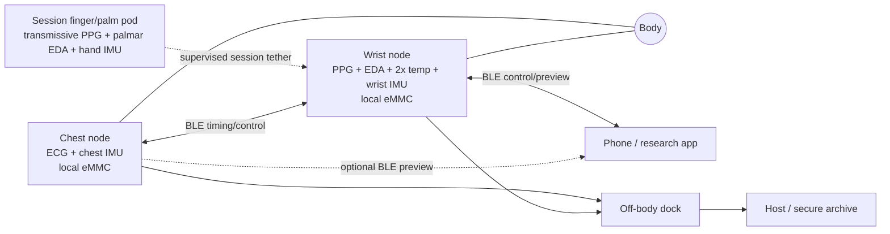
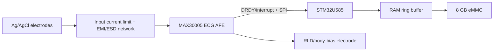
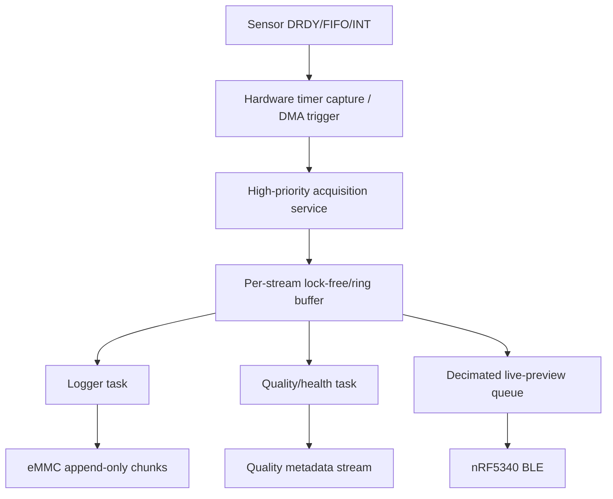
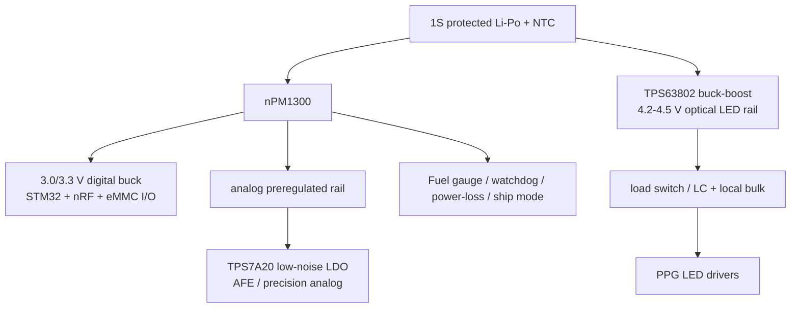
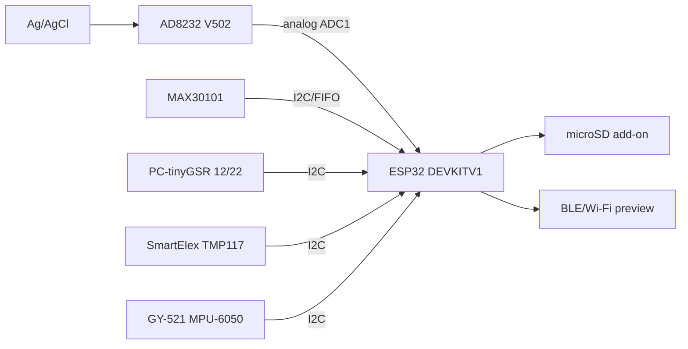
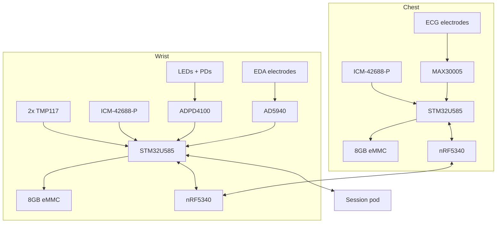
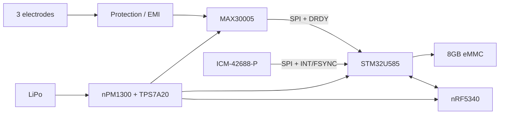
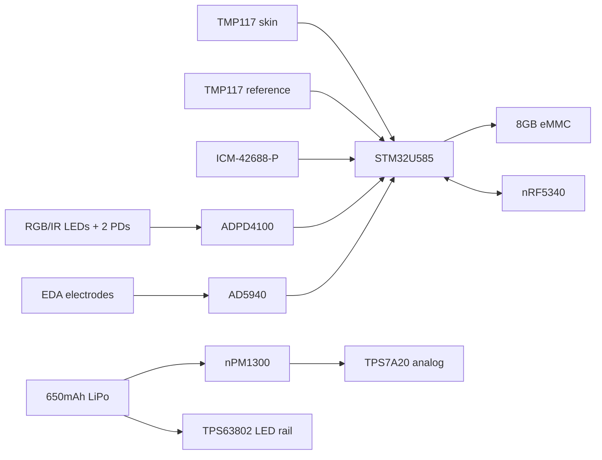
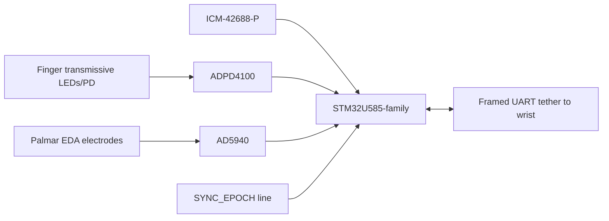

# AUD/SUD High-Confidence Hardware Architecture — Brute-Force Engineering Design

> **Purpose:** engineering-first architecture specification for a multimodal AUD/SUD physiological research platform. This document deliberately optimizes for measurement quality, synchronization, robustness, safety practice, data integrity, reproducibility, and a credible custom-hardware path. It does **not** perform novelty analysis, claim patentability, or make clinical diagnostic claims.
>
> **Primary design decision:** build a synchronized multi-module system consisting of (1) a continuous chest ECG node, (2) a continuous wrist peripheral/autonomic node, (3) a session-only finger/palm reference pod, and (4) an off-body charging/service dock. Preserve native raw data locally on every autonomous node. Use battery-only operation while body-connected. Treat BLE as control/preview, not the authoritative data path.

---

## 1. Executive Summary

### 1.1 Proposed final architecture

The recommended system is **not** a single watch containing every sensor. It is a site-appropriate distributed instrument:

1. **Chest ECG node — REQUIRED for the high-confidence architecture**
   - **Body site:** chest/torso, close to three ECG electrode contacts.
   - **Primary AFE:** **Analog Devices MAX30005** single-lead ECG AFE.
   - **Motion reference:** **TDK InvenSense ICM-42688-P** 6-axis IMU.
   - **Acquisition MCU:** **STM32U585** family, with hardware timers/DMA and SDMMC.
   - **Radio/synchronization coprocessor:** **Nordic nRF5340**.
   - **Local storage:** **8 GB Kingston EMMC08G-CT32 eMMC**.
   - **Power:** 1-cell protected Li-Po, nominal **400 mAh**, **nPM1300** PMIC/charger/fuel gauge, low-noise post-regulation for the analog domain.
   - **Nominal ECG sampling:** **512 SPS, provisionally locked** until the final MAX30005 register set is frozen.
   - **No USB/mains connection during body-connected recording.**

2. **Wrist ambulatory node — REQUIRED**
   - **Body site:** wrist, with sensing functions deliberately split between dorsal electronics and ventral/skin-facing interfaces.
   - **PPG AFE:** **Analog Devices ADPD4100**, custom multi-wavelength reflective optical head.
   - **Optical geometry:** 3 green LEDs + 1 red + 1 IR; two photodiode channels at different source-detector spacings, with opaque optical baffle/gasket.
   - **EDA AFE:** **Analog Devices AD5940** on a custom protected electrode interface, configured first for controlled low-voltage exosomatic skin-conductance acquisition and periodic contact/impedance characterization.
   - **Temperature:** **two TMP117 devices on a thermally isolated flex assembly**, patterned after TI TIDA-060034: one skin-dominant sensor and one reference/system thermal sensor.
   - **Motion reference:** **ICM-42688-P**, mechanically co-located with the optical/skin interface as closely as practical.
   - **Acquisition MCU:** STM32U585 family.
   - **Radio/sync:** nRF5340.
   - **Storage:** 8 GB eMMC.
   - **Power:** nominal **650 mAh** protected Li-Po, nPM1300, low-noise analog rail, separate switched/filtered LED rail.
   - **Nominal rates:** PPG 100 frames/s per optical sequence; EDA 32 SPS; skin/reference temperature 1 SPS each; IMU 200 SPS.

3. **Finger/palm reference pod — RECOMMENDED, session-only**
   - **Purpose:** maximize optical and EDA signal fidelity in controlled/supervised assessment and provide a high-confidence hand/tremor reference.
   - **PPG:** ADPD4100 in **transmissive finger-clip geometry** where practical, using red/IR/green sequences.
   - **EDA:** separate AD5940-based channel connected to standardized palmar/distal-finger Ag/AgCl electrodes.
   - **IMU:** ICM-42688-P on the hand/pod fixture, 200 SPS.
   - **Controller:** compact STM32U585-family device.
   - **Connection:** short detachable battery-domain digital tether to the wrist node carrying power, ground, framed UART, and a dedicated hardware synchronization pulse. No third radio is required in the primary embodiment.
   - **Storage:** local emergency ring buffer in nonvolatile memory plus authoritative mirrored logging at the wrist node during supervised sessions.

4. **Charging/service dock — REQUIRED for the product-oriented architecture**
   - USB-C enters the **dock**, not the worn body-connected path.
   - Worn nodes charge through recessed/pogo contacts only when removed from the body.
   - Dock/service mode handles charging, bulk data extraction, manufacturing/service access and firmware recovery.
   - Firmware and mechanical interlocks prevent normal recording with charging contacts energized.

### 1.2 Why this architecture is technically strong

The architecture follows five recurring lessons from professional physiological systems:

- **measurement physics chooses the body site; industrial design does not override anatomy;**
- **sensitive analog conversion occurs close to the sensing interface;**
- **sample timing originates at hardware conversion/FIFO events, not packet arrival or application loops;**
- **local nonvolatile logging is authoritative; radio is secondary;**
- **motion, contact, lead-off, saturation and thermal state are stored as first-class quality metadata instead of being hidden behind one “stress score.”**

The architecture is intentionally more complex than a one-ESP32 prototype, but each added element solves a measurable problem: dedicated ECG conversion removes MCU-ADC uncertainty; local IMUs provide site-specific artifact/tremor context; dual temperature sensing exposes self-heating; eMMC protects against radio dropout; the nRF5340 coprocessor makes wireless timing/control independent from the deterministic acquisition MCU; and the session pod supplies higher-quality finger/palmar references without forcing that burden into daily wear.

### 1.3 Decision-status vocabulary

- **SELECTED** — part of the proposed primary architecture.
- **SELECTED PROVISIONALLY** — primary choice, but final component value/geometry will be frozen after EVT characterization.
- **ALTERNATIVE** — technically valid second embodiment.
- **PROTOTYPE ONLY** — useful for current development but not preferred final hardware.
- **REJECTED** — not recommended for the primary final architecture.

---

## 2. Scope

This document answers one engineering question:

> If technical quality rather than originality is the overriding objective, what end-to-end physiological hardware should be built for the AUD/SUD project?

It therefore **does** select hardware, body sites, node boundaries, clocks, storage, power, mechanics, raw-data formats, fault behavior and validation requirements. It **does not** state that those decisions are novel or patentable.

Patents are treated only as engineering literature where useful. Existing commercial/reference architectures are deliberately adopted when technically superior.

The system is a **research physiological recorder**. ECG, PPG, EDA, peripheral temperature and inertial data can support research on autonomic, cardiovascular, thermal and motor state, but none of these channels directly measures alcohol or establishes AUD, relapse, craving or withdrawal diagnosis.

---

## 3. Repository Context

The repository establishes a conservative measurement model:

- ECG is an electrical cardiac timing channel; R peaks, RR intervals and HRV are derived only after signal/timing quality is established.
- PPG is a peripheral optical pulse/perfusion channel; pulse-rate variability must not be silently relabeled ECG HRV.
- EDA is a nonspecific sympathetic sudomotor/arousal channel.
- Temperature is peripheral/local context unless the thermal interface is validated.
- IMU is motion/activity/tremor and artifact context; withdrawal-related tremor is plausible research direction but not AUD-specific.
- Multimodal fusion cannot manufacture biochemical alcohol specificity from nonspecific physiological signals.

The repository also repeatedly highlights the engineering tensions this document resolves: chest versus wrist ECG, finger versus wrist PPG, palmar versus wrist EDA, local versus central IMUs, thermal self-heating, body-spanning I²C, local digitization, distributed synchronization, raw-data preservation, and battery-only body operation.

Repository source-of-truth files reviewed in full:

- `docs/hardware_inventory.md`
- `docs/aud_multimodal_hardware_evidence_map.md`
- `docs/aud_sensor_role_definition.md`
- `docs/aud_hardware_form_factor_options.md`
- `docs/aud_novelty_hypothesis_map.md`
- `docs/aud_hardware_reference_solutions.md`

---

## 4. Canonical Current Hardware Inventory

| ID | Exact current hardware | Verified identity / marking | Current role | Final status |
|---|---|---|---|---|
| HW-01 | ESP32 DEVKITV1 | 30-pin; ESP-WROOM-32-family module; Micro-USB; EN/BOOT | controller / logging / transport prototype | **PROTOTYPE ONLY** |
| HW-02 | ProtoCentral PC-tinyGSR legacy board | PCB **12/22**, `BASELINE` trimmer, LM324-family marking visible | relative EDA/GSR | **PROTOTYPE ONLY** |
| HW-03 | CJMCU-8232 AD8232 module | PCB **V502**; OUTPUT, LO+/LO−, SDN, RA/LA/RL | conditioned single-lead ECG into MCU ADC | **PROTOTYPE ONLY** |
| HW-04 | SmartElex MAX30101 PPG/Photodetector board | exposed `INT`; `ADR: 0x52` remains only a silkscreen observation | raw reflective PPG | **PROTOTYPE ONLY / validation fixture** |
| HW-05 | SmartElex TMP117 board | exposed INT, 0x48–0x4B address markings, narrowed sensor area | local/skin-contact temperature experiments | **PROTOTYPE ONLY; IC family retained** |
| HW-06 | GY-521 MPU-6050 | MPU-6050 6-axis module; VCC/GND/SCL/SDA/XDA/XCL/AD0/INT | motion/tremor/artifact | **PROTOTYPE ONLY** |

The inventory is useful because it prevents revision drift. In particular, the legacy tinyGSR is **12/22**, not 11/22, and the CJMCU board is **V502**, not VS82.

---

## 5. Existing Hardware Assessment

| Current hardware | Keep now | Prototype only | Replace in final | Reason |
|---|---:|---:|---:|---|
| ESP32 DEVKITV1 | Yes | **Yes** | **Yes** | Excellent bring-up ecosystem; final design benefits from deterministic acquisition MCU, product PMIC/storage, smaller PCB and explicit radio separation. |
| PC-tinyGSR 12/22 | Yes | **Yes** | **Yes** | Useful relative EDA baseline, but unknown legacy transfer/calibration and board-specific trimmer state are poor foundations for quantitative longitudinal acquisition. |
| AD8232 V502 | Yes | **Yes** | **Yes** | Good first-light analog ECG front end, but exact passives and MCU ADC digitization cap reproducibility; MAX30005 gives integrated precision conversion, lead-off, RLD and self-test. |
| SmartElex MAX30101 | Yes | **Yes** | **Yes for final wrist optics** | Valid raw PPG prototype; final custom optics need better ambient rejection, geometry control, multi-PD flexibility and mechanical integration. |
| SmartElex TMP117 | Yes | **Yes** | Board replaced; **TMP117 retained** | The IC is strong; the product needs a custom dual-sensor flex thermal path. |
| MPU-6050 | Yes | **Yes** | **Yes** | Adequate for V1; final uses ICM-42688-P for lower noise, deeper FIFO, timestamp/FSYNC and modern supply. |

---

## 6. System Requirements

### 6.1 Physiological requirements

1. Continuous single-lead chest ECG with reliable beat timing and explicit lead/contact state.
2. Continuous reflective wrist PPG with raw multi-wavelength optical data and local motion context.
3. Continuous wrist EDA for longitudinal peripheral sudomotor context; standardized palmar/finger EDA available in controlled sessions.
4. Peripheral skin-temperature context with measured self-heating/reference channel.
5. Local inertial data at each mechanically independent primary sensing site.
6. Controlled-session finger PPG and hand IMU for higher-fidelity optical/tremor characterization.

### 6.2 Electrical requirements

- Sensitive analog front ends remain physically local to electrodes/photodiodes.
- High-current optical LED return loops are confined away from ECG/EDA analog references.
- Body-spanning analog lines and body-spanning I²C are prohibited in the final architecture.
- Every high-rate sensor uses SPI/FIFO/DRDY/interrupt paths where available.
- No mains-referenced connection during body-connected recording.

### 6.3 Timing requirements

- Every stream has a local monotonic hardware timebase.
- Sample timing is anchored to conversion/FIFO/DRDY events.
- Cross-node synchronization uses hardware timer/radio-event capture, not host receive time.
- Design target: **≤0.5 ms 99th-percentile cross-node residual timestamp error over normal synchronized operation**, to be validated, not assumed.
- Any PAT-like analysis is prohibited unless the measured synchronization error is explicitly included in the uncertainty budget.

### 6.4 Data requirements

- Native raw data is first-class.
- Local storage is authoritative.
- Sequence counters and explicit gap records make loss observable.
- Configuration, calibration and board identity are recorded with every session.
- Files recover cleanly after abrupt power loss.

### 6.5 Mechanical requirements

- Chest AFE close to electrodes.
- PPG contact pressure repeatable and optically shielded.
- EDA electrode material/area/spacing controlled.
- Temperature sensor thermally isolated from processor/battery/regulators/LEDs.
- IMUs rigidly coupled to the body segment whose motion they represent.
- Sweat, strain relief, cleaning and repeated don/doff must be engineered.

### 6.6 Ambulatory requirement

The continuous configuration is **chest + wrist**. The hand/finger pod is not required for ordinary daily wear.

---

## 7. Best Existing Reference Architectures

| System | Sensors / architecture | Storage | Radio | Main strengths | Main weakness for this project | What we adopt |
|---|---|---|---|---|---|---|
| Analog Devices MAXREFDES100 | MAX30101 PPG + MAX3000x ECG + temp + IMUs + MCU | local flash | BLE/USB | manufacturer-tested multimodal stack, full design assets, ECG guidance | older components; no EDA | dedicated AFE, interrupt acquisition, local log, battery-body discipline |
| MAXREFDES104 | modern PPG/ECG wearable + temperature flex | flash | BLE/USB | modern wrist integration and metal-coupled skin-temp flex | not our site split | optical/mechanical/thermal construction principles |
| MAXREFDES106 / MAXREFDES282 | chest patch ECG/PPG/BioZ + IMU + dual temperature | flash | BLE | chest patch mechanics, local sensors, skin/ambient temp | different modality priorities | chest local digitization, temp/mechanical partition |
| HealthyPi 5 | RP2040 acquisition/storage + ESP32-C3 radio | microSD | BLE/Wi-Fi | explicit acquisition MCU / RF copro separation | bench/research form factor | ownership boundary and framed inter-MCU transport |
| HealthyPi Move | ECG + wrist/finger PPG + EDA + temp + BMI323, nRF5340 | QSPI flash | BLE/USB | very close modality set, open HW/FW, finger/wrist partition | ECG/body site and product choices differ | modular sensor boards, nRF/Zephyr ideas, raw storage |
| EmotiBit | MAX30101 + EDA + temp + IMU on ESP32-capable platform | microSD | Wi-Fi | open buffers, raw data, multimodal concurrency | no chest ECG; current design not our final mechanics | per-stream buffers, loss-aware local logging |
| Empatica EmbracePlus | wrist PPG + EDA + temp + IMU | platform storage | wireless | professional wrist sensor/contact architecture | proprietary internals; no continuous chest ECG | ventral EDA concept, skin-contact discipline |
| Shimmer3R GSR+ | EDA + optical pulse + IMU | microSD | Bluetooth | research raw data, standardized EDA workflows | proprietary detail | quantitative EDA/placement/validation expectations |
| TI TIDA-060034 | dual TMP117 on flex | n/a | n/a | exact thermal compensation/body interface precedent | hearable rather than wrist | dual-sensor thermal island |
| ADPD4100 PPG evaluation | 3 green + red + IR, discrete optical head | host | wired eval | flexible modern optical AFE, baffle/reference design | needs custom mechanics/algorithm validation | LED/PD architecture, synchronous slots, ambient rejection |

---

## 8. Engineering Lessons Adopted From Existing Systems

### Mandatory reference-design adoption table

| Subsystem | Best external precedent/reference | What it does well | What we adopt | What we change |
|---|---|---|---|---|
| ECG AFE | MAX30005/MAX86176 family; MAXREFDES100/MAXREFDES chest designs | high-Z low-noise biopotential AFE, lead-off, RLD, self-test | integrated ECG digitization and local AFE placement | use ECG-only MAX30005 on dedicated chest node |
| Optical PPG | ADPD4100 eval + MAX86141/MAXREFDES103 | controlled LED sequencing, ambient rejection, FIFO, optical baffle | discrete LED/PD custom optical head, FIFO acquisition, local IMU | two PD distances and project-specific wrist/finger mechanics |
| Wrist EDA | EmbracePlus/Shimmer; AD5940 EDA examples | professional skin interface and quantitative impedance architecture | controlled electrode geometry, dedicated AFE, periodic contact state | custom human-connected protection; no direct reuse of eval-board body wiring |
| Temperature | TI TIDA-060034; MAXREFDES104/106 | thermally isolated flex, dual/reference sensing, metal skin interface | two TMP117 sensors and thermal-island mechanics | wrist-specific contact mass and reference placement |
| IMU | ICM-42688-P / HealthyPi Move BMI323 | modern FIFO/timing/low-noise motion acquisition | local FIFO IMU at chest/wrist/hand | ICM-42688-P selected for external clock/FSYNC and noise performance |
| Controller partition | HealthyPi 5 | acquisition MCU isolated from RF MCU | STM32 acquisition/storage + nRF radio/sync boundary | product storage uses eMMC; BLE only on worn nodes |
| Storage | HealthyPi/EmotiBit/local-flash ADI designs | radio-independent authoritative logging | local managed flash, bounded queues, recoverable files | 8 GB eMMC per autonomous node |
| Sync | Nordic hardware timer/radio event techniques; body sensor networks | peripheral-linked hardware timestamps | radio-event capture + affine drift model + local hardware capture | explicit nRF→STM32 sync GPIO bridge and stored uncertainty |
| Safety workflow | ADI ECG references + ProtoCentral practice | battery operation and avoidance of mains paths | body-connected battery-only operation, off-body charging | dedicated dock and firmware interlocks |

---

## 9. Architecture Alternatives Considered

| Architecture | Measurement quality | Wear burden | Timing simplicity | Key failure | Decision |
|---|---:|---:|---:|---|---|
| Single wrist all-in-one | Medium | Low | High | continuous ECG and palmar EDA compromised by site | **REJECTED** as high-confidence primary |
| Wrist + chest | High | Medium | Medium | no high-fidelity finger/palmar reference | **SELECTED as ambulatory core** |
| Chest + wrist + permanent finger module | Very high | High | Medium | unacceptable continuous hand burden | **REJECTED as daily configuration** |
| Chest + wrist + session-only finger/palm pod | **Very high** | Medium daily / high only in sessions | Medium | more modules and sync design | **SELECTED** |
| One central belt controller with long cables | High on bench | High | High | cable artifacts, body-spanning buses, poor mechanics | **PROTOTYPE ONLY** |
| Every sensor as independent BLE node | High | Very high | Low | batteries/radios/pairing multiply failure modes | **REJECTED** |

---

## 10. Selected Architecture

**SELECTED:** a two-node continuous ambulatory system with a wired session accessory.

- **Chest node:** ECG + local IMU.
- **Wrist node:** PPG + EDA + dual temperature + local IMU.
- **Session pod:** transmissive finger PPG + palmar EDA + hand IMU.
- **Dock:** charging/service/offload.
- **Phone/tablet:** control, annotation, live preview; never the only recorder.

The architecture intentionally does **not** make the wrist the universal sensing site. The system can operate in multiple modes without changing the scientific meaning of a channel.

---

## 11. Physical System Architecture



### Mandatory body-placement table

| Modality | Selected body site | Alternative | Reason | Continuous or session-only |
|---|---|---|---|---|
| ECG | chest/torso | patch below clavicle / chest strap | best passive single-lead contact and short electrode path | **Continuous** |
| PPG | wrist reflective | ear | lowest daily burden; multi-PD optics + local IMU mitigate but do not eliminate wrist limitations | **Continuous** |
| PPG reference | finger transmissive | earlobe | high optical quality and repeatable supervised fixture | **Session-only** |
| EDA | ventral wrist/strap electrodes | palmar | continuous practicality | **Continuous** |
| EDA reference | distal index/middle finger / palm | thenar/hypothenar | stronger eccrine density and conventional controlled placement | **Session-only** |
| Temperature | ventral wrist skin-facing flex | upper arm/torso | peripheral context; mechanically integrable with wrist | **Continuous** |
| IMU — chest | chest node | upper torso | ECG-interface movement + posture/trunk reference | **Continuous** |
| IMU — wrist | wrist near optics | hand | PPG/EDA local artifact + activity | **Continuous** |
| IMU — hand | finger/palm pod | dedicated hand strap | tremor/reference and session artifact | **Session-only** |

---

## 12. Module Overview

### Mandatory module-partitioning table

| Module | Sensors | MCU | Storage | Power | Communication | Mechanical form |
|---|---|---|---|---|---|---|
| Chest node | MAX30005 ECG; ICM-42688-P | STM32U585 + nRF5340 | 8 GB eMMC | 1S Li-Po ~400 mAh; nPM1300 | BLE + hardware sync bridge; dock USB off-body | low-profile chest pod/patch or strap-mounted pod, short electrode flex |
| Wrist node | ADPD4100 optical head; AD5940 EDA; 2×TMP117; ICM-42688-P | STM32U585 + nRF5340 | 8 GB eMMC | 1S Li-Po ~650 mAh; nPM1300; separate LED buck-boost | BLE; short digital tether to session pod; dock | dorsal electronics pod + ventral sensor flex/strap |
| Finger/palm pod | ADPD4100 transmissive PPG; AD5940 EDA; ICM-42688-P | STM32U585-family compact variant | small emergency nonvolatile buffer | powered from wrist during session | framed UART + dedicated sync pulse | finger clip + light hand/palmar lead fixture |
| Dock | no physiological sensors | service MCU optional | host storage | USB-C 5 V | USB to host; pogo/pad contacts | off-body charger/offloader |

---

## 13. Chest/ECG Module

### 13.1 Required function

Produce continuous, high-integrity single-lead electrical cardiac timing while recording the mechanical state of the chest interface.

### 13.2 Selected ECG AFE — MAX30005

**Status: SELECTED.**

Rationale:

- integrated high-resolution ECG conversion avoids the classic ESP32 ADC entirely;
- >1 GΩ input impedance and high CMRR reduce electrode/contact sensitivity;
- large electrode DC-offset tolerance improves motion/electrode robustness;
- integrated EMI filtering, AC/DC lead-off, right-leg drive, lead-on and self-test are exactly the functions a serious wearable ECG node needs;
- low-power wearable orientation is better aligned with continuous single-lead chest ECG than a general-purpose lab ADC.

**Alternative:** ADS1292R when a two-channel 24-bit research AFE, respiration channel or very open reference ecosystem is more valuable than compact wearable optimization.

**Prototype only:** CJMCU V502 AD8232 → ESP32 ADC.

### 13.3 Electrodes

Primary research embodiment:

- three disposable pre-gelled Ag/AgCl snap electrodes;
- two measurement electrodes spanning a stable chest vector;
- third RLD/body-bias electrode;
- the pod or a short flexible tail sits close enough that electrode wires do not become long moving antennas.

Dry textile electrodes are an **ALTERNATIVE**, not the first validation baseline. Dry-contact operation should be compared side-by-side against Ag/AgCl before adoption.

### 13.4 Input protection and layout

- symmetric series input resistance and EMI filtering copied from AFE manufacturer guidance;
- ESD protection chosen for extremely low leakage/capacitance at the electrode inputs;
- no general-purpose TVS with uncontrolled leakage placed directly across the high-impedance input;
- RLD loop components physically close to AFE;
- guard/noisy digital traces kept away from electrode input pins;
- controlled return path and uninterrupted ground reference under digital portions, while electrode input routing is isolated spatially from RF/LED/power-switching currents.

Values are frozen only after the MAX30005 evaluation circuit, electrode type and required ECG bandwidth are simulated/measured. This is a safety-sensitive analog network and must not be invented from generic internet schematics.

### 13.5 Chest IMU

**ICM-42688-P at 200 SPS, SELECTED.**

Uses:

- chest-pod motion state;
- posture/activity context;
- ECG-interface motion annotation;
- debugging electrode/cable artifact.

It is not used to “correct” ECG invisibly. Raw motion remains in the file and derived quality flags remain reversible.

---

## 14. Wrist/Ambulatory Module

The wrist node carries the sensors whose continuous value outweighs the site compromise: reflective PPG, longitudinal EDA, peripheral temperature and local motion.

### 14.1 Mechanical partition

- **Dorsal pod:** MCU, radio, eMMC, PMIC, battery and antenna.
- **Skin-facing optical island:** LEDs/photodiodes + ADPD4100 on/near a rigid sensor PCB.
- **Ventral strap/flex:** EDA electrodes and temperature island.
- **Thermal moat:** narrow flex neck / low-copper bridge between TMP117 skin sensor and hot electronics.
- **Antenna region:** opposite the body-facing analog/optical cluster as geometry allows, with defined keepout.

### 14.2 Why EDA and temperature move into the strap

The dorsal enclosure is a poor place to put every skin interface. Moving EDA contacts and temperature onto a controlled ventral/flex region allows:

- more skin area;
- physical separation from battery/MCU heat;
- better contact consistency;
- reduced optical/electrical crosstalk;
- serviceable strap variants.

---

## 15. Finger/Hand/Reference Module

**Status: SELECTED as a supervised-session accessory, not required for ambulatory wear.**

### 15.1 Purpose

The pod exists because the wrist is convenient but not the best site for every modality. It supplies:

- high-fidelity finger PPG with controlled pressure/ambient light;
- palmar/finger EDA with standardized Ag/AgCl electrodes;
- hand-local IMU for tremor and artifact context;
- an explicit high-quality reference during calibration/assessment sessions.

### 15.2 Mechanical implementation

A reusable clip encloses the distal finger. The LED side and photodiode side are opposed in transmissive geometry where feasible. An opaque elastomer shroud blocks ambient light. A spring/compliant mechanism defines a bounded contact force; the final spring rate is selected by optical DOE so it does not occlude perfusion.

EDA electrodes are **not** integrated into the optical clip if that compromises either interface. They attach to standardized palmar/distal finger locations with strain-relieved leads.

### 15.3 Why tethered to the wrist

A short session-only tether is stronger than adding a third BLE radio/battery because it:

- creates a deterministic hardware synchronization path;
- reduces charging/pairing burden;
- keeps the pod lighter;
- provides a direct data route to the wrist logger;
- remains physically acceptable during supervised sessions.

The tether carries only battery-domain low-voltage power and digital signals; it never exposes a mains path.

---

## 16. Sensor Selection

### Mandatory component-selection table

| Function | Current component | Selected final component | Alternatives | Decision rationale |
|---|---|---|---|---|
| ECG AFE | AD8232 V502 + ESP32 ADC | **MAX30005** | MAX30001, ADS1292R | integrated wearable precision ADC, lead-off/RLD/self-test, large electrode-offset tolerance |
| Wrist PPG | MAX30101 breakout | **ADPD4100 + discrete optical head** | MAX86141, AFE4950, MAX86176 | flexible LED/PD geometry, strong ambient rejection, programmable timeslots, FIFO, current recommended design |
| Session PPG | MAX30101 finger fixture | **ADPD4100 in transmissive clip** | AFE4404, MAX86141 | common driver/AFE architecture with wrist but different mechanics |
| EDA | legacy PC-tinyGSR 12/22 | **AD5940 custom EDA AFE** | calibrated discrete 0.5 V CV AFE + precision ADC; tinyGSR v3 | quantitative programmable impedance/conductance path and contact characterization |
| Skin temperature | SmartElex TMP117 | **2× TMP117 custom flex** | MAX30208 | exact body-temperature reference precedent; dual/reference approach |
| IMU | MPU-6050 | **ICM-42688-P** | BMI323, LSM6DSV16X | modern FIFO, low noise, high-rate SPI, timestamp/FSYNC capability |
| Acquisition MCU | ESP32 DEVKITV1 | **STM32U585** | nRF5340-only, STM32U5 sibling | DMA/timers, SDMMC/eMMC, security, memory, low-power headroom |
| Radio/sync | ESP32 Wi-Fi/BLE | **nRF5340** | nRF52840, future nRF54 | dedicated network core, BLE, timers/DPPI, mature reference layout |
| Local storage | none | **Kingston EMMC08G-CT32 8 GB** | industrial microSD, ISSI/Kioxia eMMC | managed NAND, enough week-scale raw capacity, SDMMC interface |
| PMIC | dev-board regulator/USB | **nPM1300** | MAX20360-class PMIC | charger + fuel gauge + bucks/LDOs + watchdog + power-loss + ship mode |
| Low-noise analog rail | dev-board 3.3 V | **TPS7A20** | LT3042-class where space/power allow | low noise/high PSRR post-regulation |
| Optical LED rail | shared 3.3 V | **TPS63802** buck-boost, provisionally 4.5 V | newer TPS631000-class | stable LED headroom across Li-Po discharge, load disconnect |

### 16.1 ECG

- **Goal:** reliable R-wave timing, morphology sufficient for signal-quality and research analyses; no diagnostic claim.
- **Selected AFE:** MAX30005.
- **Rate:** 512 SPS provisional.
- **Body site:** chest.
- **Data:** raw signed ECG code + lead-off/RLD/status + calibration events.

### 16.2 PPG

- **Goal:** raw pulse waveform, pulse timing/perfusion/morphology research and quality context.
- **Selected AFE:** ADPD4100.
- **Wavelengths:** green, red, IR.
- **Wrist frame rate:** 100 Hz optical frames.
- **Finger reference:** 200 Hz provisional during high-fidelity sessions.
- **No SpO2 claim** without system-level calibration/validation.

### 16.3 EDA

- **Goal:** quantitative, repeatable skin-conductance/impedance-related acquisition with explicit contact state.
- **Selected AFE:** AD5940.
- **Primary wrist output:** conductance/current-derived raw channel at 32 SPS after calibrated transfer.
- **Session output:** palmar/finger EDA at 32 SPS.
- **Excitation:** start from low-voltage exosomatic constant-voltage behavior equivalent to established ~0.5 V DC GSR practice; exact drive and current-limiting network is frozen through safety/linearity validation.
- **Periodic contact mode:** low-duty diagnostic impedance measurement may be used to distinguish contact/electrode problems from physiology; it must be time-multiplexed and marked in raw data.

### 16.4 Temperature

- **Goal:** repeatable peripheral skin-temperature context, not core-temperature inference.
- **Selected:** two TMP117s at 1 SPS.
- **Sensor A:** skin-facing flex island.
- **Sensor B:** reference/system thermal node mechanically close enough to model heat leakage but not sharing the same skin contact.
- **Store both raw temperatures.** Any compensated estimate is derived, versioned data.

### 16.5 IMU

- **Goal:** local motion/artifact, gross activity, orientation changes, tremor characterization.
- **Selected:** ICM-42688-P.
- **Rate:** 200 SPS accel + gyro in continuous high-quality mode; lower-power modes may be added later but must be metadata-visible.

---

## 17. ECG Analog Front End

### 17.1 Signal chain



### 17.2 Bandwidth/configuration

Initial research configuration should preserve a broad raw ECG suitable for beat timing and waveform-quality inspection. The exact high-pass/low-pass and digital decimation configuration is frozen during EVT against an ECG simulator and human reference. The firmware must record every AFE register image in the session manifest.

### 17.3 Lead-off and contact

Lead-off state is sampled and logged continuously or at the AFE-supported status cadence. It becomes a quality flag; it is not merely used to blank the waveform. A lead transition generates an event record with local timestamp.

### 17.4 Saturation and recovery

The logger records:

- ADC saturation/clipping flag;
- lead-off state;
- calibration/self-test state;
- RLD fault/state;
- reset/configuration epoch.

A derived ECG quality engine may later compute baseline wander, mains ratio and high-frequency noise, but the underlying samples are preserved.

---

## 18. PPG Optical Front End

### 18.1 Selected optical head

**ADPD4100 + discrete LEDs/photodiodes.**

Wrist geometry begins with a manufacturer-like optical set:

- three green LEDs distributed around the detector area;
- one red LED;
- one IR LED;
- two photodiode channels at different source-detector distances;
- black/opaque internal baffle between emitters and detectors;
- matte black light well/gasket around the skin interface.

### 18.2 Why two detector distances

Two spatial paths create useful redundancy:

- near channel: higher signal amplitude and shallower optical path;
- farther channel: potentially different tissue/perfusion sensitivity;
- disagreement between channels is a real signal-quality cue;
- a second detector can reveal local lift/tilt that one photodiode cannot distinguish from physiology.

This is **SELECTED PROVISIONALLY**: exact spacings are not invented now. A mechanical/optical DOE should sweep approximately 4–10 mm effective source-detector distances and choose the best geometry for usable-data yield across skin/contact conditions.

### 18.3 LED current and sequence

LED current, pulse width, ADC integration time and gain are adaptive **within bounded validated profiles**. Firmware may select among predefined optical profiles based on saturation/perfusion, but every profile change is timestamped.

Raw storage retains:

- each photodiode × wavelength sample;
- dark/ambient slots used by the AFE;
- LED current code;
- integration time/gain;
- overflow/saturation flags;
- local IMU data.

### 18.4 Contact pressure

The primary product does not add a fragile force-sensitive resistor by default. Instead it controls pressure mechanically with a compliant strap/backing and infers contact quality from:

- PPG DC level;
- AC/DC ratio;
- inter-photodiode agreement;
- ambient/dark level;
- local IMU;
- skin temperature stabilization.

A dedicated pressure sensor is **ALTERNATIVE / validation instrument**, to be promoted only if it materially improves quality classification.

---

## 19. EDA Front End

### 19.1 Topology

The final EDA system is a **dedicated calibrated AFE**, not a legacy relative GSR breakout.

```text
EDA electrode A ─ protection/current-limit ─┐
                                            │
                                       AD5940 AFE
                                            │
EDA electrode B ─ protection/current-limit ─┘
                  ↓
      calibrated excitation + current measurement
                  ↓
 raw impedance/conductance-related samples + contact state
```

### 19.2 Continuous mode

Initial selected physiological mode:

- exosomatic low-voltage constant-voltage skin conductance measurement;
- target excitation approximately **0.5 V**, consistent with established GSR research-platform practice;
- 32 output samples/s;
- bandwidth deliberately limited to the EDA domain;
- store raw ADC/current data before tonic/phasic decomposition.

### 19.3 Contact characterization

At configurable low duty cycle, the AFE can perform an impedance/contact check. This diagnostic interval is explicitly flagged so it cannot be mistaken for normal EDA physiology.

### 19.4 Electrode interface

- Wrist: two broad, smooth, corrosion-resistant ventral strap contacts. Start with silver-coated stainless steel or 316L test coupons; lock material only after polarization/contact/drift testing.
- Session pod: pregelled Ag/AgCl electrodes with controlled area and spacing on distal finger/palmar sites.
- Cable/flex strain relief prevents electrode motion from loading the analog input.

### 19.5 Safety boundary

The AD5940 evaluation EDA example is an instrumentation reference, not permission to connect an evaluation board directly to a human. The custom human-connected design requires independent current-limiting, fault analysis, ESD protection and battery-only operation. No compliance claim follows from using an AFE marketed for bioimpedance.

---

## 20. Temperature Interface

### 20.1 Physical stack

```text
skin
  ↓
thin controlled thermal interface / small metal puck
  ↓
TMP117-A on small low-mass flex island
  ↓
narrow flex thermal neck / minimal copper
  ↓
strap flex
  ↓
TMP117-B reference/system sensor
  ↓
main wrist electronics kept physically separated
```

### 20.2 Design intent

TMP117-A should become **skin-dominant** after a characterized settling interval. TMP117-B exists to expose whether enclosure/electronics/ambient changes are driving the apparent skin value.

No firmware is allowed to output a single “skin temperature” value without retaining both raw sensors and the thermal-stability state.

### 20.3 Thermal quality flags

- `TEMP_CONTACT_TRANSIENT`
- `TEMP_NOT_STABILIZED`
- `TEMP_SYSTEM_GRADIENT_HIGH`
- `TEMP_REFERENCE_STEP`
- `TEMP_SENSOR_FAULT`

---

## 21. IMU Architecture

### 21.1 Why multiple IMUs are justified

One IMU cannot represent motion simultaneously at chest electrodes, wrist optical/EDA contact and the hand. Therefore:

- chest IMU is part of the chest node;
- wrist IMU is part of the wrist node;
- session hand IMU is part of the reference pod.

This is not redundant complexity: each sensor measures a different mechanical interface and therefore has a different artifact interpretation.

### 21.2 Configuration

Initial settings:

- accelerometer: ±4 g for controlled/resting work, with adaptive or predefined ±8/16 g profile for activity sessions;
- gyroscope: ±500 dps starting point;
- ODR: 200 Hz;
- anti-alias/filter configuration recorded in manifest;
- FIFO enabled;
- hardware interrupt and timestamp/FSYNC used.

### 21.3 Tremor

A 200 Hz IMU rate comfortably preserves the repository’s withdrawal-tremor frequency region of interest while leaving room for harmonics and artifact characterization. Tremor output remains a motor measurement, not a withdrawal diagnosis.

---

## 22. MCU / Processing Architecture

### 22.1 Acquisition MCU — STM32U585

**Status: SELECTED.**

Why it exists:

- SDMMC gives a clean eMMC interface;
- abundant DMA, SPI, I²C, UART and timers support independent sensor pipelines;
- 32-bit timers allow hardware event capture;
- memory is sufficient for large bounded ring buffers;
- TrustZone/HUK/crypto support signed firmware and encrypted storage metadata;
- power modes are appropriate for wearable duty cycling.

The product board should use a compact STM32U585 package; advanced prototypes can use easier-to-assemble packages before miniaturization.

### 22.2 Radio/synchronization MCU — nRF5340

**Status: SELECTED.**

Why a second MCU is justified rather than “random complexity”:

- radio timing and BLE stack cannot preempt the physiological acquisition MCU;
- hardware timer/DPPI/radio-event capture is valuable for distributed synchronization;
- the radio processor can reboot/update independently while the acquisition side preserves data;
- this pattern is already proven conceptually by HealthyPi 5’s acquisition/RF split;
- the nRF5340 network core isolates much of the radio stack internally as well.

### 22.3 Inter-MCU link

- primary: high-speed SPI with DMA and framed messages;
- separate GPIO lines: `SYNC_EPOCH`, `RADIO_HEALTH`, `ACQ_WAKE`, `FAULT`;
- no sensor samples are owned only by the radio MCU;
- the acquisition MCU is the owner of raw data and storage.

---

## 23. Acquisition Architecture

### 23.1 Ownership

Each sensor has exactly one acquisition owner: the STM32U585 of its node.

### 23.2 Pipeline



### 23.3 Buffer sizing strategy

Buffers are sized to survive **at least 2 seconds of worst-case storage latency** without sample loss, then doubled where RAM permits.

Approximate raw throughput:

- chest ~3.94 kB/s;
- wrist ~4.33 kB/s;
- even a 4-second raw buffer per node is <20 kB, so there is no excuse for tiny queues.

Recommended per-stream buffers:

- ECG: ≥4096 samples;
- wrist PPG: ≥2 seconds of all PD/wavelength slots;
- IMU: ≥2048 frames;
- EDA/temp: ≥256 samples;
- logger staging: 32–128 kB double buffers aligned to eMMC writes.

### 23.4 Backpressure

Wireless congestion never propagates to acquisition. Preview packets are dropped first. Storage queue overflow is a critical fault and produces a gap/error record; acquisition continues where possible rather than blocking on a failed write.

---

## 24. Timing Architecture

### 24.1 Local master timebase

Every node maintains a free-running **32-bit or extended 64-bit hardware timer** referenced to its high-frequency crystal. The acquisition firmware extends counter rollover in software without resetting the hardware timer during a session.

### 24.2 Timestamp levels

1. **Sensor conversion time** — defined by AFE/IMU clock and configured cadence.
2. **Hardware event time** — timer capture on DRDY/FIFO/sync edge.
3. **Buffer enqueue time** — diagnostic only.
4. **Storage commit time** — diagnostic only.
5. **Host receive time** — transport metadata only, never substituted for sample time.

### 24.3 FIFO sensors

For FIFO bursts, the newest or defined anchor sample is associated with a captured hardware event; earlier samples are back-calculated using the configured hardware sample period. FIFO overflow counters are stored.

---

## 25. Distributed Synchronization

### 25.1 Primary architecture

The **wrist nRF5340 is session time master**. Chest and wrist nRF radios exchange periodic sync frames. Radio events are coupled to hardware timer capture using DPPI/PPI-style peripheral interconnect, avoiding ISR-arrival timestamps.

Each nRF generates a local `SYNC_EPOCH` GPIO edge at a precisely scheduled timer compare. That edge is captured by the local STM32 hardware timer. Therefore the time mapping chain is:

```text
wireless radio event
→ nRF hardware timer capture
→ scheduled nRF timer compare
→ SYNC_EPOCH GPIO edge
→ STM32 input-capture timer
→ node acquisition timebase mapping
```

### 25.2 Clock model

For every synchronization interval the host/node estimates:

`T_master = a * T_local + b`

where:

- `b` = offset;
- `a` = relative clock-rate/drift term.

The raw sync observations are stored so a better offline estimator can be applied later.

### 25.3 Sync cadence

- start-of-session burst: 10+ sync observations;
- steady state: nominal **1 Hz** sync event;
- after RF outage: burst resynchronization;
- end-of-session sync burst.

### 25.4 Drift implication

If two free-running oscillators can differ by 40 ppm relative, unsynchronized alignment can drift roughly:

- 40 µs/s;
- 2.4 ms/min;
- 144 ms/hour.

That is unacceptable for ECG↔PPG timing research, so offset-only synchronization is insufficient.

### 25.5 Acceptance targets

Engineering target, to be verified on hardware:

- cross-node residual error after mapping: **≤0.5 ms at the 99th percentile** during normal synchronized operation;
- no unreported sync discontinuity;
- sync quality flag includes estimated uncertainty;
- if error exceeds 1 ms, PAT-like outputs are marked invalid unless the analysis explicitly tolerates it.

### 25.6 Session pod synchronization

The tethered pod receives a wrist-generated hardware sync pulse directly, captured by its MCU timer. This should provide significantly tighter and easier-to-validate alignment than wireless; the design target is **<100 µs**, verified with a logic analyzer.

---

## 26. Local Storage Architecture

### 26.1 Selected storage

**Kingston EMMC08G-CT32, 8 GB eMMC 5.1, SELECTED PROVISIONALLY.**

Why:

- managed NAND hides raw bad-block/ECC complexity from application firmware;
- 8 GB comfortably covers week-scale raw storage per node under the selected rates;
- SDMMC interface avoids the connector/mechanical vulnerability of a removable microSD in the product;
- commercial availability and small BGA package are appropriate for integrated hardware.

### 26.2 File organization

Each node uses an append-only session structure:

```text
/session_<uuid>/
  manifest.cbor
  stream_0001.bin
  stream_0002.bin
  events.bin
  sync.bin
  faults.bin
  commit.log
```

Files rotate by a fixed size or time interval (for example 32–64 MB or 30–60 minutes) so one corrupted tail does not jeopardize a whole day.

### 26.3 Power-loss resilience

- preallocate data extents where practical;
- use fixed-size chunk headers + CRC32C;
- after a chunk is fully written, append a small commit record;
- on boot, scan only from the last committed chunk;
- nPM1300 power-loss warning triggers immediate close/commit attempt;
- no large in-memory-only write cache may contain seconds of uncommitted physiological data.

---

## 27. Wireless Architecture

### 27.1 Worn nodes

**BLE only** in the primary wearable architecture.

BLE functions:

- pairing/session control;
- clock/synchronization messages;
- battery and health state;
- decimated live preview;
- event/annotation transport;
- small configuration changes.

Full-rate raw data remains local.

### 27.2 Why no Wi-Fi in worn nodes

Wi-Fi is rejected for the primary worn nodes because it adds peak current, coexistence complexity and RF/power noise without solving the core requirement. High-rate transfer happens in the dock or slowly over BLE when needed.

### 27.3 Dock transfer

USB is preferred for bulk offload. A dock-side Wi-Fi bridge is an **OPTIONAL** convenience because it is no longer electrically connected to a person during service.

---

## 28. Data Format

### 28.1 Binary block

Every data block contains:

```text
magic                u32
schema_version       u16
header_length        u16
module_id            u32
sensor_stream_id     u16
config_epoch         u16
sequence_start       u64
local_time_anchor    u64   # hardware timer ticks or ns/us scale
sample_period_q32    u64   # fixed-point period where regular
sample_count         u16
payload_format       u16
status_flags         u32
sync_epoch_id        u32
sync_uncertainty_us  u16
payload_length       u32
payload[...]               # packed native raw samples
crc32c               u32
```

### 28.2 Manifest

`manifest.cbor` stores:

- device/module serials;
- PCB revision and BOM revision;
- firmware hashes for STM32 and nRF;
- AFE register images;
- optical LED/current/timing profiles;
- IMU ranges/filter/ODR;
- EDA excitation/calibration constants;
- temperature sensor serial/calibration data;
- electrode/strap/pod configuration;
- battery state at start;
- calibration/reference equipment IDs;
- session start wall clock plus monotonic epoch;
- pseudonymous participant/session ID if approved for human research.

---

## 29. Sensor Quality Metadata

Quality metadata is stored alongside raw data, not used to delete it.

### 29.1 ECG

- lead-off per electrode;
- RLD state;
- ADC clipping/saturation;
- baseline-wander estimate;
- mains-band power estimate;
- high-frequency noise estimate;
- local chest-motion state;
- AFE reset/config event.

### 29.2 PPG

- detector saturation;
- LED current profile;
- ambient/dark level;
- AC/DC ratio;
- two-PD agreement;
- pulse periodicity confidence;
- local wrist motion;
- optical-contact state;
- thermal stabilization/perfusion context.

### 29.3 EDA

- open/short/out-of-range;
- electrode contact/impedance state;
- excitation profile;
- saturation;
- long-term drift indicator;
- local movement;
- diagnostic impedance-measurement window flag.

### 29.4 Temperature

- skin/reference difference;
- stabilization timer;
- electronics activity state;
- contact-loss transition;
- sensor CRC/fault state if available.

### 29.5 IMU

- range/profile;
- clipping per axis;
- FIFO overflow;
- timestamp discontinuity;
- mounting/orientation configuration epoch.

---

## 30. Power Architecture

### 30.1 Overall tree



### 30.2 Ground strategy

Use one low-impedance ground system, **not arbitrary split ground planes**. Separation is primarily by placement and current-loop control:

- ECG/EDA analog section isolated physically from switchers/RF;
- PPG LED return loop short and local;
- converter hot loops compact;
- antenna keepout respected;
- no high-current LED/battery traces traverse the ECG input area;
- analog rails post-regulated and locally decoupled;
- digital edges do not cross sensitive electrode traces.

### 30.3 Optical rail

The LED rail is load-switched and can be disabled independently. TPS63802 is selected provisionally because a Li-Po can fall below the forward-voltage headroom required by green LEDs; a regulated 4.2–4.5 V rail makes LED current more consistent over battery discharge.

---

## 31. Battery and Charging

### 31.1 Batteries

- Chest: 1S Li-Po, **~400 mAh**, protected pack with NTC.
- Wrist: 1S Li-Po, **~650 mAh**, protected pack with NTC.
- Session pod: powered from wrist in primary embodiment.

Exact cell vendor/shape is selected after PCB/enclosure EVT because pouch dimensions dominate mechanics. Capacity targets are locked; physical part number remains **SELECTED PROVISIONALLY**.

### 31.2 Charging

- only in off-body dock;
- nPM1300 charger uses NTC/JEITA behavior and dynamic power path;
- firmware enters service mode when docked;
- physiological acquisition is disabled while charging contacts are energized;
- worn enclosures have no user-accessible USB connector.

### 31.3 Research safety rule

For prototype body-connected work, **USB/charger/debugger is physically disconnected**. An isolated debug system can be engineered for specialized bench work, but isolation components do not magically certify the whole device.

---

## 32. Noise and Mixed-Signal Design

### 32.1 Dominant aggressors

- PPG LED current pulses;
- buck/buck-boost switch nodes;
- BLE RF PA current;
- eMMC write current;
- digital clock edges;
- electrode cable motion and triboelectric effects;
- ground impedance between sensor and battery returns.

### 32.2 PCB rules

- 4-layer minimum for sensor boards; 6-layer preferred for dense wrist board.
- continuous ground reference layer.
- analog input traces short, differential/symmetric where required.
- LED power routing separated from ECG/EDA.
- RF feed/antenna on dedicated board edge with keepout.
- eMMC and high-speed digital routing kept away from temperature/AFE islands.
- temperature flex uses minimal copper cross-section across thermal neck.
- all AFE decoupling follows datasheet placement exactly before aesthetic routing compromises.

### 32.3 Scheduling as a noise tool

If measurements show deterministic coupling, firmware may schedule eMMC writes or radio bursts around particularly sensitive acquisition slots. This is **an optimization after measurement**, not a substitute for good layout.

---

## 33. Safety Architecture

### 33.1 Research-prototype practice

Required:

- battery-only body-connected operation;
- input current limiting and manufacturer-derived electrode protection;
- no charging while worn;
- no mains-referenced oscilloscope/programmer when electrodes are connected;
- ESD/transient networks reviewed for leakage and input-range effects;
- controlled electrode connectors to reduce misconnection.

### 33.2 What is not claimed

This architecture is **not** a certified medical device and does not claim compliance merely because individual components mention IEC standards or medical applications. Product certification would require formal risk management, leakage/current testing, EMC, biocompatibility, electrical safety, software lifecycle and jurisdiction-specific regulatory work.

### 33.3 Service isolation

A dedicated isolated USB reference such as an ADuM4160/CN0419-style path may be used in a lab service fixture. It is not part of normal worn operation.

---

## 34. Mechanical Architecture

### 34.1 Chest

Two acceptable embodiments:

1. **Adhesive patch:** very stable electrodes; disposable adhesive/consumable layer; best signal repeatability.
2. **Chest strap pod:** reusable and lower consumable cost; electrode repeatability must be validated.

Primary validation begins with disposable Ag/AgCl electrodes and a reusable electronics pod.

### 34.2 Wrist

- dorsal electronics/battery module;
- sensor underside with opaque optical gasket;
- replaceable strap carrying ventral EDA and temperature flex;
- no hard enclosure edge pressing directly on electrodes;
- strap tension range marked or mechanically indexed for repeatability.

### 34.3 Ingress and sweat

Product target: at least **IPx7-class design intent**, with final rating only after formal test. Sensor windows/electrodes need sweat-resistant sealing and materials. Vent paths, if any, are not routed toward analog electronics.

---

## 35. Electrode and Skin Interfaces

### 35.1 ECG

- disposable Ag/AgCl baseline;
- snap geometry strain-relieved;
- electrode lot/type logged during validation;
- skin prep standardized in reference studies.

### 35.2 Wrist EDA

- smooth, rounded electrode edges;
- fixed exposed area;
- defined separation;
- noncorroding material suitable for repeated sweat exposure;
- strap tension keeps contact without pressure hotspots.

### 35.3 Session EDA

- pregelled Ag/AgCl;
- fixed finger/palmar site template;
- electrode placement and contact time logged.

---

## 36. PPG Optical Mechanics

The optical head is treated as part of the sensor, not packaging.

Required features:

- opaque baffle between LEDs and photodiodes;
- black elastomer perimeter gasket;
- flush or slightly compliant sensor-to-skin surface;
- controlled contact force;
- no transparent cover that creates uncontrolled internal reflections;
- minimal movement between PCB and enclosure;
- no light pipe from status LEDs into the photodiodes;
- wrist hair/gap tolerance tested explicitly.

The wrist optical DOE varies LED/PD spacing, gasket hardness, strap force and window thickness while measuring usable-data yield against simultaneous ECG/reference PPG.

---

## 37. Thermal Mechanics

The temperature subsystem is mechanically separated from:

- battery;
- PMIC;
- STM32/nRF;
- LED drivers;
- eMMC.

A small metal skin contact may be used, but its mass must remain low enough that response is not dominated by stored heat. The reference TMP117 is positioned so electronics self-heating produces a measurable gradient rather than an invisible bias.

Acceptance is not “TMP117 reads within datasheet accuracy.” Acceptance is: the assembled interface exhibits repeatable time constant and bias against a co-located reference under changes in ambient, radio activity and LED duty cycle.

---

## 38. Enclosure / Strap / Adhesive System

### Chest

- two-part pod with soft skin-side carrier;
- short flex to snap contacts;
- electronics removable from disposable adhesive/electrode substrate where practical;
- mechanical latch prevents electrode connector rotation/pull.

### Wrist

- hard dorsal shell for battery/electronics;
- soft or overmolded skin sensor bezel;
- replaceable ventral strap/flex assembly;
- pogo contacts recessed so skin cannot bridge charging pins during normal wear.

### Session pod

- washable/reusable optical clip;
- replaceable EDA electrode leads/consumables;
- short keyed tether with strain relief.

---

## 39. Custom PCB Partitioning

### 39.1 Chest board

Prefer rigid-flex or two rigid boards:

- **sensor/AFE island:** MAX30005 + electrode protection + IMU;
- **main island:** STM32, nRF, eMMC, PMIC, battery connector, antenna;
- flex or short board-to-board bridge keeps AFE away from antenna/power switchers.

### 39.2 Wrist board

At least three functional regions:

1. optical sensor island;
2. main digital/power board;
3. ventral thermal/EDA flex.

### 39.3 Manufacturing features

Every board includes:

- SWD test pads for both MCUs;
- current-measurement jumpers/0-ohm links per rail;
- analog test pads inaccessible in final enclosure but available at EVT;
- bed-of-nails programming/test points;
- serialized PCB/assembly revision EEPROM/OTP record or MCU OTP field;
- production test fixture pads for sync pulse and sensor simulators.

---

## 40. Firmware Architecture

### 40.1 STM32 acquisition firmware

Recommended structure: static-allocation RTOS or carefully bounded event-driven firmware.

Tasks:

- sensor ISR/DMA service;
- timebase/sync mapping;
- stream ring buffers;
- logger/eMMC writer;
- health/quality metadata;
- nRF link;
- power manager;
- secure boot/update state;
- watchdog supervisor.

No heap allocation occurs in the high-rate acquisition path after session start.

### 40.2 nRF firmware

- BLE control/preview;
- sync master/follower protocol;
- radio-event/timer hardware capture;
- device pairing;
- secure update transport;
- radio health telemetry.

### 40.3 Watchdogs

- independent MCU hardware watchdog on STM32;
- nPM1300 external/system watchdog path;
- nRF watchdog;
- each side monitors heartbeat from the other.

A radio crash must not stop local logging. An acquisition crash must create a reboot/discontinuity record at next boot.

### 40.4 Device identity, secure boot and updates

Each physical module has a factory-programmed module ID bound to the MCU unique ID and PCB/assembly revision. Firmware images for both processors are signed; update bundles include hardware-compatibility metadata and an anti-rollback version. STM32U585 secure-boot/TrustZone capabilities and the nRF secure boot chain should be used so an interrupted or invalid update cannot replace the last known-good image.

Session data are encrypted at rest in the product-oriented build using per-device keys rooted in hardware-protected device material; each log segment is independently authenticated so a damaged segment does not make an entire week unreadable. Encryption is deliberately outside the real-time sensor ISR path. Recovery/service keys and manufacturing credentials are provisioned through a controlled factory fixture rather than compiled into firmware.

The update sequence is: download while off-body or in low-risk idle state → verify complete image and hardware target → stage → reboot into candidate image → run self-test → commit only after successful health handshake. Physiological recording is never erased as part of an update.

---

## 41. Operating Modes

| Mode | Chest | Wrist | Session pod | Radio | Storage | Charging |
|---|---|---|---|---|---|---|
| Boot/self-test | lead-on/self-test, IMU | optics dark/LED check, EDA open-check, temp, IMU | if connected | control only | health log | no |
| Idle | low-power | low-power | off | advertising/low duty | no raw | no |
| Ambulatory recording | ECG+IMU | PPG+EDA+temp+IMU | off | sync + low-rate preview | **full raw local** | prohibited |
| Supervised recording | high-fidelity | high-fidelity | PPG+EDA+IMU | sync/control | full raw | prohibited |
| Withdrawal/tremor assessment | ECG+IMU | IMU+PPG/EDA with quality flags | hand IMU + reference channels | sync | full raw | prohibited |
| Live preview | unchanged acquisition | unchanged | optional | decimated preview | unchanged | prohibited |
| Bulk transfer | off-body | off-body | optional | USB/BLE | read-only/export | allowed only off-body |
| Charging/service | no physiological recording | no physiological recording | disconnected | service | maintenance | **yes** |
| Fault mode | safe logging/fail flags | safe logging/fail flags | stop if tether fault | health only | fault journal | no |

---

## 42. End-to-End Data Journey

### 42.1 ECG sample

Cardiac potential → Ag/AgCl electrodes → protected MAX30005 differential input → AFE ADC/conversion clock → DRDY/FIFO event → STM32 hardware timer capture → SPI DMA → ECG ring buffer → chunk header with sequence/time/status → eMMC → later master-time mapping using sync records.

### 42.2 Wrist PPG frame

LED slot fires → tissue optical return → photodiode → ADPD4100 integrator/ADC → FIFO → interrupt captured → SPI DMA → each wavelength/PD sample stored with optical profile → local PPG quality metadata references wrist IMU/temp but does not overwrite raw samples → eMMC.

### 42.3 EDA sample

AFE applies validated excitation → electrode current/impedance converted by AD5940 → calibration transfer applied to produce physical-unit derived channel while native raw code is retained → contact state + motion flag appended → eMMC.

### 42.4 Temperature sample

TMP117-A/B conversions → I²C read → local timestamp → raw temperatures + thermal stabilization state → eMMC. Compensated skin estimate is derived later.

### 42.5 IMU sample

MEMS accel/gyro → internal FIFO/timestamp → interrupt/FSYNC relationship → SPI burst → local timer anchor → raw axis samples + range/ODR metadata → eMMC.

---

## 43. Failure Handling

| Failure | Detection | Immediate behavior | Data record |
|---|---|---|---|
| ECG lead-off | MAX30005 status | keep waveform if safe, mark invalid/lead-off | lead event + quality flag |
| ECG saturation | AFE range/status/software threshold | retain samples, lower confidence | clipping interval |
| PPG saturation | ADPD ADC/status | profile may reduce LED/gain at next bounded epoch | raw saturated data + config change |
| PPG FIFO overflow | FIFO status/sequence gap | drain/recover, never invent samples | explicit gap |
| EDA open circuit | range/contact diagnostic | mark EDA invalid | contact state |
| I²C/SPI fault | bus timeout/CRC/ID | bounded reset of sensor/bus | fault + config epoch |
| IMU FIFO overflow | status/counter | clear/restart FIFO | gap record |
| eMMC write failure | driver status + verify | switch to RAM emergency buffer, stop preview, attempt new segment | storage fault |
| radio loss | missed sync/control | continue local acquisition | sync uncertainty grows |
| low battery | nPM1300 fuel gauge | warn; graceful session close at threshold | battery events |
| brownout/power loss | PMIC warning + MCU BOR | commit current chunk if possible | recovery marker |
| STM32 reboot | boot reason | reopen new segment; preserve previous | discontinuity epoch |
| nRF reboot | inter-MCU heartbeat | acquisition continues; restart sync | radio fault |
| sync loss | uncertainty threshold | disable timing-sensitive derived features | sync-quality flag |
| session pod cable loss | link heartbeat | pod buffers short outage; wrist records disconnect | tether event |

---

## 44. Prototype Architecture Using Existing Boards

The current parts should be used to build a **representative signal-validation platform**, not imitated in the final product.



Prototype rules:

- add microSD and protected battery before body sessions;
- run ECG on ADC1 using continuous/DMA acquisition;
- disable Wi-Fi for first noise characterization;
- use controlled finger PPG fixture;
- use legacy tinyGSR only as relative output;
- build a separate TMP117 skin fixture away from ESP32 heat;
- rigidly mount MPU-6050 at the hand/PPG fixture;
- preserve raw signals and error counters.

This platform answers whether fixtures/protocols work. It is **not** the final electronics architecture.

---

## 45. Stronger Product-Level Architecture

Product transition replaces the breakout harness with purpose-built modules:

- chest rigid-flex MAX30005 + ICM-42688-P + STM32U585 + nRF5340 + eMMC + nPM1300;
- wrist optical/EDA/temp rigid-flex assembly with the same controller/storage architecture;
- session pod with local AFE + MCU and deterministic tether;
- off-body dock.

No body-spanning I²C remains. No MCU on-chip ADC is responsible for ECG. No wireless link is the only copy of physiological data.

---

## 46. Prototype-to-Product Mapping

| Current board | Prototype purpose | Product replacement | Why |
|---|---|---|---|
| ESP32 DEVKITV1 | integration/timing/logger prototype | STM32U585 + nRF5340 custom board | deterministic acquisition, SDMMC/eMMC, radio partition, security, size/power |
| AD8232 V502 | prove ECG/electrodes | MAX30005 | integrated precision ECG ADC + lead-off/RLD/self-test |
| MAX30101 SmartElex | prove raw PPG/fixtures | ADPD4100 optical head | stronger geometry control, ambient rejection, multi-PD/wavelength flexibility |
| PC-tinyGSR 12/22 | relative EDA proof | AD5940 custom AFE | reproducible quantitative/contact-aware acquisition |
| SmartElex TMP117 | thermal fixture experiments | dual TMP117 flex | characterized skin/reference thermal path |
| MPU-6050 GY-521 | motion/tremor proof | ICM-42688-P | modern FIFO/timing/noise/power |

---

## 47. Additional Components Required

| Component | Exact candidate(s) | Function | Required/Optional | Module | Reason |
|---|---|---|---|---|---|
| ECG AFE | MAX30005 | precision single-lead ECG | **Required** | chest | removes MCU ADC, adds lead/RLD/self-test |
| Optical AFE | ADPD4100 | wrist/finger PPG | **Required** | wrist + pod | flexible modern optical acquisition |
| EDA AFE | AD5940 | skin conductance/contact | **Required** | wrist + pod | calibrated programmable acquisition |
| IMU | ICM-42688-P | local motion/tremor | **Required** | all sensing modules | site-local quality and motor data |
| Temp sensors | TMP117 ×2 | skin/reference thermal | **Required** | wrist | self-heating/context |
| Acquisition MCU | STM32U585 | timers/DMA/storage/control | **Required** | chest/wrist/pod | deterministic sensor ownership |
| Radio MCU | nRF5340-QKAA initially | BLE + sync | **Required** | chest/wrist | wireless/control timing |
| eMMC | Kingston EMMC08G-CT32 | authoritative raw log | **Required** | chest/wrist | week-scale capacity |
| PMIC | nPM1300 | charge/gauge/regulators/watchdog | **Required** | chest/wrist | product-grade power management |
| Analog LDO | TPS7A20 | clean AFE supply | **Required** | chest/wrist/pod | low-noise rail |
| LED buck-boost | TPS63802 | regulated optical LED rail | **Required wrist** | wrist/pod as needed | LED headroom over Li-Po discharge |
| ECG electrodes | medical/research Ag/AgCl snap electrodes | body interface | **Required** | chest | repeatable baseline contact |
| EDA electrodes | pregelled Ag/AgCl for session; metal strap contacts ambulatory | body interface | **Required** | wrist/pod | reproducible skin interface |
| Dock pogo/contact system | sealed recessed contacts | charge/offload | **Required** | dock/nodes | off-body service architecture |
| Pressure sensor | thin-film/capacitive candidate | PPG contact experiment | **Optional** | optical fixtures | only promote if it improves quality classification |
| RTC | dedicated TCXO RTC | wall-clock holdover | **Optional** | nodes | not required for sample timing |

---

## 48. Proposed Functional BOM

### 48.1 Prototype BOM — use current boards

- ESP32 DEVKITV1 30-pin.
- CJMCU-8232 V502 AD8232.
- SmartElex MAX30101.
- PC-tinyGSR PCB 12/22.
- SmartElex TMP117.
- GY-521 MPU-6050.
- microSD module with verified 3.3 V logic.
- protected Li-Po supply and charger used only off-body.
- Ag/AgCl ECG electrodes and lead cable.
- EDA electrodes.
- opaque PPG finger fixture.
- thermally isolated TMP117 fixture.
- logic analyzer and appropriate reference instruments.

### 48.2 Advanced prototype BOM

- MAX30005 evaluation/breakout or custom daughterboard.
- ADPD4100 evaluation optical board.
- AD5940 bioimpedance/EDA evaluation hardware for simulator work and custom protected electrode daughterboard for later human research.
- TMP117 dual-flex prototype.
- ICM-42688-P breakout/evaluation modules.
- STM32U585 dev board.
- nRF5340 DK.
- eMMC carrier or industrial microSD until custom board.
- nPM1300 EK.

### 48.3 Product-oriented BOM

Core ICs:

- MAX30005 — chest ECG.
- ADPD4100 × wrist/pod — optical AFE.
- AD5940 × wrist/pod — EDA/impedance AFE.
- TMP117 ×2 — wrist thermal.
- ICM-42688-P ×3 — local motion.
- STM32U585 — acquisition controllers.
- nRF5340 — chest/wrist radio + sync.
- EMMC08G-CT32 ×2 — raw storage.
- nPM1300 ×2 — PMIC.
- TPS7A20 — low-noise analog post-regulation.
- TPS63802 — optical LED rail.
- protected NTC-equipped Li-Po cells.

Passives, crystals, ESD/input networks and antenna matching are selected from manufacturer reference circuits and frozen with schematic/layout review and pre-compliance testing.

---

## 49. Architecture Diagrams

### 49.1 Whole-system electronics



### 49.2 Chest node



### 49.3 Wrist node



### 49.4 Session pod



### 49.5 Synchronization

```mermaid
sequenceDiagram
    participant WRF as Wrist nRF master
    participant CRF as Chest nRF
    participant WMCU as Wrist STM32
    participant CMCU as Chest STM32
    WRF->>CRF: sync radio frame
    Note over WRF,CRF: hardware radio events captured by timers
    WRF->>WMCU: timed SYNC_EPOCH GPIO
    CRF->>CMCU: timed SYNC_EPOCH GPIO
    WMCU-->>WMCU: input capture local timer
    CMCU-->>CMCU: input capture local timer
    Note over WMCU,CMCU: store raw observations; fit offset + drift
```

### 49.6 Power

See Section 30 Mermaid power tree.

### 49.7 Acquisition/data flow

See Section 23 Mermaid pipeline.

---

## 50. Sampling Plan

| Stream | Selected/provisional rate | Native payload | Rationale |
|---|---:|---|---|
| Chest ECG | **512 SPS** | 24-bit packed/raw code | robust beat timing and morphology headroom |
| Chest IMU | **200 SPS** | 6×16-bit | motion artifact + posture |
| Wrist PPG | **100 frames/s** | 3 wavelengths × 2 PD × 20-bit, packed to 3 bytes each | morphology + multi-PD quality with manageable power |
| Wrist EDA | **32 SPS** | 32-bit calibrated raw/engineering representation + native code | sufficient EDA bandwidth with margin |
| Wrist temperature A/B | **1 SPS each** | 16-bit each | thermal dynamics are slow |
| Wrist IMU | **200 SPS** | 6×16-bit | motion/tremor/artifact |
| Session PPG | **200 frames/s provisional** | 3 wavelengths × detector channels | high-fidelity controlled reference |
| Session EDA | **32 SPS** | raw + calibrated | controlled palmar reference |
| Session IMU | **200 SPS** | 6×16-bit | tremor/reference |
| Sync observations | **1 Hz steady + bursts** | timer pairs + RF metadata | drift correction |

---

## 51. Expected Data Rates

The following deliberately excludes filesystem and quality-metadata overhead to show a transparent lower-bound raw calculation.

### Chest

- ECG: `512 samples/s × 3 bytes = 1,536 B/s`.
- IMU: `200 frames/s × 12 bytes = 2,400 B/s`.
- **Chest raw total ≈ 3,936 B/s = 14.17 MB/h = 340.1 MB/day = 2.38 GB/week.**

### Wrist

- PPG: `100 frames/s × 3 wavelengths × 2 PD × 3 bytes = 1,800 B/s`.
- IMU: `200 × 12 = 2,400 B/s`.
- EDA: `32 × 4 = 128 B/s`.
- temperature: `2 sensors × 1 SPS × 2 bytes = 4 B/s`.
- **Wrist raw total ≈ 4,332 B/s = 15.60 MB/h = 374.3 MB/day = 2.62 GB/week.**

### Continuous core

- **≈8,268 B/s raw = 29.76 MB/h = 714.4 MB/day = 5.00 GB/week across both nodes.**

Allow **20–35% engineering overhead** for headers, quality streams, sync, filesystem allocation and configuration events. Because each autonomous node has its own 8 GB device rather than sharing one 8 GB device, a week of selected raw data fits with substantial margin.

---

## 52. Storage Sizing

| Node | Raw/hour | Raw/24 h | Raw/week | 8 GB practical margin |
|---|---:|---:|---:|---|
| Chest | ~14.2 MB | ~340 MB | ~2.38 GB | >2 weeks even after overhead, depending formatting/reserve |
| Wrist | ~15.6 MB | ~374 MB | ~2.62 GB | >2 weeks even after overhead, depending formatting/reserve |
| Combined exported session | ~29.8 MB | ~714 MB | ~5.0 GB | distributed across two 8 GB devices |

The system should not wait until storage is full. Normal workflow offloads daily or every few days. A configurable high-water mark (e.g. 80%) prevents starting a long session without capacity.

---

## 53. Battery-Power Estimation Framework

Exact current must be measured on EVT hardware because PPG LED duty cycle, RF interval, eMMC batching, MCU sleep states and AFE configuration dominate consumption.

### 53.1 Chest design budget

Approximate engineering target:

| Load | Target-average planning range |
|---|---:|
| MAX30005 + analog rail | sub-mA class; verify exact config |
| ICM-42688-P | ~1 mA class in high-performance 6-axis mode |
| STM32U585 | 1–4 mA average with DMA/sleep scheduling |
| nRF5340 BLE/sync | 0.5–2 mA average depending connection/sync interval |
| eMMC | burst tens of mA; target 1–3 mA time-averaged through batching |
| PMIC/losses/misc | 0.5–1.5 mA equivalent |
| **Design target average** | **≤12 mA** |

At 400 mAh, a 12 mA average corresponds to ~33 h ideal arithmetic; derate for battery aging, cold, cutoff and conversion. **Product target: ≥24 h continuous recording with 20% reserve.**

### 53.2 Wrist design budget

Optical LED power dominates uncertainty.

| Load | Target-average planning range |
|---|---:|
| ADPD4100 electronics + LED average | 3–10+ mA depending optical profile |
| AD5940 EDA | configuration dependent, low-mA/sub-mA target average |
| ICM-42688-P | ~1 mA class |
| 2×TMP117 | negligible relative to LEDs/MCUs |
| STM32U585 | 1–4 mA average |
| nRF5340 | 0.5–2 mA average |
| eMMC | 1–3 mA average target with bursts |
| **Design target average** | **≤22 mA** |

650 mAh / 22 mA ≈ 29.5 h ideal. After derating, **target ≥24 h** is realistic only if optical and storage duty cycles are tuned; this must be verified with current-profile logging.

### 53.3 Power validation

Measure per-rail current with:

- LEDs disabled/enabled by profile;
- radio disconnected/connected;
- eMMC idle/burst writes;
- each sensor independently disabled;
- temperature extremes if available;
- battery at full/mid/near-cutoff voltage.

---

## 54. Engineering Validation Requirements

### 54.1 ECG

- AFE simulator sweep across heart rates/amplitudes;
- lead-off/lead-on transition tests;
- 50/60 Hz interference challenge;
- electrode offset/saturation recovery;
- simultaneous reference ECG during rest/posture/motion;
- compare R-peak timing and usable-data yield.

### 54.2 PPG

- optical phantom/bench checks where practical;
- finger/wrist reference against ECG pulse timing;
- ambient-light sweep;
- strap-force sweep;
- skin/contact/placement repeatability;
- motion protocols with local IMU;
- multi-PD disagreement characterization;
- LED thermal/self-heating test.

### 54.3 EDA

- precision resistor/RC body-simulator sweep;
- transfer linearity across expected conductance range;
- excitation voltage/current verification;
- contact impedance challenge;
- electrode material/area/spacing DOE;
- simultaneous research EDA reference where available;
- long-duration drift/electrode drying.

### 54.4 Temperature

- calibrated contact reference;
- controlled warm/cool steps;
- skin co-location;
- self-heating A/B with radio/eMMC/LED activity;
- ambient airflow change;
- re-donning repeatability;
- fit and validate dual-sensor compensation only if it improves error.

### 54.5 IMU

- six-face gravity calibration;
- stationary noise/Allan-like stability characterization as needed;
- known-frequency shaker/metronome fixture;
- clipping/range tests;
- FIFO and timestamp stress;
- orientation/re-donning repeatability.

### 54.6 Timing/synchronization

- feed a common electrical/optical/debug pulse into multiple nodes;
- capture sync GPIOs and DRDY with a logic analyzer;
- measure residual offset over 1 h, 8 h, 24 h;
- RF interference/outage tests;
- forced packet loss;
- temperature-dependent drift;
- verify that stored sync uncertainty correctly bounds measured error.

### 54.7 Power/noise

- RF on/off ECG/EDA spectral comparison;
- LED on/off ECG/EDA noise comparison;
- eMMC write burst coupling;
- converter operating-mode comparison;
- battery-voltage sweep;
- thermal camera during worst-case optical/radio load.

### 54.8 Mechanical

- 100+ don/doff cycles;
- strap-tension repeatability;
- sweat ingress simulation;
- cable/connector bend cycles;
- adhesive peel/skin-interface study under approved protocol;
- cleaning/material compatibility.

---

## 55. Critical Engineering Risks

Scale: Severity (S), Likelihood (L), Detectability difficulty (D), each 1–5; rough priority = S×L×D.

| Risk | S | L | D | Priority | Mitigation |
|---|---:|---:|---:|---:|---|
| Wrist PPG motion/contact remains poor despite high-end AFE | 4 | 4 | 2 | 32 | optical DOE, local IMU, two PD paths, controlled strap, retain finger reference |
| Wrist EDA weak/noncomparable to palmar reference | 4 | 4 | 3 | 48 | standardized ventral electrodes, quantitative AFE, session palmar reference, avoid overclaim |
| Temperature dominated by enclosure heat | 3 | 4 | 3 | 36 | dual TMP117 flex, thermal moat, activity tests |
| Cross-node sync inadequate for ECG↔PPG timing | 4 | 3 | 3 | 36 | hardware radio/timer capture, frequent sync, wired validation, uncertainty flag |
| ECG motion/electrode artifact | 4 | 3 | 2 | 24 | local AFE, RLD/lead-off, Ag/AgCl baseline, chest IMU, mechanics |
| Optical LED rail injects noise | 4 | 3 | 3 | 36 | separate rail/loops, low-noise analog post-regulation, layout, scheduling if measured |
| eMMC stalls/power-loss corruption | 4 | 2 | 3 | 24 | large RAM buffers, chunk CRC/commit journal, PMIC power-loss, fault injection |
| Dual-MCU firmware complexity | 3 | 4 | 2 | 24 | strict ownership, framed protocol, independent watchdogs, shared schema tests |
| Battery cannot achieve 24 h wrist target | 3 | 3 | 2 | 18 | optical power profiling, duty optimization, battery envelope adjustment |
| Human-connected prototype leakage/misconnection | 5 | 2 | 3 | 30 | battery-only protocol, protection review, no charging, controlled connectors |
| Session pod tether motion contaminates hand data | 3 | 3 | 2 | 18 | lightweight flex/strain relief, tether route, local IMU |
| Component obsolescence/sourcing | 3 | 2 | 3 | 18 | alternates prequalified, avoid single-source mechanics where possible |

The highest scientific risk is not the MCU. It is **body-interface quality and site comparability**, especially wrist EDA/PPG and thermal coupling.

---

## 56. Decisions Locked Now

1. **Distributed chest + wrist continuous architecture.**
2. **Session-only finger/palm reference pod.**
3. **Chest is the primary continuous ECG site.**
4. **MAX30005-class dedicated ECG AFE replaces AD8232→MCU ADC in final hardware.**
5. **ADPD4100 custom optics replaces MAX30101 breakout in final wrist/finger design.**
6. **Quantitative dedicated EDA AFE replaces legacy tinyGSR in final hardware.**
7. **Dual-sensor thermally isolated TMP117 architecture.**
8. **Local IMU at chest, wrist and session hand interface.**
9. **STM32 acquisition/storage MCU + nRF5340 radio/sync copro on autonomous nodes.**
10. **Local nonvolatile logging is authoritative; BLE is secondary.**
11. **Battery-only body operation and off-body charging.**
12. **Hardware-event timestamping + explicit drift correction.**
13. **Raw data and quality metadata preserved.**

---

## 57. Decisions Left Flexible

Only a small set remains deliberately provisional:

1. exact wrist LED/photodiode spacing and window geometry;
2. final ventral EDA electrode material/area after polarization/sweat tests;
3. final Li-Po pouch dimensions/vendor within locked capacity targets;
4. exact MAX30005 ECG digital filter profile/bandwidth;
5. whether the product assembly uses rigid-flex or stacked rigid boards at each node;
6. exact sync target tighter than 0.5 ms if a future PAT protocol requires it.

These are not architectural ambiguity; they are parameters that require physical EVT data.

---

## 58. Implementation Order

### Phase 0 — preserve known-good inventory

Photograph, label, electrical-characterize and archive the six current boards. Never overwrite their identity with generic family assumptions.

### Phase 1 — current-board individual channels

Prove ECG, PPG, EDA, temperature and IMU independently using fixtures/reference sources.

### Phase 2 — current-board synchronized logger

Build one-ESP32 raw recorder with microSD and battery-only human operation. This establishes data schema, fixtures and validation protocols.

### Phase 3 — replace ECG first

Bring up MAX30005 or its evaluation path against simulator/reference ECG. Freeze chest electrode interface and sample timing.

### Phase 4 — build wrist optical mechanics

Use ADPD4100 evaluation hardware to run LED/PD geometry and pressure/light experiments before custom PCB.

### Phase 5 — quantitative EDA

Validate AD5940 transfer on resistor/RC skin simulators and then a protected human-connected custom daughterboard under approved research practice.

### Phase 6 — dual temperature flex

Prototype the TMP117 skin/reference flex and characterize time constant/self-heating.

### Phase 7 — local IMUs and node PCBs

Integrate ICM-42688-P with ECG and wrist boards; validate FIFO/timestamp behavior.

### Phase 8 — acquisition/storage controller

STM32U585 + eMMC bring-up, power-failure recovery, high-rate stress, secure boot/update.

### Phase 9 — nRF sync/radio copro

Implement radio-event timer capture and STM32 sync bridge; verify with logic analyzer before physiology.

### Phase 10 — EVT chest + wrist hardware

Run 24-hour logging/power/noise tests and controlled body-interface validation.

### Phase 11 — session pod

Add transmissive finger PPG, palmar EDA and hand IMU only after core nodes are stable.

### Phase 12 — DVT mechanics/dock

Finalize strap, electrode consumables, thermal window, charging dock and ingress strategy.

---

## 59. Mentor-Ready Architecture Summary

The recommended AUD/SUD hardware is a **synchronized physiological research platform**, not an AUD detector. A chest node records high-integrity single-lead ECG through a MAX30005 AFE and a local ICM-42688-P IMU. A wrist node continuously records custom multi-wavelength PPG using ADPD4100, quantitative EDA through AD5940, dual TMP117 skin/reference temperature and a local ICM-42688-P. A supervised finger/palm pod supplies higher-quality transmissive PPG, palmar EDA and hand tremor data when maximum measurement fidelity is needed.

Each autonomous node uses an STM32U585 as acquisition/storage owner, nRF5340 as BLE/synchronization coprocessor, 8 GB eMMC as the authoritative log and nPM1300-based battery management. Hardware conversion/FIFO events are timestamped locally. Cross-node clock offset and drift are measured through radio-event-linked hardware timers and periodic sync, and the raw sync observations are saved. BLE provides control/preview only. Charging and bulk service occur off-body through a dock.

The architecture deliberately copies proven engineering principles from Analog Devices health reference designs, HealthyPi, EmotiBit, Empatica/Shimmer-style body interfaces, TI TMP117 body-temperature work and Nordic hardware synchronization techniques. It rejects the weak assumption that one wrist enclosure is the best place for chest ECG, finger-quality PPG, palmar EDA and temperature simultaneously.

---

## 60. Final Recommended System

> **This is the hardware system we recommend building.**

Build a **chest + wrist continuous system with a session-only finger/palm reference pod**.

- Put **ECG on the chest** and digitize it locally with **MAX30005**.
- Put continuous **PPG + EDA + peripheral temperature + local motion on the wrist**, using **ADPD4100 + AD5940 + dual TMP117 + ICM-42688-P**.
- Use the **finger/palm pod** only when high-fidelity PPG, palmar EDA or hand-tremor reference is worth the extra burden.
- Use **STM32U585** as deterministic acquisition/storage owner and **nRF5340** as radio/synchronization coprocessor on autonomous nodes.
- Store raw data locally in **8 GB eMMC per node** with sequence counters, CRC-protected chunks and crash recovery.
- Synchronize nodes with **hardware-captured radio/timer events and explicit offset/drift estimation**, not BLE arrival time.
- Use **nPM1300**, low-noise post-regulation and a separate optical LED rail.
- Charge **only off-body** through a dock.
- Preserve raw signals and detailed quality metadata; never collapse the instrument into BPM/stress/AUD scores.
- Validate every sensing interface against independent references before interpreting AUD/SUD relationships.

This architecture is intentionally reference-derived. It combines known strong solutions because engineering quality—not originality—is the objective of this document.

---

# Appendix A — Decision Detail by Major Component

## A.1 MAX30005 ECG

**Required function:** low-noise continuous single-lead ECG with lead/contact observability.  
**Current:** AD8232 V502 + ESP32 ADC.  
**Selected:** MAX30005.  
**Alternative:** ADS1292R; MAX30001.  
**Signal-quality implication:** materially reduces converter/reference/timing uncertainty; provides high input impedance, high CMRR, large electrode-offset tolerance, lead-off/RLD and self-test.  
**Power:** wearable-oriented low-power AFE.  
**Mechanical:** allows AFE to sit directly at chest electrodes.  
**Firmware:** SPI/FIFO/interrupt acquisition; configuration image logged.  
**Recommendation:** **SELECTED**.

## A.2 ADPD4100 PPG

**Required function:** flexible multi-wavelength, multi-photodiode optical acquisition with high ambient tolerance.  
**Current:** MAX30101 breakout.  
**Selected:** ADPD4100.  
**Alternatives:** MAX86141; AFE4950; MAX86176.  
**Signal quality:** stronger custom geometry and time-slot control than an integrated fixed optical module.  
**Power:** highly configuration-dependent; LED duty dominates.  
**Mechanical:** requires custom baffle/window/pressure design.  
**Firmware:** SPI FIFO + profile table.  
**Recommendation:** **SELECTED**.

## A.3 AD5940 EDA

**Required function:** calibrated skin conductance/impedance acquisition plus contact diagnostics.  
**Current:** legacy tinyGSR.  
**Selected:** AD5940 custom interface.  
**Alternatives:** tinyGSR v3; discrete constant-voltage AFE + precision ADC.  
**Signal quality:** makes excitation/current measurement explicit and calibratable.  
**Power:** suitable for low-duty bioimpedance operation but must be measured in selected profile.  
**Mechanical:** electrode geometry remains at least as important as AFE.  
**Firmware:** sequencer/AFE profiles; diagnostic windows marked.  
**Recommendation:** **SELECTED PROVISIONALLY**, with a discrete 0.5 V CV AFE retained as a benchmark if DC EDA implementation proves simpler/more stable.

## A.4 TMP117 thermal pair

**Required function:** separate true skin-contact behavior from system heat.  
**Current:** one SmartElex breakout.  
**Selected:** two TMP117s on custom flex.  
**Alternative:** MAX30208.  
**Signal quality:** system-level thermal validity improves far more from mechanics than another nominally accurate IC.  
**Recommendation:** **SELECTED**.

## A.5 ICM-42688-P

**Required function:** local motion/tremor/artifact stream with reliable FIFO/timing.  
**Current:** MPU-6050.  
**Selected:** ICM-42688-P.  
**Alternatives:** BMI323, LSM6DSV16X.  
**Signal quality:** low-noise modern motion reference and explicit timestamp/FSYNC support.  
**Recommendation:** **SELECTED**.

## A.6 STM32U585 + nRF5340

**Required function:** deterministic acquisition/storage plus robust BLE/sync.  
**Current:** one classic ESP32.  
**Selected:** two-processor functional partition.  
**Alternative:** one nRF5340 owning everything for a lower-power/lower-BOM variant.  
**Why simpler alternative is not primary:** the final selected storage and deterministic acquisition architecture benefit from SDMMC/eMMC and a hard radio boundary.  
**Measurable improvement required:** zero sample loss under worst-case BLE + storage stress; no analog degradation from radio; recoverable independent radio reset.  
**Recommendation:** **SELECTED**, but the nRF-only architecture should remain a DVT cost/power comparison rather than being dismissed.

---

# Appendix B — Data Flow Matrix

### Mandatory data-flow table

| Source | Native rate | Interface | Local buffer | Timestamp source | Destination |
|---|---:|---|---|---|---|
| MAX30005 ECG | 512 SPS provisional | SPI + DRDY/FIFO | ≥4096 ECG samples | STM32 timer capture anchored to AFE event | chest eMMC; decimated BLE preview |
| Chest ICM-42688-P | 200 SPS | SPI + FIFO/INT | ≥2048 frames | IMU timestamp + STM32 event capture | chest eMMC |
| Wrist ADPD4100 | 100 frames/s | SPI + FIFO | ≥2 s full optical frames | STM32 timer anchor + configured slot cadence | wrist eMMC |
| Wrist AD5940 EDA | 32 SPS | SPI | ≥256 samples | AFE event / STM32 timer | wrist eMMC |
| Wrist TMP117 A/B | 1 SPS each | local I²C | ≥64 samples | STM32 monotonic read/conversion anchor | wrist eMMC |
| Wrist ICM-42688-P | 200 SPS | SPI + FIFO/INT | ≥2048 frames | IMU timestamp + STM32 event capture | wrist eMMC |
| Session ADPD4100 | 200 frames/s provisional | SPI | ≥2 s | pod STM32 timer | tether → wrist + pod emergency buffer |
| Session AD5940 | 32 SPS | SPI | ≥256 | pod STM32 timer | tether → wrist |
| Session IMU | 200 SPS | SPI | ≥2048 | pod timer/IMU timestamp | tether → wrist |
| Wireless sync | 1 Hz + bursts | nRF radio + DPPI/timers | sync ring | hardware radio-event capture | sync.bin + STM32 mapping |

---

# Appendix C — Reference / Source Ledger

The following are the main engineering sources used to select this architecture. They are not an exhaustive patent landscape and are not cited to imply novelty.

1. **Project repository — canonical inventory and accumulated research**  
   https://github.com/Beastly713/aud-obj-hardware

2. **Analog Devices MAX30005 / MAX86176 product and datasheet** — modern ECG/PPG AFE, lead-off/RLD, synchronized architecture.  
   https://www.analog.com/en/products/max30005.html

3. **Analog Devices ADPD4100** — multimodal optical/sensor AFE; 8 inputs, 12 programmable slots, LED drivers, FIFO; wrist PPG evaluation hardware.  
   https://www.analog.com/en/products/adpd4100.html

4. **Analog Devices AD5940 EDA example and bioelectric measurement resources** — EDA/impedance AFE architecture and simulator workflow.  
   https://wiki.analog.com/resources/eval/user-guides/eval-ad5940/software_examples/ad5940_eda

5. **TI TIDA-060034** — dual TMP117 flex body-temperature reference architecture.  
   https://www.ti.com/tool/TIDA-060034

6. **Nordic nPM1300** — charger, fuel gauge, dual bucks, LDO/load switches, watchdog, power-loss warning, ship/hibernate.  
   https://www.nordicsemi.com/Products/nPM1300

7. **ST STM32U585 family** — timers, DMA, SDMMC, security and low-power acquisition controller.  
   https://www.st.com/en/microcontrollers-microprocessors/stm32u585ai.html
   STM32U5 SDMMC is explicitly compliant with eMMC 5.1 and supports 1/4/8-bit MMC modes; HS400 is not required for this data rate.  
   https://www.st.com/resource/en/datasheet/stm32u585zi.pdf

8. **Nordic nRF5340** — dual-core BLE SoC, timers, DPPI, QSPI and radio hardware.  
   https://www.nordicsemi.com/Products/nRF5340

9. **Nordic timer/DPPI documentation and wireless timer synchronization example** — hardware-coupled timer/radio timing principle.  
   https://docs.nordicsemi.com/r/bundle/ps_nrf5340/page/timer.html  
   https://devzone.nordicsemi.com/guides/short-range-guides/b/bluetooth-low-energy/posts/wireless-timer-synchronization-among-nrf5-devices

10. **Kingston eMMC embedded flash** — EMMC08G-CT32 8 GB eMMC 5.1 MLC option.  
    https://www.kingston.com/en/embedded/emmc-embedded-flash

11. **TI TPS7A20** — low-noise, high-PSRR 300 mA LDO.  
    https://www.ti.com/product/TPS7A20

12. **TI TPS63802** — active low-IQ buck-boost with 1.8–5.2 V output range and load disconnect.  
    https://www.ti.com/product/TPS63802

13. **Analog Devices MAXREFDES100** — MAX30101 + ECG AFE + temp + motion + local logging complete reference.  
    https://www.analog.com/en/resources/reference-designs/maxrefdes100.html

14. **Analog Devices MAXREFDES104** — modern wrist health platform and temperature-flex mechanical precedent.  
    https://www.analog.com/en/resources/reference-designs/maxrefdes104.html

15. **Analog Devices MAXREFDES106** — chest patch, ECG/PPG/BioZ, IMU, flash, skin/ambient temperature mechanics.  
    https://www.analog.com/en/resources/reference-designs/maxrefdes106.html

16. **ProtoCentral HealthyPi 5 hardware** — acquisition MCU + radio copro + microSD partition.  
    https://github.com/Protocentral/protocentral_healthypi_5

17. **ProtoCentral HealthyPi Move hardware/firmware** — ECG, wrist/finger PPG, EDA, temperature, IMU, nRF5340 and local flash.  
    https://github.com/Protocentral/healthypi-move-hw  
    https://github.com/Protocentral/healthypi-move-fw

18. **EmotiBit** — open multimodal PPG/EDA/temp/IMU buffering, SD and networking.  
    https://github.com/EmotiBit/EmotiBit_FeatherWing

19. **SparkFun AD8232 / Analog Devices AD8232 evaluation guidance** — current prototype ECG reference.  
    https://github.com/sparkfun/AD8232_Heart_Rate_Monitor  
    https://wiki.analog.com/resources/eval/ad8232-evaluation-guide/a03321a

20. **ProtoCentral ADS1292R** — open dedicated ECG AFE alternative.  
    https://github.com/Protocentral/ADS1292rShield_Breakout

21. **ProtoCentral tinyGSR v3** — open quantitative EDA reference.  
    https://github.com/Protocentral/protocentral_tinygsr

22. **Shimmer3R GSR+** — research EDA/PPG/IMU platform and 0.5 V GSR measurement precedent.  
    https://www.shimmersensing.com/product/shimmer3-gsr-unit/

23. **Empatica EmbracePlus** — professional wrist PPG/EDA/temp/IMU placement reference.  
    https://www.empatica.com/embraceplus

24. **TDK InvenSense ICM-42688-P** — modern low-noise FIFO IMU with external synchronization/timestamp capabilities.  
    https://invensense.tdk.com/products/motion-tracking/6-axis/icm-42688-p/

25. **Analog Devices ADuM4160 / CN0419** — isolated USB architecture reference for specialized service/debug, not a whole-device certification.  
    https://www.analog.com/en/products/adum4160.html  
    https://www.analog.com/en/resources/reference-designs/circuits-from-the-lab/cn0419.html

26. **Patent engineering references already identified in the repository** — used only as technical precedent, not novelty analysis:  
    MIT washable multimodal wearable: https://patents.google.com/patent/US20100268056A1/en  
    Samsung physiological confidence architecture: https://patents.google.com/patent/US10595786B2/en  
    Byteflies body-sensor synchronization: https://patents.google.com/patent/WO2018134380A1/en  
    Philips chest/wrist synchronization: https://patents.google.com/patent/WO2024235828A1/en  
    wearable reference calibration: https://patents.google.com/patent/WO2020119296A1/en

---

# Appendix D — Explicit Rejections

The following approaches are intentionally rejected for the primary architecture:

- **single all-in-one wrist device** as the highest-confidence system;
- **continuous wrist-contact ECG as a replacement for chest ECG**;
- **ESP32 on-chip ADC as the final ECG converter**;
- **legacy tinyGSR as the final quantitative EDA instrument**;
- **MPU-6050 as the final production IMU**;
- **body-spanning I²C**;
- **phone/BLE as the sole authoritative recorder**;
- **host receive timestamps as sample timestamps**;
- **charging while worn**;
- **Wi-Fi radios in each worn node**;
- **automatic deletion of “bad” raw data after quality scoring**;
- **derived AUD/craving/withdrawal scores in place of raw physiological signals**;
- **PAT interpreted as blood pressure or pure PTT without independent validation**;
- **PPG variability silently labeled ECG HRV**;
- **TMP117 IC accuracy treated as assembled skin-temperature accuracy**;
- **EDA interpreted as stress/craving cause rather than nonspecific sympathetic sudomotor activity**.

---

# Appendix E — Engineering Acceptance Gates Before Human Interpretation

A subsystem is not allowed to contribute to AUD/SUD research analysis until it passes its instrumentation gate.

| Channel/system | Gate |
|---|---|
| ECG | simulator/reference beat timing, lead-off, clipping/noise and 24 h logging validated |
| Wrist PPG | optical contact/ambient/motion tests and simultaneous ECG timing validated |
| Finger PPG | repeatable clip pressure and reference waveform validated |
| Wrist EDA | resistor/RC transfer + repeatable human contact + palmar comparison characterized |
| Palmar EDA | standardized electrode geometry and reference agreement characterized |
| Temperature | dual-sensor thermal path validated against contact reference under electronics activity |
| IMU | rate, scale, FIFO/timestamp and known-frequency motion validated |
| Sync | measured clock error is below analysis-specific bound |
| Storage | abrupt power-loss and full-rate stress recover without silent gaps |
| Power | ≥24 h target verified or recording protocol explicitly shortened |
| Safety practice | battery-only body mode and charging/service interlocks verified |

Only after these gates should features be interpreted physiologically. Clinical interpretation remains a separate study question.
